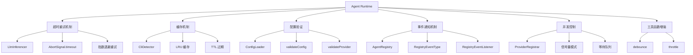

# Agent Runtime 增强功能设计

> Document Status: Current Implementation / Architecture Design
> Authority: Agent Runtime 模块的增强功能设计文档，包括超时重试机制、缓存机制、配置验证和事件通知。

## 概述

Agent Runtime 模块是 VectaHub 的核心模块之一，负责管理外部 Agent CLI 的注册、发现和执行。为了提高模块的健壮性、性能和可维护性，我们对模块进行了多项增强。

## 增强功能

### 1. 超时重试机制

**文件**: `src/agent-runtime/llm-inferencer.ts`

LLM 推理器现在支持超时和重试机制，防止 LLM 调用时间过长或失败。

#### 配置选项

```typescript
interface LlmInferencerOptions {
  timeoutMs?: number;        // 超时时间（毫秒），默认 30000
  maxRetries?: number;       // 最大重试次数，默认 3
  retryBaseDelayMs?: number; // 重试基础延迟（毫秒），默认 1000
}
```

#### 使用示例

```typescript
const inferencer = new LlmInferencer({
  timeoutMs: 60000,
  maxRetries: 5,
  retryBaseDelayMs: 2000,
});

const result = await inferencer.infer(prompt);
```

#### 实现细节

- 使用 `AbortSignal.timeout()` 实现超时控制
- 使用指数退避算法实现重试延迟
- 支持配置重试次数和基础延迟时间
- 超时或重试耗尽时抛出明确的错误信息

### 2. 缓存机制

**文件**: `src/agent-runtime/cli-detector.ts`

CLI 检测器现在支持缓存机制，避免重复检测相同的 CLI 工具。

#### 缓存配置

```typescript
interface CacheConfig {
  ttlMs?: number; // 缓存生存时间（毫秒），默认 300000（5 分钟）
}
```

#### 使用示例

```typescript
const detector = new CliDetector({ ttlMs: 600000 }); // 10 分钟缓存

// 第一次检测
const result1 = await detector.detect('node');

// 第二次检测（从缓存返回）
const result2 = await detector.detect('node');

// 清除缓存
detector.clearCache();
```

#### 实现细节

- 使用 LRU 缓存策略
- 支持配置缓存生存时间
- 缓存未命中或已过期时重新执行检测
- 提供 `clearCache()` 方法手动清除缓存

### 3. 配置验证

**文件**: `src/agent-runtime/config-loader.ts`

配置加载器现在支持配置验证，防止无效配置导致运行时错误。

#### 验证规则

```typescript
function validateConfig(config: unknown): ValidationResult {
  // 验证顶层配置结构
  if (typeof config !== 'object' || config === null) {
    return { valid: false, error: '配置必须是对象' };
  }

  const record = config as Record<string, unknown>;

  // 验证 version 字段
  if (typeof record.version !== 'string') {
    return { valid: false, error: 'version 字段必须是字符串' };
  }

  // 验证 first_run_completed 字段
  if (typeof record.first_run_completed !== 'boolean') {
    return { valid: false, error: 'first_run_completed 字段必须是布尔值' };
  }

  // 验证 ai_providers 字段
  if (!Array.isArray(record.ai_providers)) {
    return { valid: false, error: 'ai_providers 字段必须是数组' };
  }

  // 验证每个 Provider 配置
  for (const provider of record.ai_providers) {
    const result = validateProvider(provider);
    if (!result.valid) {
      return result;
    }
  }

  return { valid: true };
}
```

#### 使用示例

```typescript
import { loadConfig, validateConfig } from './config-loader';

try {
  const config = await loadConfig();
  const validation = validateConfig(config);

  if (!validation.valid) {
    console.error('配置验证失败:', validation.error);
    process.exit(1);
  }

  // 使用有效配置
  await initializeProviders(config.ai_providers);
} catch (error) {
  console.error('加载配置失败:', error);
  process.exit(1);
}
```

#### 实现细节

- 验证顶层配置结构（version、first_run_completed、ai_providers）
- 验证每个 Provider 配置（entryCommand、enabled、nonInteractiveFlags、promptTransport）
- 验证失败时返回明确的错误信息
- 支持在运行时防止无效配置

### 4. 事件通知机制

**文件**: `src/agent-runtime/registry.ts`

Agent 注册表现在支持事件通知机制，支持 Agent 注册/注销的监听。

#### 事件类型

```typescript
type RegistryEventType = 'register' | 'unregister' | 'clear';

interface RegistryEvent {
  type: RegistryEventType;
  agentId: string;
  timestamp: number;
}

type RegistryEventListener = (event: RegistryEvent) => void;
```

#### 使用示例

```typescript
const registry = new AgentRegistry();

// 监听 Agent 注册事件
const unsubscribe = registry.on('register', (event) => {
  console.log(`Agent 注册: ${event.agentId}`);
});

// 监听 Agent 注销事件
registry.on('unregister', (event) => {
  console.log(`Agent 注销: ${event.agentId}`);
});

// 注册 Agent
registry.register('my-agent', agentDescriptor);

// 取消监听
unsubscribe();
```

#### 实现细节

- 支持 `register`、`unregister`、`clear` 三种事件类型
- 使用观察者模式实现事件通知
- `on()` 方法返回取消监听函数
- 事件包含 agentId 和 timestamp 信息

### 5. 并发控制

**文件**: `src/agent-runtime/provider-registrar.ts`

Provider 注册器现在支持并发控制，防止同时注册过多 Provider。

#### 配置选项

```typescript
interface ConcurrencyConfig {
  maxConcurrent?: number; // 最大并发注册数，默认 3
}
```

#### 使用示例

```typescript
const registrar = new ProviderRegistrar({ maxConcurrent: 5 });

// 并发注册多个 Provider
await Promise.all([
  registrar.register(provider1),
  registrar.register(provider2),
  registrar.register(provider3),
]);

// 获取当前活跃注册数
const activeCount = registrar.getActiveRegistrationCount();

// 获取等待队列长度
const queueLength = registrar.getPendingQueueLength();
```

#### 实现细节

- 使用信号量模式实现并发控制
- 超出限制时排队等待
- 提供 `getActiveRegistrationCount()` 和 `getPendingQueueLength()` 方法
- 支持配置最大并发数

### 6. 工具函数增强

**文件**: `src/agent-runtime/utils.ts`

工具函数模块新增了 `debounce` 和 `throttle` 函数。

#### debounce 函数

```typescript
function debounce<T extends (...args: unknown[]) => unknown>(
  func: T,
  waitMs: number
): (...args: Parameters<T>) => void;
```

**使用示例**:

```typescript
const debouncedSave = debounce(saveData, 300);

// 频繁调用，只有最后一次会执行
debouncedSave(data1);
debouncedSave(data2);
debouncedSave(data3); // 只有这次会执行
```

#### throttle 函数

```typescript
function throttle<T extends (...args: unknown[]) => unknown>(
  func: T,
  limitMs: number
): (...args: Parameters<T>) => void;
```

**使用示例**:

```typescript
const throttledUpdate = throttle(updateUI, 100);

// 频繁调用，每 100ms 最多执行一次
throttledUpdate(data1);
throttledUpdate(data2); // 被节流
throttledUpdate(data3); // 被节流
```

#### 实现细节

- `debounce` 使用 setTimeout 实现延迟执行
- `throttle` 使用时间戳实现节流控制
- 支持配置等待时间和限制时间
- 返回的函数支持参数传递

## 架构图



## 性能影响

### 超时重试机制

- **优点**: 提高 LLM 调用的可靠性，防止长时间阻塞
- **缺点**: 可能增加延迟（重试时）
- **建议**: 根据 LLM 服务的响应时间调整超时和重试参数

### 缓存机制

- **优点**: 显著减少重复检测的开销
- **缺点**: 增加内存使用（缓存存储）
- **建议**: 根据 CLI 工具的更新频率调整缓存 TTL

### 配置验证

- **优点**: 提前发现配置错误，防止运行时异常
- **缺点**: 增加配置加载时间（验证开销）
- **建议**: 在开发环境中启用严格验证，在生产环境中使用宽松验证

### 事件通知机制

- **优点**: 支持模块间解耦通信
- **缺点**: 增加少量内存和 CPU 开销
- **建议**: 在不需要监听时及时取消订阅

### 并发控制

- **优点**: 防止资源耗尽，提高系统稳定性
- **缺点**: 可能增加注册延迟（排队等待）
- **建议**: 根据系统资源调整最大并发数

## 测试覆盖

所有增强功能都有完整的测试覆盖：

- `llm-inferencer.test.ts`: 超时重试机制测试（3 个用例）
- `cli-detector.test.ts`: 缓存机制测试（2 个用例）
- `config-loader.test.ts`: 配置验证测试（7 个用例）
- `registry.test.ts`: 事件通知机制测试（4 个用例）
- `provider-registrar.test.ts`: 并发控制测试（1 个用例）
- `utils.test.ts`: 工具函数测试（6 个用例）

**总计**: 23 个新增测试用例

## 最佳实践

### 1. 超时重试机制

```typescript
// ✅ 推荐：根据 LLM 服务特性调整参数
const inferencer = new LlmInferencer({
  timeoutMs: 60000,      // 60 秒超时
  maxRetries: 3,         // 最多重试 3 次
  retryBaseDelayMs: 2000 // 2 秒基础延迟
});

// ❌ 避免：设置过短的超时时间
const inferencer = new LlmInferencer({
  timeoutMs: 1000,  // 1 秒可能太短
  maxRetries: 10,   // 10 次重试可能太多
});
```

### 2. 缓存机制

```typescript
// ✅ 推荐：根据 CLI 工具更新频率调整 TTL
const detector = new CliDetector({ ttlMs: 300000 }); // 5 分钟

// ❌ 避免：设置过长的 TTL（可能使用过期数据）
const detector = new CliDetector({ ttlMs: 86400000 }); // 24 小时
```

### 3. 配置验证

```typescript
// ✅ 推荐：在应用启动时验证配置
const config = await loadConfig();
const validation = validateConfig(config);

if (!validation.valid) {
  console.error('配置验证失败:', validation.error);
  process.exit(1);
}

// ❌ 避免：跳过配置验证
const config = await loadConfig();
// 直接使用，可能导致运行时错误
```

### 4. 事件通知机制

```typescript
// ✅ 推荐：在组件卸载时取消监听
const unsubscribe = registry.on('register', handleRegister);

// 组件卸载时
useEffect(() => {
  return () => unsubscribe();
}, []);

// ❌ 避免：忘记取消监听（可能导致内存泄漏）
registry.on('register', handleRegister);
// 组件卸载后仍然监听
```

### 5. 并发控制

```typescript
// ✅ 推荐：根据系统资源调整并发数
const registrar = new ProviderRegistrar({ maxConcurrent: 5 });

// ❌ 避免：设置过高的并发数（可能耗尽资源）
const registrar = new ProviderRegistrar({ maxConcurrent: 100 });
```

## 相关文档

- [Agent CLI 注册与 Runtime 架构设计](./agent-cli-runtime-architecture.md)
- [Agent 执行系统](../agent-execution.md)
- [Agent Worker 合同](../specs/agent-worker-contract.md)
- [Agent 操作规范](../agent-operating-guide.md)
