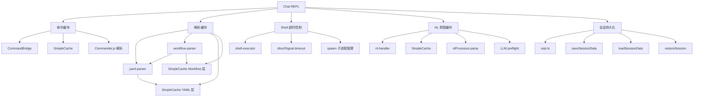

# Chat REPL 增强功能设计

> Document Status: Current Implementation / Architecture Design
> Authority: Chat REPL 模块的增强功能设计文档，包括命令缓存、解析缓存、Shell 超时控制、意图缓存和会话持久化。

## 概述

Chat REPL 模块是 VectaHub 的交互式命令行界面，负责处理用户输入的自然语言、Shell 命令和斜杠命令，并将其路由到对应的处理器。为了提升模块的响应速度、执行安全性和用户体验，我们对模块进行了多项增强。

核心增强涵盖五个方面：

1. **命令缓存** — 避免短时间内重复解析和执行相同 CLI 命令
2. **YAML/工作流解析缓存** — 避免对相同 YAML 文本重复调用解析器
3. **Shell 超时控制** — 防止 Shell 命令执行时间过长导致 REPL 阻塞
4. **NL 意图缓存** — 避免对相同自然语言输入重复进行意图匹配
5. **会话持久化** — 在 REPL 退出时保存会话状态，重启后自动恢复

## 增强功能

### 1. 命令缓存

**文件**: `src/chat/command-bridge.ts`

CommandBridge 是连接 REPL 与 Commander.js 的桥接器，负责将用户输入的命令字符串委托给 Commander.js 程序执行。为了减少重复命令的解析开销，CommandBridge 内置了基于 `SimpleCache` 的缓存机制，对短时间内重复执行的相同命令直接返回缓存结果。

#### 配置选项

```typescript
interface CommandBridgeOptions {
  cacheTtlMs?: number;     // 命令缓存 TTL（毫秒），默认 30000
  cacheMaxSize?: number;   // 命令缓存最大容量，默认 50
}
```

#### 使用示例

```typescript
import { createCommandBridge } from './command-bridge';

// 使用默认缓存配置
const bridge = createCommandBridge(program);

// 第一次执行（实际解析并执行）
const result1 = await bridge.execute('help');

// 第二次执行（从缓存返回）
const result2 = await bridge.execute('help');

// 自定义缓存配置
const bridgeWithCustomCache = createCommandBridge(program, {
  cacheTtlMs: 60_000,    // 60 秒缓存
  cacheMaxSize: 100,     // 最多 100 条
});

// 手动清空缓存
bridge.clearCache();
```

#### 实现细节

- 基于 `SimpleCache<string>` 实现，缓存键为完整的命令字符串
- 默认 TTL 为 30 秒，最大容量为 50 条
- 命令执行完成后自动写入缓存（包括成功和错误结果）
- 通过拦截 `process.stdout.write` 和 `process.stderr.write` 捕获 Commander.js 的输出
- 提供 `clearCache()` 方法，供配置变更或需要强制重新执行时调用
- 使用 FIFO 淘汰策略，缓存满时淘汰最早的条目

### 2. YAML/工作流解析缓存

**文件**: `src/chat/yaml-parser.ts`、`src/chat/workflow-parser.ts`

YAML 解析和工作流步骤映射是 REPL 处理 NL 输入的关键路径。LLM 生成的工作流 YAML 可能在短时间内被重复引用（例如用户反复查看或执行同一工作流），因此我们在 YAML 解析层和工作流映射层分别引入了缓存。

#### YAML 解析缓存

```typescript
// src/chat/yaml-parser.ts

const YAML_CACHE_TTL_MS = 60_000;     // 60 秒
const YAML_CACHE_MAX_SIZE = 100;       // 最多 100 条

function parseYAML<T = unknown>(input: string): T {
  const cached = yamlCache.get(input);
  if (cached !== undefined) {
    return cached as T;
  }

  const result = YAML.parse(input) as T;
  yamlCache.set(input, result);
  return result;
}
```

#### 工作流解析缓存

```typescript
// src/chat/workflow-parser.ts

const WORKFLOW_CACHE_TTL_MS = 60_000;  // 60 秒
const WORKFLOW_CACHE_MAX_SIZE = 50;     // 最多 50 条

function parseWorkflowSteps(workflowYAML: string): Step[] {
  const cached = workflowCache.get(workflowYAML);
  if (cached !== undefined) {
    return cached;
  }

  const parsedYaml = parseYAML<{ steps?: ParsedWorkflowStep[] } | null>(workflowYAML);
  if (!parsedYaml || !Array.isArray(parsedYaml.steps)) {
    throw new Error('Workflow YAML must contain a steps array');
  }

  const steps = parsedYaml.steps.map((step, index) => mapWorkflowStep(step, `step_${index + 1}`));
  workflowCache.set(workflowYAML, steps);
  return steps;
}
```

#### 使用示例

```typescript
import { parseWorkflowSteps, clearWorkflowCache } from './workflow-parser';
import { parseYAML, clearYAMLCache } from './yaml-parser';

// 第一次解析（执行 YAML 解析 + 步骤映射）
const steps1 = parseWorkflowSteps(yamlText);

// 第二次解析（从缓存返回）
const steps2 = parseWorkflowSteps(yamlText);

// YAML 层独立缓存
const data = parseYAML<{ name: string }>('name: hello');

// 手动清空缓存
clearWorkflowCache();
clearYAMLCache();
```

#### 实现细节

- **双层缓存架构**：YAML 解析层和工作流映射层各维护独立的 `SimpleCache` 实例
- YAML 解析缓存 TTL 60 秒，容量 100 条；工作流解析缓存 TTL 60 秒，容量 50 条
- 缓存键均为原始 YAML 字符串，保证输入相同则结果相同
- 两层缓存均使用模块级单例，整个 REPL 生命周期共享
- `parseWorkflowSteps` 内部调用 `parseYAML`，命中 YAML 缓存时可跳过底层解析
- 提供独立的 `clearYAMLCache()` 和 `clearWorkflowCache()` 方法

### 3. Shell 超时控制

**文件**: `src/chat/shell-executor.ts`

Shell 执行器是 REPL 的最后回退手段，当 CommandBridge 和 CommandExecutor 均不可用时，通过 `child_process.spawn` 直接执行系统命令。为防止长时间运行的命令阻塞 REPL 交互，引入了基于 `AbortSignal.timeout()` 的超时控制机制。

#### 配置选项

```typescript
interface ShellExecutorOptions {
  timeoutMs?: number;  // 执行超时时间（毫秒），默认 30000
}
```

#### 使用示例

```typescript
import { executeDirectShellCommand } from './shell-executor';

// 使用默认超时（30 秒）
const result = await executeDirectShellCommand('ls -la');

// 自定义超时时间
const result2 = await executeDirectShellCommand('npm install', {
  timeoutMs: 120_000,  // 2 分钟
});

// 超时后的返回结果
// {
//   type: 'error',
//   content: '❌ 命令执行超时（30000ms）: long-running-command',
//   metadata: { exitCode: -1, stderr: 'Process killed with signal SIGTERM' }
// }
```

#### 实现细节

- 使用 `AbortSignal.timeout()` 实现超时控制，Node.js 原生 API，无需额外依赖
- 默认超时时间 30 秒，与 `CommandBridgeOptions.cacheTtlMs` 默认值一致
- 超时触发时子进程收到 `SIGTERM` 信号，通过 `close` 事件的 `signal` 参数检测
- 同时处理 `AbortError` 异常（`err.name === 'AbortError' || err.code === 'ABORT_ERR'`）
- 使用 `settled` 标志防止 Promise 被重复 resolve
- 超时结果返回 `ChatOutput` 类型，`type` 为 `'error'`，`exitCode` 为 `-1`
- 命令正常完成时返回 `type: 'command-result'`，包含 stdout 和 stderr

### 4. NL 意图缓存

**文件**: `src/chat/nl-handler.ts`

NL 处理器负责将用户自然语言输入转换为结构化的意图和工作流。意图匹配过程涉及模式匹配和可选的 LLM 调用，开销较大。为避免对相同输入重复执行意图匹配，引入了基于会话隔离的意图缓存。

#### 缓存配置

```typescript
const INTENT_CACHE_TTL_MS = 120_000;   // 120 秒
const INTENT_CACHE_MAX_SIZE = 200;      // 最多 200 条
```

#### 使用示例

```typescript
import { createNLHandler } from './nl-handler';

const nlHandler = createNLHandler(
  deps,
  sessionId,
  ui,
  pendingWorkflows,
  promptForConfirmation,
  executePendingWorkflow,
);

// 第一次处理（执行完整的 NL 解析流程）
const result1 = await nlHandler.handleNLInput('帮我创建一个部署工作流');

// 相同输入在缓存 TTL 内直接返回缓存结果
const result2 = await nlHandler.handleNLInput('帮我创建一个部署工作流');

// 会话切换时清空缓存
nlHandler.clearIntentCache();
```

#### 实现细节

- 缓存键由 `sessionId` 和 `input` 拼接而成（`${sessionId}::${input}`），保证不同会话的相同输入互不干扰
- 缓存 TTL 为 120 秒，容量 200 条，是所有缓存中容量最大的（NL 输入多样性最高）
- 缓存发生在 `nlProcessor.parse()` 调用之后，存储完整的 `NLResult` 对象
- LLM preflight 调用在缓存查找之前执行，确保 LLM 审计日志不受缓存影响
- `createNLHandler` 为闭包工厂模式，每个 REPL 实例拥有独立的缓存实例
- 提供 `clearIntentCache()` 方法，供会话切换或需要强制重新解析时调用

### 5. 会话持久化

**文件**: `src/chat/repl.ts`

REPL 会话可能因用户退出、进程崩溃或系统重启而中断。为了不丢失已生成的待执行工作流，引入了基于文件系统的会话持久化机制，在关键节点自动保存会话状态，并在 REPL 启动时自动恢复。

#### 数据结构

```typescript
interface SessionPersistData {
  sessionId: string;              // 会话标识符
  version: number;                // 持久化格式版本号（当前为 1）
  lastActivity: string;           // 最后活动时间（ISO 8601）
  pendingWorkflowYAMLs: string[]; // 待执行工作流的 YAML 列表
  config: ChatConfig;             // 聊天配置快照
}
```

#### 存储路径

```typescript
// 存储目录: ~/.vectahub/chat-sessions/
// 文件命名: {sessionId}.json

function getSessionStoreDir(): string {
  return join(homedir(), '.vectahub', 'chat-sessions');
}

function getSessionFilePath(sessionId: string): string {
  return join(getSessionStoreDir(), `${sessionId}.json`);
}
```

#### 使用示例

```typescript
import { createREPL } from './repl';

const repl = createREPL(deps);

// 启动 REPL（自动恢复上一次会话）
await repl.start();

// 手动持久化当前会话
await repl.persistSession();

// 自动持久化触发时机：
// 1. 工作流执行完成后
// 2. NL 输入生成新工作流后
```

#### 实现细节

- **存储格式**：JSON 文件，包含版本号用于未来格式迁移
- **版本校验**：加载时检查 `version === SESSION_DATA_VERSION`（当前为 1），不匹配则丢弃
- **保存时机**：工作流执行完成后、NL 生成新工作流后自动触发 `persistSession()`
- **恢复流程**：REPL 启动时调用 `restoreSession()`，遍历 `pendingWorkflowYAMLs` 逐个重建 `PendingWorkflow`
- **容错设计**：
  - 保存失败不阻断 REPL 主流程（静默 catch）
  - 单个工作流恢复失败不影响其他工作流
  - 文件不存在或格式无效时返回 `null`，REPL 正常启动
- **恢复的工作流 ID**：使用 `restored_${Date.now()}` 标识，与新生成的工作流区分
- **目录自动创建**：保存时使用 `mkdir({ recursive: true })` 确保目录存在

## 架构图



## 性能影响

### 命令缓存

- **优点**: 显著减少重复命令的 Commander.js 解析和 stdout/stderr 拦截开销
- **缺点**: 增加少量内存使用（每条缓存存储命令字符串和输出文本）
- **建议**: 对于 `help`、`status` 等高频只读命令效果最佳；有副作用的命令可通过 `clearCache()` 绕过

### YAML/工作流解析缓存

- **优点**: 避免重复调用 `YAML.parse()` 和步骤映射逻辑，对复杂工作流 YAML 提升明显
- **缺点**: 双层缓存增加内存占用；缓存键为完整 YAML 字符串，长文本的哈希比较开销略高
- **建议**: 60 秒 TTL 适合大多数交互场景；如需处理大批量 YAML 可适当增大 `cacheMaxSize`

### Shell 超时控制

- **优点**: 防止长时间运行的命令阻塞 REPL 交互，提升用户体验
- **缺点**: 正常情况下增加 `AbortSignal` 创建的微量开销
- **建议**: 30 秒默认值适合大多数命令；对于 `npm install`、`docker build` 等长时间操作，调用方应传入更大的 `timeoutMs`

### NL 意图缓存

- **优点**: 避免重复调用 `nlProcessor.parse()` 和 LLM preflight，是所有缓存中收益最大的（NL 处理开销最高）
- **缺点**: 缓存键包含 `sessionId`，会话数量多时缓存命中率下降
- **建议**: 120 秒 TTL 和 200 条容量适合交互式会话；自动执行模式下可考虑缩短 TTL 以减少陈旧结果风险

### 会话持久化

- **优点**: 避免 REPL 退出后丢失已生成的工作流，提升用户体验
- **缺点**: 每次持久化涉及文件 I/O（JSON 序列化 + 写入磁盘）
- **建议**: 当前实现为异步非阻塞，对 REPL 响应时间影响极小；持久化失败静默处理，不阻断主流程

## 测试覆盖

所有增强功能均有对应的测试覆盖：

- `command-bridge.test.ts`: 命令缓存测试（缓存命中、缓存未命中、缓存清空、自定义配置）
- `yaml-parser.test.ts`: YAML 解析缓存测试（缓存命中、缓存清空、错误输入不缓存）
- `workflow-parser.test.ts`: 工作流解析缓存测试（缓存命中、步骤映射、嵌套步骤）
- `shell-executor.test.ts`: Shell 超时控制测试（正常执行、超时终止、AbortError 处理）
- `nl-handler.test.ts`: NL 意图缓存测试（缓存命中、会话隔离、缓存清空）
- `repl.test.ts`: 会话持久化测试（保存、恢复、版本校验、损坏文件处理）
- `utils.test.ts`: SimpleCache 单元测试（TTL 过期、容量淘汰、clear、size）

**缓存基础设施**：所有缓存均基于 `SimpleCache<T>` 实现，该类在 `utils.test.ts` 中有完整的单元测试覆盖，包括 TTL 过期、FIFO 淘汰、`has()` 方法和 `clear()` 方法。

## 最佳实践

### 1. 命令缓存

```typescript
// ✅ 推荐：对只读命令使用默认缓存配置
const bridge = createCommandBridge(program);
const helpOutput = await bridge.execute('help');

// ✅ 推荐：在配置变更后清空缓存
bridge.clearCache();

// ❌ 避免：对有副作用的命令依赖缓存结果
const result = await bridge.execute('deploy production'); // 不应被缓存返回旧结果
```

### 2. YAML/工作流解析缓存

```typescript
// ✅ 推荐：利用双层缓存减少重复解析
const steps = parseWorkflowSteps(yamlText); // 首次：YAML 解析 + 步骤映射
const steps2 = parseWorkflowSteps(yamlText); // 命中缓存

// ✅ 推荐：在测试中清空缓存避免状态泄漏
beforeEach(() => {
  clearYAMLCache();
  clearWorkflowCache();
});

// ❌ 避免：在循环中对不同输入反复清空缓存（降低命中率）
for (const yaml of yamlList) {
  clearWorkflowCache(); // 不必要的清空
  parseWorkflowSteps(yaml);
}
```

### 3. Shell 超时控制

```typescript
// ✅ 推荐：对长时间命令设置合理的超时时间
const result = await executeDirectShellCommand('npm test', {
  timeoutMs: 120_000,  // 测试可能需要 2 分钟
});

// ✅ 推荐：对快速命令使用默认超时
const result = await executeDirectShellCommand('echo hello');

// ❌ 避免：设置过短的超时时间导致正常命令被误杀
const result = await executeDirectShellCommand('npm install', {
  timeoutMs: 5_000,  // 5 秒对 npm install 来说太短
});
```

### 4. NL 意图缓存

```typescript
// ✅ 推荐：在会话切换时清空缓存
function onSessionSwitch(newSessionId: string) {
  nlHandler.clearIntentCache();
  sessionId = newSessionId;
}

// ✅ 推荐：利用缓存键的会话隔离特性
// 不同 session 的相同输入各自独立缓存，互不干扰

// ❌ 避免：在自动执行模式下不理解缓存的陈旧风险
// auto 模式下相同输入在 TTL 内会直接执行缓存的旧工作流
// 如需强制重新生成，应调用 clearIntentCache()
```

### 5. 会话持久化

```typescript
// ✅ 推荐：依赖自动持久化机制
// 工作流执行完成和 NL 生成工作流后会自动调用 persistSession()

// ✅ 推荐：在关键操作后手动触发持久化
await repl.persistSession();

// ❌ 避免：在高频操作中反复调用 persistSession()
// 持久化涉及文件 I/O，频繁调用会影响性能
for (const input of inputs) {
  await repl.processInput(input);
  await repl.persistSession(); // 不必要的频繁持久化
}
```

## 相关文档

- [Agent Runtime 增强功能设计](./agent-runtime-enhancements.md)
- [Chat REPL 模块类型定义](../../src/chat/types.ts)
- [Chat REPL 工具函数](../../src/chat/utils.ts)
- [Agent 操作规范](../agent-operating-guide.md)
