# CLI Tools 增强功能设计

> Document Status: Current Implementation / Target Design / Migration Contract
> Authority: CLI Tools 模块的增强功能设计文档，包括接口去重、Node 前缀修复、测试覆盖、JSDoc 文档和配置验证。

## 概述

CLI Tools 模块是 VectaHub 的外部工具集成层，负责管理 CLI 工具的注册、发现、执行和安全规则评估。为了提高模块的类型一致性、代码质量、可测试性和可维护性，我们对模块进行了多项增强。

## 增强功能

### 1. 接口去重（Interface Deduplication）

**文件**: `src/cli-tools/types.ts`

跨模块的类型接口统一收归到 `types.ts` 单一来源，消除 `ToolService`、`ToolChain`、`Registry`、`CommandRules` 等子模块间的重复定义。

#### 配置选项

```typescript
// types.ts 统一导出的核心接口
export interface CliTool { ... }
export interface CliCommand { ... }
export interface CliOption { ... }
export interface CliToolResult { ... }
export interface CliToolExecutor { ... }
export interface CliExecutionOptions { ... }
export interface CliToolRegistry { ... }
export interface ToolStep { ... }
export interface ToolChainResult { ... }
export interface ToolExample { ... }
```

#### 使用示例

```typescript
// 所有子模块从 types.ts 统一导入
import type { CliTool, CliToolRegistry, CliToolResult } from './types.js';

// tool-chain.ts 使用统一接口
import type { ToolStep, ToolChainResult, CliToolRegistry, CliToolResult } from './types.js';

// tool-service.ts 使用统一接口
import type { CliTool, CliToolRegistry } from './types.js';

// registry.ts 使用统一接口
import type { CliTool, CliCommand, CliToolRegistry } from './types.js';
```

#### 实现细节

- 所有共享类型定义在 `types.ts` 中，作为唯一权威来源
- 每个接口均带有完整的 JSDoc 注释，说明字段含义和使用场景
- 子模块通过 `import type` 语句引用，避免运行时开销
- 消除了 `tool-chain.ts`、`tool-service.ts`、`registry.ts` 之间对 `CliToolResult`、`CliToolRegistry` 等接口的重复声明

### 2. Node 前缀修复（Node Prefix Fix）

**文件**: `src/cli-tools/tool-chain.ts`

所有 Node.js 内置模块的导入统一使用 `node:` 前缀，符合 Node.js 16+ 的最佳实践，消除模块歧义。

#### 修复前后对比

```typescript
// ❌ 修复前：缺少 node: 前缀
import { spawn } from 'child_process';

// ✅ 修复后：使用 node: 前缀
import { spawn } from 'node:child_process';
```

#### 使用示例

```typescript
// tool-chain.ts 中的进程创建
import { spawn } from 'node:child_process';

// registration/config.ts 中的文件系统操作
import { writeFileSync, existsSync, mkdirSync } from 'node:fs';
import * as path from 'node:path';
```

#### 实现细节

- `tool-chain.ts` 中 `child_process` 改为 `node:child_process`
- `registration/config.ts` 中 `fs` 改为 `node:fs`，`path` 改为 `node:path`
- 使用 `node:` 前缀可以明确区分内置模块和第三方 npm 包，避免命名冲突
- 与 Node.js 官方文档推荐保持一致

### 3. 测试覆盖（Test Coverage）

**文件**: `src/cli-tools/tool-chain.test.ts`、`src/cli-tools/tool-service.test.ts`、`src/cli-tools/command-rules/engine.test.ts`

为 CLI Tools 核心模块新增 77 个测试用例，覆盖工具链执行、工具服务管理和命令安全规则引擎。

#### 测试分布

```typescript
// tool-chain.test.ts: 20 个用例
// 覆盖：实例创建、步骤添加、上下文管理、链式调用、
//       执行流程、错误处理、超时、上下文传播

// tool-service.test.ts: 24 个用例
// 覆盖：实例创建、工具注册/查询/搜索、分类管理、
//       内置工具加载、发现摘要、单例管理、错误日志

// command-rules/engine.test.ts: 33 个用例
// 覆盖：规则创建/设置/加载模板、命令分析/评估、
//       危险等级推断、规则增删、正则容错、作用域
```

#### 使用示例

```typescript
// 工具链测试示例
describe('ToolChain', () => {
  it('should stop execution on first failure', async () => {
    chain.addStep({ tool: 'nonexistent', command: 'nonexistent', args: [] });
    chain.addStep({ tool: 'echo', command: 'echo', args: ['should not run'] });
    const result = await chain.execute();
    expect(result.success).toBe(false);
    expect(result.results).toHaveLength(1);
    expect(result.failedStep).toBe(0);
  });
});

// 命令规则引擎测试示例
describe('CommandRuleEngine', () => {
  it('should infer critical danger level for rm -rf /', () => {
    const analysis = engine.analyzeCommand('rm', ['-rf', '/'], '/tmp');
    expect(analysis.dangerLevel).toBe('critical');
  });
});
```

#### 实现细节

- 使用 Vitest 框架，与项目技术栈保持一致
- 通过 `vi.fn()` 构建 Mock Registry 和 Logger，隔离测试依赖
- 测试覆盖正向路径、异常路径和边界条件
- 工具链测试验证顺序执行、失败中断和上下文传播语义
- 命令规则引擎测试覆盖四种 action 类型（allow、block、prompt、sanitize）和四级危险等级

### 4. JSDoc 文档（JSDoc Documentation）

**文件**: `src/cli-tools/types.ts`、`src/cli-tools/tool-chain.ts`、`src/cli-tools/tool-service.ts`、`src/cli-tools/command-rules/engine.ts`

为所有公共接口、类和函数添加完整的 JSDoc 注释，提升 IDE 体验和代码可读性。

#### 文档覆盖

```typescript
// types.ts - 所有接口字段均有 JSDoc
export interface CliTool {
  /** 工具名称，例如 'git'、'npm' */
  name: string;
  /** 工具描述 */
  description: string;
  /** 工具版本要求，使用 semver 格式 */
  version: string;
  /** 工具分类，例如 'version-control'、'package-management' */
  category?: string;
  // ...
}

// tool-chain.ts - 接口和工厂函数均有 JSDoc
/** 工具链接口 - 支持链式调用的工具执行器 */
export interface ToolChain {
  /** 添加一个执行步骤 */
  addStep(step: ToolStep): ToolChain;
  // ...
}

/** 创建工具链实例
 * @param registry - CLI 工具注册表
 * @returns 工具链实例
 */
export function createToolChain(registry: CliToolRegistry): ToolChain { ... }
```

#### 使用示例

```typescript
// tool-service.ts - 类和方法均有 JSDoc
/** 工具服务类 - 提供 CLI 工具的注册、管理和查询功能 */
export class ToolService {
  /** 获取工具注册表 */
  getRegistry(): CliToolRegistry { ... }

  /** 根据名称获取工具 */
  getTool(name: string): CliTool | undefined { ... }

  /** 搜索工具 */
  searchTools(keyword: string): CliTool[] { ... }
}

// command-rules/engine.ts - 引擎类和分析方法均有 JSDoc
/** 命令规则引擎类 - 用于分析和评估 CLI 命令的安全性 */
export class CommandRuleEngine {
  /** 分析命令 */
  analyzeCommand(command: string, args: string[], cwd: string): CommandAnalysis { ... }

  /** 评估命令 */
  evaluate(command: string, args: string[], cwd: string): CommandRuleResult { ... }
}
```

#### 实现细节

- 所有 `export` 的接口、类型、类和函数均添加 JSDoc
- 接口字段使用 `/** ... */` 行内注释
- 函数使用 `@param` 和 `@returns` 标签
- 使用中文描述业务含义，英文标识符保持不变
- 依赖注入接口（如 `ToolServiceDeps`、`CommandRuleEngineDeps`）同样包含完整文档

### 5. 配置验证（Config Validation）

**文件**: `src/cli-tools/registration/config.ts`

工具注册配置支持运行时验证，防止无效配置导致注册失败或运行时错误。

#### 验证规则

```typescript
interface ValidationResult {
  valid: boolean;
  errors: string[];    // 阻断性错误
  warnings: string[];  // 非阻断性警告
}

function validateToolRegistration(
  tool: ToolRegistrationCandidate,
  existingConfig: RegistrationConfig
): ValidationResult {
  const errors: string[] = [];
  const warnings: string[] = [];

  // 规则 1: 工具名称必填
  if (!tool.name) {
    errors.push('工具名称不能为空');
  }

  // 规则 2: 建议添加描述
  if (!tool.description) {
    warnings.push('建议添加工具描述');
  }

  // 规则 3: 重复注册警告
  if (tool.name && existingConfig.registeredTools.includes(tool.name)) {
    warnings.push(`工具 ${tool.name} 已经注册`);
  }

  return { valid: errors.length === 0, errors, warnings };
}
```

#### 使用示例

```typescript
import { loadConfig, validateToolRegistration } from './registration/config.js';

const config = await loadConfig(configService);
const validation = validateToolRegistration(
  { name: 'git', description: 'Version control' },
  config
);

if (!validation.valid) {
  console.error('验证失败:', validation.errors);
  return;
}

if (validation.warnings.length > 0) {
  console.warn('注意事项:', validation.warnings);
}
```

#### 实现细节

- 验证分为 `errors`（阻断）和 `warnings`（建议）两级
- 工具名称为空时返回 `valid: false`，阻止注册
- 重复注册和缺少描述仅产生警告，不阻断流程
- 支持测试模式（`setTestMode`），无需真实文件系统即可验证逻辑
- `loadConfig` 和 `saveConfig` 在测试模式下使用内存存储

## 架构图

```mermaid
graph TD
    A[CLI Tools 模块] --> B[接口去重]
    A --> C[Node 前缀修复]
    A --> D[测试覆盖]
    A --> E[JSDoc 文档]
    A --> F[配置验证]

    B --> B1[types.ts 统一类型]
    B --> B2[import type 引用]
    B --> B3[消除重复定义]

    C --> C1[node:child_process]
    C --> C2[node:fs]
    C --> C3[node:path]

    D --> D1[tool-chain.test.ts - 20 用例]
    D --> D2[tool-service.test.ts - 24 用例]
    D --> D3[engine.test.ts - 33 用例]

    E --> E1[接口字段注释]
    E --> E2[类和方法注释]
    E --> E3[依赖注入文档]

    F --> F1[validateToolRegistration]
    F --> F2[errors / warnings 分级]
    F --> F3[测试模式支持]

    A --> G[ToolChain]
    A --> H[ToolService]
    A --> I[CommandRuleEngine]
    A --> J[CliToolRegistry]
    A --> K[Registration Config]

    G --> G1[步骤顺序执行]
    G --> G2[上下文传播]
    G --> G3[超时控制]

    H --> H1[工具注册/查询]
    H --> H2[内置工具加载]
    H --> H3[发现摘要]

    I --> I1[命令分析]
    I --> I2[危险等级推断]
    I --> I3[安全模板]

    J --> J1[工具存储]
    J --> J2[搜索/分类]
    J --> J3[危险命令检测]

    K --> K1[配置加载/保存]
    K --> K2[工具注册验证]
    K --> K3[测试模式]
```



## 性能影响

### 接口去重

- **优点**: 减少编译时类型重复解析，降低 TypeScript 编译开销
- **缺点**: 无运行时影响（`import type` 在编译后被擦除）
- **建议**: 保持 `types.ts` 作为唯一类型来源，新增接口时优先在此文件扩展

### Node 前缀修复

- **优点**: 消除模块解析歧义，提升冷启动时的模块查找效率
- **缺点**: 无
- **建议**: 全项目统一使用 `node:` 前缀，可通过 lint 规则强制执行

### 测试覆盖

- **优点**: 77 个用例覆盖核心路径和边界条件，显著降低回归风险
- **缺点**: 测试执行时间略有增加（约 200ms）
- **建议**: 在 CI 中保持测试运行，新增功能同步补充测试

### JSDoc 文档

- **优点**: IDE 悬浮提示更完整，降低新开发者上手成本
- **缺点**: 源文件体积略有增加
- **建议**: 保持注释与代码同步更新，避免文档腐烂

### 配置验证

- **优点**: 提前发现无效配置，防止运行时注册失败
- **缺点**: 增加注册流程的少量验证开销（微秒级）
- **建议**: 在工具注册入口统一调用验证，不在各处分散校验

## 测试覆盖

所有增强功能都有完整的测试覆盖：

- `tool-chain.test.ts`: 工具链测试（20 个用例）
- `tool-service.test.ts`: 工具服务测试（24 个用例）
- `command-rules/engine.test.ts`: 命令规则引擎测试（33 个用例）
- `registration/config.test.ts`: 配置验证测试（3 个用例）

**总计**: 77 个新增测试用例（核心模块）+ 3 个配置测试用例

### 测试分类明细

| 测试文件 | 用例数 | 覆盖范围 |
|---------|--------|---------|
| tool-chain.test.ts | 20 | 实例创建、步骤管理、上下文传播、执行流程、错误处理、超时 |
| tool-service.test.ts | 24 | 服务创建、工具注册/查询/搜索、分类、内置工具、单例、日志 |
| engine.test.ts | 33 | 规则管理、模板加载、命令分析、危险评估、等级推断、正则容错 |
| config.test.ts | 3 | 配置加载、保存重载、数据隔离 |

## 最佳实践

### 1. 接口去重

```typescript
// ✅ 推荐：从 types.ts 统一导入
import type { CliTool, CliToolRegistry, CliToolResult } from './types.js';

// ❌ 避免：在各模块中重复定义接口
interface CliToolResult {
  success: boolean;
  output: string;
  // ...
}
```

### 2. Node 前缀

```typescript
// ✅ 推荐：使用 node: 前缀
import { spawn } from 'node:child_process';
import { writeFileSync } from 'node:fs';
import * as path from 'node:path';

// ❌ 避免：省略 node: 前缀
import { spawn } from 'child_process';
import { writeFileSync } from 'fs';
```

### 3. 依赖注入与测试

```typescript
// ✅ 推荐：通过 deps 注入 logger，便于测试
const deps: ToolServiceDeps = { logger: { warn: vi.fn() } };
const service = new ToolService(registry, {}, deps);

// ❌ 避免：直接使用 console，无法在测试中捕获日志
export class ToolService {
  constructor() {
    console.warn('...'); // 难以测试
  }
}
```

### 4. 配置验证

```typescript
// ✅ 推荐：注册前验证，区分 errors 和 warnings
const result = validateToolRegistration(candidate, config);
if (!result.valid) {
  throw new Error(result.errors.join('; '));
}
if (result.warnings.length > 0) {
  logger.warn(result.warnings.join('; '));
}

// ❌ 避免：跳过验证直接注册
registry.register(tool); // 可能注册无效工具
```

### 5. 命令安全规则

```typescript
// ✅ 推荐：使用 evaluate 获取完整决策信息
const result = engine.evaluate(command, args, cwd);
if (result.decision === 'block') {
  throw new Error(`命令被阻止: ${result.rule?.reason}`);
}

// ❌ 避免：仅检查 isDangerous 而忽略决策细节
const analysis = engine.analyzeCommand(command, args, cwd);
if (analysis.isDangerous) {
  throw new Error('危险命令'); // 缺少规则和原因信息
}
```

## 相关文档

- [Agent Runtime 增强功能设计](./agent-runtime-enhancements.md)
- [Agent CLI 注册与 Runtime 架构设计](./agent-cli-runtime-architecture.md)
- [Agent 操作规范](../agent-operating-guide.md)
