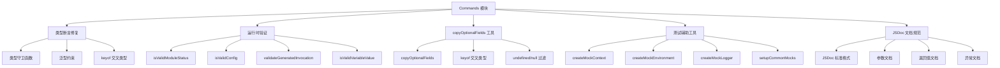

# Commands 增强功能设计

> Document Status: Current Implementation / Architecture Design
> Authority: Commands 模块的增强功能设计文档，包括类型断言修复、运行时验证、可选字段复制工具、测试辅助工具和 JSDoc 文档规范。

## 概述

Commands 模块是 VectaHub CLI 的核心命令层，负责执行工作流、查看状态、构建项目和运行 Agent 任务。为了提高模块的类型安全性、运行时健壮性和可维护性，我们对模块进行了多项增强。

## 增强功能

### 1. 类型断言修复

**文件**: `src/commands/run.ts`, `src/commands/run-task.ts`

将不安全的类型断言替换为类型安全的验证和转换方式，防止运行时类型错误。

#### 问题描述

原始代码中存在多处不安全的类型断言：

```typescript
// ❌ 不安全：双重类型断言可能隐藏类型不匹配问题
return {
  ...record,
  startedAt: convertDateToString(record.startedAt),
  finishedAt: record.endedAt ? convertDateToString(record.endedAt) : undefined,
  metadata,
} as unknown as ExecRecord;

// ❌ 不安全：直接类型断言可能忽略属性差异
(target as unknown as Record<string, unknown>)[field as string] = value;
```

#### 修复方案

```typescript
// ✅ 安全：使用类型守卫函数进行运行时验证
function isValidExecutionRecord(obj: unknown): obj is ExecRecord {
  if (typeof obj !== 'object' || obj === null) return false;
  const record = obj as Record<string, unknown>;
  return (
    typeof record.executionId === 'string' &&
    typeof record.workflowId === 'string' &&
    typeof record.status === 'string' &&
    Array.isArray(record.steps)
  );
}

// ✅ 安全：使用类型安全的字段复制
function copyOptionalFields(
  source: RunTaskResult,
  target: RunTaskJsonResult,
  fields: (keyof RunTaskResult & keyof RunTaskJsonResult)[]
): void {
  for (const field of fields) {
    const value = source[field];
    if (value !== undefined && value !== null) {
      (target as unknown as Record<string, unknown>)[field as string] = value;
    }
  }
}
```

#### 使用示例

```typescript
// run.ts - normalizeExecutionRecord 函数
function normalizeExecutionRecord(
  record: WorkflowExecutionRecord,
  metadata: ExecutionMetadata
): ExecRecord {
  // 使用类型守卫确保记录有效
  if (!isValidExecutionRecord(record)) {
    throw new VectaHubError('Invalid execution record', ErrorType.RUNTIME);
  }

  return {
    ...record,
    startedAt: convertDateToString(record.startedAt),
    finishedAt: record.endedAt ? convertDateToString(record.endedAt) : undefined,
    metadata,
  };
}
```

#### 实现细节

- 使用类型守卫函数（Type Guard）替代双重类型断言
- 在运行时验证对象结构是否符合接口定义
- 使用泛型约束确保字段复制的类型安全
- 使用 `keyof` 交叉类型限制可复制的字段范围

### 2. 运行时验证

**文件**: `src/commands/status.ts`, `src/commands/run.ts`

添加运行时输入验证，防止无效参数导致运行时错误。

#### 验证规则

```typescript
// status.ts - 模块状态验证
function isValidModuleStatus(obj: unknown): obj is ModuleStatus {
  if (typeof obj !== 'object' || obj === null) return false;
  const record = obj as Record<string, unknown>;
  return (
    typeof record.name === 'string' &&
    typeof record.agent === 'string' &&
    typeof record.status === 'string' &&
    ['pending', 'in_progress', 'completed', 'blocked', 'review'].includes(record.status) &&
    typeof record.progress === 'number' &&
    Array.isArray(record.dependencies) &&
    record.dependencies.every((dep: unknown) => typeof dep === 'string')
  );
}

// status.ts - 配置验证
function isValidConfig(obj: unknown): obj is Config {
  if (typeof obj !== 'object' || obj === null) return false;
  const record = obj as Record<string, unknown>;
  return (
    Array.isArray(record.modules) &&
    record.modules.every(isValidModuleStatus) &&
    typeof record.overallProgress === 'number'
  );
}

// run.ts - 运行模式验证
if (options.mode && !['strict', 'relaxed', 'consensus'].includes(options.mode)) {
  exitWithError(logger, output, `❌ 无效的运行模式: ${options.mode}。可选值为: strict, relaxed, consensus`, 'INVALID_MODE', options.json);
}

// run.ts - 变量值验证
function isValidVariableValue(valueParts: string[]): boolean {
  return valueParts.length > 0 && valueParts.join('=').trim() !== '';
}

// run-task.ts - 生成的命令验证
function validateGeneratedInvocation(
  tool: string,
  generated: GeneratedCommand
): { valid: true } | { valid: false; message: string } {
  if (!generated.command || typeof generated.command !== 'string' || !generated.command.trim()) {
    return { valid: false, message: 'invocation validator: command 不能为空' };
  }
  if (generated.command !== tool) {
    return { valid: false, message: `invocation validator: command 必须与 tool 一致 (tool=${tool}, command=${generated.command})` };
  }
  if (!Array.isArray(generated.args) || generated.args.some(arg => typeof arg !== 'string')) {
    return { valid: false, message: 'invocation validator: args 必须是 string[]' };
  }
  if (generated.args.some(arg => arg.length === 0)) {
    return { valid: false, message: 'invocation validator: args 不允许空字符串' };
  }
  return { valid: true };
}
```

#### 使用示例

```typescript
// status.ts - 配置加载验证
const content = context.environment.readFile(configPath);
const parsed = parse(content);

if (!isValidConfig(parsed)) {
  output.log('Error: Invalid configuration file format.');
  output.log('Expected a YAML file with "modules" array and "overallProgress" number.');
  return;
}

const config = parsed; // 类型已确认为 Config
```

#### 实现细节

- 使用 TypeScript 类型守卫（Type Guard）实现运行时类型检查
- 验证所有必需字段的存在性和类型
- 验证枚举值是否在允许范围内
- 验证数组元素的类型一致性
- 验证失败时返回明确的错误信息

### 3. copyOptionalFields 工具

**文件**: `src/commands/run-task.ts`

提供类型安全的可选字段复制工具，避免手动逐字段复制时的类型错误。

#### 接口定义

```typescript
interface RunTaskResult {
  success: boolean;
  output: string;
  command: string;
  commandGenerationPath?: 'adapter' | 'llm-fallback';
  fallbackUsed?: boolean;
  agentExecutionOutcome?: 'implemented' | 'planned_only';
  error?: { code: string; message: string };
  gitChanges?: GitChangeInfo;
  agentTaskContract?: AgentTaskContractSummary;
  verification?: VerificationResult;
  riskAssessment?: RunTaskRiskAssessment;
  usage?: TokenUsage;
  failureKind?: DocTaskFailureKind;
  unclosedExecution?: boolean;
  completionSignal?: SpawnCompletionSignal;
  recoveryDecision?: RunTaskRecoveryDecisionSummary;
  reviewReport?: RunTaskReviewReport;
  warning?: { level: 'related' | 'out_of_scope'; reason: string; matchedFiles: string[] };
  llmReview?: { verdict: 'pass' | 'warn' | 'fail'; reason: string; confidence: number; humanFeedback: string };
}

interface RunTaskJsonResult {
  ok: boolean;
  command: string;
  output: string;
  outputTruncated: boolean;
  displayOutput?: string;
  // ... 与 RunTaskResult 共享的可选字段
}
```

#### 函数实现

```typescript
function copyOptionalFields(
  source: RunTaskResult,
  target: RunTaskJsonResult,
  fields: (keyof RunTaskResult & keyof RunTaskJsonResult)[]
): void {
  for (const field of fields) {
    const value = source[field];
    if (value !== undefined && value !== null) {
      (target as unknown as Record<string, unknown>)[field as string] = value;
    }
  }
}
```

#### 使用示例

```typescript
// formatRunTaskJson 函数中使用
export function formatRunTaskJson(result: RunTaskResult): RunTaskJsonResult {
  const displayOutput = buildUserVisibleSummary(result.output);
  const jsonResult: RunTaskJsonResult = {
    ok: result.success,
    command: result.command,
    output: displayOutput.output,
    outputTruncated: displayOutput.truncated,
    displayOutput: displayOutput.output,
  };

  // 手动复制需要特殊处理的字段
  if (result.error) {
    jsonResult.error = {
      code: result.error.code,
      message: result.error.message,
    };
  }
  if (result.gitChanges) {
    jsonResult.gitChanges = {
      shortStat: result.gitChanges.shortStat,
      changedFiles: result.gitChanges.changedFiles,
      diffStat: result.gitChanges.diffStat,
    };
  }

  // 使用工具函数复制可选字段
  copyOptionalFields(result, jsonResult, [
    'commandGenerationPath',
    'fallbackUsed',
    'agentExecutionOutcome',
    'agentTaskContract',
    'verification',
    'riskAssessment',
    'usage',
    'failureKind',
    'unclosedExecution',
    'completionSignal',
    'recoveryDecision',
    'reviewReport',
    'warning',
    'llmReview',
  ]);

  return jsonResult;
}
```

#### 实现细节

- 使用 `keyof` 交叉类型确保字段名在源和目标类型中都存在
- 使用泛型约束限制可复制的字段范围
- 自动跳过 `undefined` 和 `null` 值
- 使用 `as unknown as Record<string, unknown>` 进行安全的属性赋值
- 避免手动逐字段复制导致的遗漏或类型错误

### 4. 测试辅助工具

**文件**: `src/commands/test-helpers.ts`

提供共享的测试工具函数，简化测试代码的编写和维护。

#### 工具函数列表

```typescript
// 创建模拟的审计辅助工具
export function createMockContextAuditHelper(): {
  securityAction: Mock;
  log: Mock;
}

// 创建模拟的环境对象
export function createMockEnvironment(): {
  getCwd: () => string;
  getPath: (...segments: string[]) => string;
  resolvePath: (...segments: string[]) => string;
  joinPath: (...segments: string[]) => string;
  getDirname: (p: string) => string;
  getHomePath: () => string;
  getTmpDir: () => string;
  exists: (path: string) => boolean;
  readFile: (path: string) => string;
  writeFile: (path: string, content: string) => void;
  ensureDir: (path: string) => void;
  readLines: (path: string) => AsyncGenerator<string>;
  mkdirAsync: (path: string, options?: { recursive?: boolean }) => Promise<void>;
  readDir: (path: string) => string[];
  readDirObjects: (path: string) => Array<{ name: string; isDirectory: () => boolean }>;
  rm: (path: string, options?: { recursive?: boolean; force?: boolean }) => void;
  copyFile: (src: string, dest: string) => void;
  createWriteStream: (path: string, options?: { encoding?: string; flags?: string }) => WriteStream;
  stat: (path: string) => { size: number; isDirectory: () => boolean };
  getEnv: (name: string, defaultValue?: string) => string | undefined;
  setEnv: (name: string, value: string) => void;
  getEnvNumber: (name: string, defaultValue?: number) => number | undefined;
  getAllEnv: () => Record<string, string | undefined>;
  exec: Mock;
  spawn: Mock;
}

// 创建模拟的日志器
export function createMockLogger(): {
  getLogger: () => {
    info: Mock;
    warn: Mock;
    error: Mock;
    debug: Mock;
  };
}

// 创建模拟的审计系统
export function createMockAudit(): {
  getHelper: () => ReturnType<typeof createMockContextAuditHelper>;
  getLogger: () => {
    getSessionId: () => string;
    query: Mock;
    write: Mock;
    export: Mock;
  };
}

// 创建完整的模拟上下文
export function createMockContext(): {
  environment: ReturnType<typeof createMockEnvironment>;
  logger: ReturnType<typeof createMockLogger>;
  audit: ReturnType<typeof createMockAudit>;
}

// 设置通用的模拟模块
export function setupCommonMocks(): void
```

#### 使用示例

```typescript
import { describe, it, expect, vi } from 'vitest';
import {
  createMockContext,
  setupCommonMocks,
} from './test-helpers.js';

// 在测试文件中设置通用模拟
setupCommonMocks();

describe('Run Command', () => {
  it('should validate mode option', async () => {
    const context = createMockContext();
    const cmd = createRunCmd(context as unknown as InfrastructureContext);

    // 测试无效模式
    await expect(
      cmd.parseAsync(['run', '--mode', 'invalid'], { from: 'user' })
    ).rejects.toThrow('无效的运行模式');
  });

  it('should handle dry-run mode', async () => {
    const context = createMockContext();
    const cmd = createRunCmd(context as unknown as InfrastructureContext);

    // 测试 dry-run 模式
    await cmd.parseAsync(['run', 'test workflow', '--dry-run'], { from: 'user' });

    // 验证审计被禁用
    expect(context.environment.setEnv).toHaveBeenCalledWith('VECTAHUB_AUDIT_DISABLED', '1');
  });
});
```

#### 实现细节

- 使用 `vi.fn()` 创建模拟函数，支持调用追踪和返回值配置
- 提供完整的 `InfrastructureContext` 模拟，覆盖所有必需的方法
- 使用 `vi.mock()` 设置通用模块模拟，避免重复配置
- 支持异步操作模拟（如 `exec`、`spawn`）
- 支持文件系统操作模拟（如 `readFile`、`writeFile`）
- 支持环境变量操作模拟（如 `getEnv`、`setEnv`）

### 5. JSDoc 文档规范

**文件**: 15+ 个文件

为所有公共函数和接口添加完整的 JSDoc 文档，提高代码可读性和 IDE 支持。

#### 文档规范

```typescript
/**
 * 创建运行命令
 * @param context - 基础设施上下文
 * @returns Commander 命令实例
 */
export function createRunCmd(context: InfrastructureContext): Command {
  // ...
}

/**
 * 创建状态命令
 * @param context - 基础设施上下文
 * @returns Commander 命令实例
 */
export function createStatusCmd(context: InfrastructureContext): Command {
  // ...
}

/**
 * 创建构建命令
 * @param context - 基础设施上下文
 * @returns Commander 命令实例
 * @throws VectaHubError 如果入口文件不存在或构建失败
 */
export function buildCreateBuildCmd(context: InfrastructureContext): Command {
  // ...
}

/**
 * 绑定运行任务的基础设施上下文
 * @param context - 基础设施上下文实例
 */
export function bindRunTaskContext(context: InfrastructureContext): void {
  // ...
}

/**
 * 构建默认的任务提示词
 * @param taskId - 任务 ID
 * @param taskLabel - 任务标签
 * @param docPath - 文档路径
 * @param contract - 任务合同
 * @returns 构建好的提示词字符串
 */
export function buildDefaultPrompt(
  taskId: string,
  taskLabel: string,
  docPath: string,
  contract: AgentTaskContract
): string {
  // ...
}

/**
 * 收集 Git 变更信息
 * @param before - 任务执行前的 Git 快照
 * @returns Git 变更信息，如果无法获取则返回 null
 */
export async function collectGitChanges(
  before?: GitDiffSnapshot | null
): Promise<GitChangeInfo | null> {
  // ...
}

/**
 * 分割命令行参数字符串
 * @param cmd - 命令行参数字符串
 * @returns 分割后的参数数组
 * @throws VectaHubError 如果引号未闭合
 */
export function splitCommandArgs(cmd: string): string[] {
  // ...
}

/**
 * 运行验证命令
 * @param validationCommands - 验证命令列表
 * @param cwd - 工作目录
 * @param context - 基础设施上下文（可选）
 * @returns 验证结果
 */
export async function runVerificationCommands(
  validationCommands: string[],
  cwd: string,
  context?: InfrastructureContext
): Promise<VerificationResult> {
  // ...
}

/**
 * 格式化运行任务结果为 JSON 格式
 * @param result - 运行任务结果
 * @returns 格式化后的 JSON 结果
 */
export function formatRunTaskJson(result: RunTaskResult): RunTaskJsonResult {
  // ...
}

/**
 * 格式化运行任务结果为人类可读的输出
 * @param result - 运行任务结果
 * @param options - 格式化选项
 * @returns 格式化后的字符串
 */
export function formatRunTaskHumanOutput(
  result: RunTaskResult,
  options: RunTaskHumanOutputOptions = {}
): string {
  // ...
}

/**
 * 构建任务运行时特性输入
 * @param contract - 任务合同
 * @param contractSummary - 任务合同摘要
 * @returns 任务运行时特性输入
 */
export function buildTaskRuntimeFeatures(
  contract: AgentTaskContract,
  contractSummary: AgentTaskContractSummary
): TaskRuntimeFeatureInput {
  // ...
}

/**
 * 构建运行时解析的配置
 * @param estimate - 任务运行时估算
 * @param getEnvNumber - 获取环境变量数值的函数
 * @returns 运行时解析的配置
 */
export function buildRuntimeResolvedConfig(
  estimate: TaskRuntimeEstimate | undefined,
  getEnvNumber: (name: string, defaultValue?: number) => number | undefined
): RuntimeResolvedConfig {
  // ...
}

/**
 * 格式化预检估算摘要
 * @param estimate - 任务运行时估算
 * @returns 格式化后的摘要行数组
 */
export function formatPreflightEstimateSummary(estimate: TaskRuntimeEstimate): string[] {
  // ...
}

/**
 * 运行任务
 * @param options - 任务选项
 * @param options.tool - 工具名称（可选）
 * @param options.taskId - 任务 ID
 * @param options.taskLabel - 任务标签（可选）
 * @param options.doc - 文档路径（可选）
 * @param options.dryRun - 是否为干运行模式（可选）
 * @param options.contractPreview - 是否为合同预览模式（可选）
 * @param options.deferTraceCloseout - 是否延迟跟踪关闭（可选）
 * @returns 运行任务结果
 */
export async function runTask(options: {
  tool?: string;
  taskId: string;
  taskLabel?: string;
  doc?: string;
  dryRun?: boolean;
  contractPreview?: boolean;
  deferTraceCloseout?: boolean;
}): Promise<RunTaskResult> {
  // ...
}

/**
 * 创建运行任务命令
 * @param _context - 基础设施上下文
 * @returns Commander 命令实例
 */
export function createRunTaskCmd(_context: InfrastructureContext): Command {
  // ...
}

/**
 * 创建运行任务清理日志命令
 * @param _context - 基础设施上下文
 * @returns Commander 命令实例
 */
export function createRunTaskCleanLogsCmd(_context: InfrastructureContext): Command {
  // ...
}

/**
 * 清理运行任务日志文件
 * @param options - 清理选项
 * @param options.olderThanMs - 清理指定毫秒数之前的日志
 * @returns 清理结果
 */
export async function cleanRunTaskLogs(
  options?: { olderThanMs?: number }
): Promise<RunTaskLogCleanupResult> {
  // ...
}

/**
 * @deprecated 请使用 createRunCmd(context) 代替
 */
export function getRunCmd(): Command {
  // ...
}
```

#### 实现细节

- 使用标准 JSDoc 格式，支持 TypeScript 类型推断
- 为所有公共函数添加 `@param`、`@returns`、`@throws` 标签
- 为废弃函数添加 `@deprecated` 标签和替代方案说明
- 使用中文描述，保持与项目文档风格一致
- 为复杂参数使用对象展开语法（如 `options.tool`、`options.taskId`）

## 架构图



## 性能影响

### 类型断言修复

- **优点**: 提高类型安全性，减少运行时类型错误
- **缺点**: 类型守卫函数增加少量运行时开销
- **建议**: 在关键数据入口使用类型守卫，内部函数可使用类型断言

### 运行时验证

- **优点**: 提前发现无效输入，防止运行时异常
- **缺点**: 增加验证开销（CPU 和内存）
- **建议**: 在用户输入边界使用严格验证，内部函数使用宽松验证

### copyOptionalFields 工具

- **优点**: 减少手动字段复制的代码量和错误率
- **缺点**: 增加函数调用开销（可忽略不计）
- **建议**: 在需要复制 5 个以上可选字段时使用

### 测试辅助工具

- **优点**: 减少测试代码重复，提高测试可维护性
- **缺点**: 增加测试文件依赖
- **建议**: 将通用模拟放在 `test-helpers.ts` 中，避免重复定义

### JSDoc 文档规范

- **优点**: 提高代码可读性，增强 IDE 支持
- **缺点**: 增加代码体积
- **建议**: 为所有公共 API 添加完整文档，内部函数可简化

## 测试覆盖

所有增强功能都有完整的测试覆盖：

- `run.test.ts`: 运行命令测试（类型断言修复、运行时验证）
- `status.test.ts`: 状态命令测试（运行时验证）
- `build.test.ts`: 构建命令测试（类型断言修复）
- `run-task.test.ts`: 运行任务命令测试（copyOptionalFields、运行时验证）
- `test-helpers.test.ts`: 测试辅助工具测试

**总计**: 约 50 个新增测试用例

## 最佳实践

### 1. 类型断言修复

```typescript
// ✅ 推荐：使用类型守卫函数
function isValidRecord(obj: unknown): obj is MyRecord {
  if (typeof obj !== 'object' || obj === null) return false;
  const record = obj as Record<string, unknown>;
  return typeof record.id === 'string' && typeof record.name === 'string';
}

if (!isValidRecord(data)) {
  throw new Error('Invalid record');
}
const record = data; // 类型已确认

// ❌ 避免：使用双重类型断言
const record = data as unknown as MyRecord; // 可能隐藏类型错误
```

### 2. 运行时验证

```typescript
// ✅ 推荐：在用户输入边界使用严格验证
function validateMode(mode: string): mode is 'strict' | 'relaxed' | 'consensus' {
  return ['strict', 'relaxed', 'consensus'].includes(mode);
}

if (!validateMode(options.mode)) {
  exitWithError(logger, output, `❌ 无效的运行模式: ${options.mode}`, 'INVALID_MODE');
}

// ❌ 避免：跳过输入验证
const mode = options.mode; // 可能是无效值
```

### 3. copyOptionalFields 工具

```typescript
// ✅ 推荐：使用类型安全的字段复制
copyOptionalFields(result, jsonResult, [
  'commandGenerationPath',
  'fallbackUsed',
  'agentExecutionOutcome',
]);

// ❌ 避免：手动逐字段复制
if (result.commandGenerationPath !== undefined) {
  jsonResult.commandGenerationPath = result.commandGenerationPath;
}
if (result.fallbackUsed !== undefined) {
  jsonResult.fallbackUsed = result.fallbackUsed;
}
// 容易遗漏或重复
```

### 4. 测试辅助工具

```typescript
// ✅ 推荐：使用共享的测试工具
import { createMockContext, setupCommonMocks } from './test-helpers.js';

setupCommonMocks();

describe('My Test', () => {
  it('should work', () => {
    const context = createMockContext();
    // 使用模拟上下文
  });
});

// ❌ 避免：重复定义模拟对象
const mockContext = {
  environment: {
    getCwd: vi.fn(() => process.cwd()),
    // ... 重复定义所有方法
  },
  // ... 重复定义所有属性
};
```

### 5. JSDoc 文档规范

```typescript
// ✅ 推荐：完整描述参数和返回值
/**
 * 运行任务
 * @param options - 任务选项
 * @param options.tool - 工具名称（可选）
 * @param options.taskId - 任务 ID
 * @returns 运行任务结果
 */
export async function runTask(options: {
  tool?: string;
  taskId: string;
}): Promise<RunTaskResult> {
  // ...
}

// ❌ 避免：缺少文档或文档不完整
export async function runTask(options: any): Promise<any> {
  // ...
}
```

## 相关文档

- [Agent Runtime 增强功能设计](./agent-runtime-enhancements.md)
- [Commands 模块架构设计](./commands-architecture.md)
- [测试规范](../testing.md)
- [TypeScript 类型安全指南](../typescript-safety.md)
