# Execution 增强功能设计

> Document Status: Current Implementation / Target Design / Migration Contract
> Authority: Execution 模块的增强功能设计文档，包括双类型断言修复、生命周期状态机、记录管理器改进、队列管理器增强、输出存储和工具函数。

## 概述

Execution 模块是 VectaHub 的核心执行基础设施，负责管理执行记录的持久化、执行生命周期（rerun/resume）、诊断任务队列、步骤级输出存储和历史记录归档。为了解决类型冲突、提升类型安全性、优化存储效率和增强模块可维护性，我们对模块进行了多项增强。

## 增强功能

### 1. 双类型断言修复

**文件**: `src/execution/types.ts`、`src/types/workflow.ts`、`src/commands/run.ts`

VectaHub 中存在两个 `ExecutionRecord` 类型定义，分别服务于不同的使用场景。原始的 workflow 层使用 `Date` 对象作为时间戳字段，而执行记录持久化层需要 `string`（ISO 8601）格式。这种类型冲突导致了跨模块传递时需要进行双类型断言（`as unknown as`），降低了类型安全性。

#### 类型冲突分析

| 字段 | `types/workflow.ts` | `execution/types.ts` |
|------|---------------------|----------------------|
| `startedAt` | `Date` | `string` (ISO 8601) |
| `endedAt` / `finishedAt` | `endedAt?: Date` | `finishedAt?: string` |
| `mode` | `WorkflowMode` | 不包含 |
| `warnings` | `string[]` | 不包含 |
| `logs` | `string[]` | 不包含 |
| `metadata` | 不包含 | `Record<string, unknown>` |
| `triggeredBy` | 不包含 | `string` |
| `outputRef` | 不包含 | `string` |
| `steps` | `StepRecord[]` | `StepExecution[]` |

#### 权威定义

```typescript
// src/execution/types.ts - 执行记录权威定义（ISO 8601 string 时间戳）
export interface ExecutionRecord {
  executionId: string;
  workflowId: string;
  workflowName: string;
  status: ExecutionStatus;
  startedAt: string;        // ISO 8601
  finishedAt?: string;
  duration?: number;         // ms
  steps: StepExecution[];
  error?: string;
  outputRef?: string;
  triggeredBy?: string;      // 'user' | 'api' | 'system'
  metadata?: Record<string, unknown>;
}
```

#### 桥接转换

在 `src/commands/run.ts` 中通过 `normalizeExecutionRecord` 函数实现两个类型之间的桥接：

```typescript
interface WorkflowExecutionRecord {
  executionId: string;
  workflowId: string;
  workflowName: string;
  status: string;
  mode: string;
  startedAt: Date | string;
  endedAt?: Date | string;
  duration?: number;
  steps: unknown[];
  warnings: string[];
  logs: string[];
}

function normalizeExecutionRecord(
  record: WorkflowExecutionRecord,
  metadata: ExecutionMetadata
): ExecRecord {
  return {
    ...record,
    startedAt: convertDateToString(record.startedAt),
    finishedAt: record.endedAt ? convertDateToString(record.endedAt) : undefined,
    metadata,
  } as unknown as ExecRecord;
}
```

#### 使用示例

```typescript
import type { ExecutionRecord } from './types.js';
import type { ExecutionMetadata } from './types.js';

// Workflow 层产出的记录（Date 类型时间戳）
const workflowRecord: WorkflowExecutionRecord = {
  executionId: 'exec_20260528_103000_a1b2c3d4',
  workflowId: 'wf_001',
  workflowName: 'deploy-prod',
  status: 'COMPLETED',
  mode: 'strict',
  startedAt: new Date(),
  steps: [],
  warnings: [],
  logs: [],
};

// 转换为执行记录层的类型（string 时间戳）
const execRecord = normalizeExecutionRecord(workflowRecord, {
  source: 'user',
  cwd: process.cwd(),
});

// 转换后可安全传入 RecordManager
await recordManager.save(execRecord);
```

#### 实现细节

- `execution/types.ts` 作为 `ExecutionRecord` 的权威定义源（Single Source of Truth）
- `execution/types.ts` 从 `types/workflow.ts` 导入并 re-export `ExecutionStatus`，确保枚举值统一
- 通过 `normalizeExecutionRecord` 函数在 CLI 命令层完成类型桥接
- `parseStartedAt` 工具函数防御性地处理 `Date | string` 双类型，确保下游消费安全

### 2. 生命周期状态机

**文件**: `src/execution/lifecycle.ts`、`src/workflow/state-manager.ts`

Lifecycle Manager 提供了执行记录的 `rerun`（重新执行）和 `resume`（从失败点恢复）能力，配合 Workflow Engine 的状态管理器实现完整的执行生命周期控制。

#### 配置接口

```typescript
interface LifecycleManager {
  rerun(executionId: string, options?: RerunOptions): Promise<ExecutionRecord>;
  resume(executionId: string, options?: ResumeOptions): Promise<ExecutionRecord>;
  resumeFromStep(
    executionId: string,
    stepIndex: number,
    options?: ExecuteOptions
  ): Promise<ExecutionRecord>;
}

interface RerunOptions {
  reuseContext?: boolean;
  mode?: 'strict' | 'relaxed' | 'consensus';
}

interface ResumeOptions {
  fromStep?: number;
  mode?: 'strict' | 'relaxed' | 'consensus';
}
```

#### 状态转换图

Workflow Engine 的状态管理器定义了合法的状态转换路径：

```typescript
// src/workflow/state-manager.ts
type ExecutionState =
  | 'IDLE'
  | 'RUNNING'
  | 'PAUSING'
  | 'PAUSED'
  | 'COMPLETED'
  | 'FAILED'
  | 'ABORTING'
  | 'ABORTED';

const ALLOWED_TRANSITIONS: Record<ExecutionState, readonly ExecutionState[]> = {
  IDLE:      ['RUNNING'],
  RUNNING:   ['PAUSING', 'FAILED', 'COMPLETED', 'ABORTING'],
  PAUSING:   ['PAUSED', 'ABORTING', 'FAILED'],
  PAUSED:    ['RUNNING', 'ABORTING', 'FAILED'],
  COMPLETED: ['RUNNING'],
  FAILED:    ['RUNNING'],
  ABORTING:  ['ABORTED', 'FAILED'],
  ABORTED:   ['RUNNING'],
};
```

#### 使用示例

```typescript
import { createLifecycleManager } from './lifecycle.js';
import { createRecordManager } from './record-manager.js';
import { createWorkflowEngine } from './workflow/engine.js';

const recordManager = createRecordManager();
const engine = createWorkflowEngine({ /* deps */ });
const lifecycle = createLifecycleManager({ engine, recordManager });

// 重新执行某个已完成的工作流
const rerunRecord = await lifecycle.rerun('exec_20260528_103000_a1b2c3d4', {
  mode: 'relaxed',
});

// 从失败步骤恢复执行
const resumeRecord = await lifecycle.resume('exec_20260527_090000_b2c3d4e5', {
  mode: 'strict',
});

// 从指定步骤恢复（stepIndex = 2 表示第三个步骤）
const stepResumeRecord = await lifecycle.resumeFromStep(
  'exec_20260527_090000_b2c3d4e5',
  2,
  { mode: 'relaxed' }
);
```

#### 实现细节

- `rerun` 通过 `recordManager.get()` 查找原始记录，再调用 `engine.execute()` 执行完整工作流
- `resume` 委托给 `resumeFromStep`，当 `fromStep` 未指定时自动查找第一个 `FAILED` 状态的步骤
- `resumeFromStep` 直接调用 `engine.resumeFromFailure()` 从指定步骤继续执行
- 依赖注入模式：`createLifecycleManager({ engine, recordManager })` 接收 engine 和 recordManager 作为依赖
- 错误处理：当执行记录或工作流不存在时抛出明确错误

### 3. 记录管理器改进

**文件**: `src/execution/record-manager.ts`、`src/execution/utils.ts`

Record Manager 使用 JSONL 文件系统实现执行记录的持久化，按日期分区存储，支持列表查询、过滤、搜索和元数据检索。

#### 接口定义

```typescript
interface RecordManager {
  save(record: ExecutionRecord): Promise<void>;
  get(id: string): Promise<ExecutionRecord | undefined>;
  list(filter?: ExecutionFilter): Promise<ExecutionRecord[]>;
  delete(id: string): Promise<boolean>;
  search(
    query: string,
    options?: { limit?: number; status?: string }
  ): Promise<ExecutionSearchResult>;
  getMetadata(id: string): Promise<ExecutionMetadata | undefined>;
  getLatest(status?: string): Promise<ExecutionRecord | undefined>;
  getRecent(limit?: number): Promise<ExecutionRecord[]>;
}

interface ExecutionFilter {
  workflowId?: string;
  status?: ExecutionStatus;
  from?: string;
  to?: string;
  grep?: string;
  limit?: number;
  offset?: number;
}

interface ExecutionSearchResult {
  records: ExecutionRecord[];
  total: number;
  hasMore: boolean;
}
```

#### 存储结构

```
.vectahub/
└── executions/
    ├── 20260526.jsonl   # 按日期分区
    ├── 20260527.jsonl
    └── 20260528.jsonl
```

每条 JSONL 行为一个完整的 `ExecutionRecord` JSON 对象。

#### 使用示例

```typescript
import { createRecordManager } from './record-manager.js';

const manager = createRecordManager();

// 保存执行记录
await manager.save({
  executionId: 'exec_20260528_103000_a1b2c3d4',
  workflowId: 'wf_001',
  workflowName: 'deploy-prod',
  status: 'COMPLETED',
  startedAt: '2026-05-28T10:30:00.000Z',
  finishedAt: '2026-05-28T10:35:00.000Z',
  duration: 300000,
  steps: [],
});

// 按条件过滤列表
const records = await manager.list({
  workflowId: 'wf_001',
  status: 'COMPLETED',
  from: '2026-05-27T00:00:00.000Z',
  to: '2026-05-28T23:59:59.999Z',
  limit: 20,
  offset: 0,
});

// 全文搜索
const results = await manager.search('deploy', {
  limit: 10,
  status: 'FAILED',
});

// 获取最新记录
const latest = await manager.getLatest('COMPLETED');

// 获取最近 N 条记录
const recent = await manager.getRecent(5);
```

#### 实现细节

- **日期分区**: 按 `YYYYMMDD` 格式将记录分文件存储，使用 `toDatePartitionKey()` 提取分区键
- **反向读取**: `readRecords()` 按文件名逆序读取，每个文件内行也逆序，确保最新记录优先
- **提前终止**: 读取时通过 `limit` 参数实现提前终止，避免扫描全部文件
- **类型安全**: 所有记录操作使用 `ExecutionRecord` 类型，`parseStartedAt()` 防御性处理 `Date | string`
- **删除策略**: `delete()` 读取全量记录后按日期重新分组写回，确保跨文件删除的正确性
- **默认限制**: `DEFAULT_LIST_LIMIT = 50`，防止无限制查询

### 4. 队列管理器增强

**文件**: `src/execution/queue-manager.ts`

Queue Manager 管理诊断任务队列，支持单例模式、文件锁、去重和容量限制。

#### 接口定义

```typescript
class QueueManager {
  static getInstance(queueFilePath: string, deps: QueueManagerDeps): QueueManager;
  static createForPath(queueFilePath: string, deps: QueueManagerDeps): QueueManager;

  loadTasks(): Promise<DiagnosticTask[]>;
  saveTasks(tasks: DiagnosticTask[]): Promise<void>;
  addTask(task: Omit<DiagnosticTask, 'createdAt' | 'updatedAt'>): Promise<void>;
  enqueue(task: Omit<DiagnosticTask, 'createdAt' | 'updatedAt'>): Promise<boolean>;
  updateTaskStatus(id: string, status: DiagnosticTaskStatus, error?: string): Promise<void>;
  removeTask(id: string): Promise<void>;
  clearCompleted(): Promise<void>;
  clearAll(): Promise<void>;
}

interface QueueManagerDeps {
  logger: Pick<Logger, 'error' | 'warn'>;
}
```

#### 队列容量与去重

```typescript
const MAX_QUEUE_SIZE = 100;

// enqueue 时检查容量
if (tasks.length >= MAX_QUEUE_SIZE) {
  logger.warn(`Queue is full (${tasks.length}/${MAX_QUEUE_SIZE}), rejecting task "${task.title}"`);
  return false;
}

// 按 sourceId 去重
if (task.sourceId && tasks.some(t => t.sourceId === task.sourceId)) {
  return true; // 已存在则跳过
}
```

#### 使用示例

```typescript
import { getQueueManager, getQueueManagerForProject } from './queue-manager.js';
import { logger } from './infrastructure/logger/index.js';

// 单例模式（全局队列）
const globalQueue = getQueueManager('/path/to/queue.json', { logger });

// 项目级队列（独立实例）
const projectQueue = getQueueManagerForProject('/project/queue.json', { logger });

// 入队任务（带容量检查和去重）
const accepted = await globalQueue.enqueue({
  id: 'task_001',
  title: 'Check deployment health',
  sourceId: 'deploy_check_001',
  status: 'pending',
});

if (!accepted) {
  console.warn('队列已满，任务被拒绝');
}

// 更新任务状态
await globalQueue.updateTaskStatus('task_001', 'completed');

// 清理已完成任务
await globalQueue.clearCompleted();
```

#### 实现细节

- **单例模式**: `QueueManager.getInstance()` 基于文件路径的单例，同一路径返回同一实例
- **文件锁**: 使用 Promise 链实现异步锁（`acquireLock`），防止并发读写导致数据损坏
- **验证**: 使用 `validateDiagnosticQueue()` 验证队列数据完整性，无效条目直接抛错
- **容量限制**: `MAX_QUEUE_SIZE = 100`，超出时 `enqueue` 返回 `false` 并记录警告
- **去重策略**: 基于 `sourceId` 字段去重，`addTask` 静默跳过，`enqueue` 返回 `true`
- **工厂函数**: 提供 `getQueueManager()`（单例）和 `getQueueManagerForProject()`（独立实例）两种创建方式

### 5. 输出存储

**文件**: `src/execution/output-store.ts`

Output Store 提供步骤级的 stdout/stderr 存储，每个步骤的输出作为独立文件存储在执行目录下。

#### 接口定义

```typescript
interface OutputStore {
  save(
    executionId: string,
    stepId: string,
    stdout: string,
    stderr?: string
  ): Promise<OutputReference>;
  read(
    executionId: string,
    stepId: string
  ): Promise<{ stdout: string; stderr: string }>;
  getSummary(executionId: string, stepId: string): Promise<string | null>;
  getSize(executionId: string): Promise<number>;
  delete(executionId: string): Promise<void>;
  has(executionId: string, stepId: string): Promise<boolean>;
}

interface OutputReference {
  stepId: string;
  stdoutPath?: string;
  stderrPath?: string;
  summary?: string;
  lineCount?: number;
  byteSize?: number;
}
```

#### 存储结构

```
.vectahub/
└── outputs/
    └── exec_20260528_103000_a1b2c3d4/
        ├── step_1.stdout
        ├── step_1.stderr
        ├── step_2.stdout
        └── step_3.stdout
```

#### 使用示例

```typescript
import { createOutputStore } from './output-store.js';

const store = createOutputStore();

// 保存步骤输出
const ref = await store.save(
  'exec_20260528_103000_a1b2c3d4',
  'step_1',
  'Hello, World!\nExecution complete.',
  ''
);
// ref = {
//   stepId: 'step_1',
//   stdoutPath: 'exec_20260528_103000_a1b2c3d4/step_1.stdout',
//   summary: 'Hello, World!\nExecution complete.',
//   lineCount: 2,
//   byteSize: 30,
// }

// 读取输出
const { stdout, stderr } = await store.read(
  'exec_20260528_103000_a1b2c3d4',
  'step_1'
);

// 获取摘要（截断至 200 字符）
const summary = await store.getSummary(
  'exec_20260528_103000_a1b2c3d4',
  'step_1'
);

// 检查输出是否存在
const exists = await store.has(
  'exec_20260528_103000_a1b2c3d4',
  'step_1'
);

// 获取执行的总输出大小
const totalBytes = await store.getSize('exec_20260528_103000_a1b2c3d4');

// 删除执行的所有输出
await store.delete('exec_20260528_103000_a1b2c3d4');
```

#### 实现细节

- **独立文件存储**: 每个步骤的 stdout 和 stderr 分别存储为 `{stepId}.stdout` 和 `{stepId}.stderr`
- **摘要截断**: `makeSummary()` 默认截断至 200 字符，超出部分以 `...` 标识
- **ENOENT 防御**: 读取操作统一处理文件不存在的情况，避免抛出 `ENOENT` 错误
- **元数据返回**: `save()` 返回 `OutputReference`，包含路径、摘要、行数和字节数
- **递归目录创建**: 使用 `mkdir(execDir, { recursive: true })` 确保目录存在
- **批量删除**: `delete()` 使用 `rm(execDir, { recursive: true, force: true })` 一次性删除整个执行目录

### 6. 工具函数

**文件**: `src/execution/utils.ts`

从执行模块中提取的共享工具函数，供 `RecordManager` 和其他模块复用。

#### 函数列表

```typescript
// 解析 ExecutionRecord 的 startedAt 字段
function parseStartedAt(record: ExecutionRecord): string;

// 从 ISO 8601 日期字符串提取 YYYYMMDD 分区键
function toDatePartitionKey(isoDateStr: string): string;
```

#### 使用示例

```typescript
import { parseStartedAt, toDatePartitionKey } from './utils.js';

// 防御性解析 startedAt（兼容 Date 和 string）
const isoStr = parseStartedAt(record);
// '2026-05-28T10:30:00.000Z'

// 提取日期分区键
const partitionKey = toDatePartitionKey(isoStr);
// '20260528'

// 处理异常输入
const unknownKey = toDatePartitionKey('invalid');
// 'unknown'
```

#### 实现细节

- **`parseStartedAt`**: 检查 `startedAt` 是否为具有 `toISOString` 方法的对象（`Date`），否则转为字符串。这解决了 JSON 反序列化后 `Date` 变为 `string` 的边界情况
- **`toDatePartitionKey`**: 从 ISO 8601 字符串中提取前 10 位（`YYYY-MM-DD`），去除连字符得到 `YYYYMMDD`。解析失败时返回 `'unknown'`

### 7. 归档器

**文件**: `src/execution/archiver.ts`

Archiver 提供执行记录的 gzip 压缩归档功能，用于清理历史数据并节省存储空间。

#### 接口定义

```typescript
interface Archiver {
  archiveBefore(date: Date): Promise<ArchiveResult>;
  listArchives(): Promise<ArchiveInfo[]>;
  restore(archiveId: string): Promise<void>;
  deleteArchive(archiveId: string): Promise<void>;
}

interface ArchiveResult {
  archiveId: string;
  archivedCount: number;
  originalSize: number;
  compressedSize: number;
  compressionRatio: number;
}

interface ArchiveInfo {
  archiveId: string;
  archivedCount: number;
  createdAt: string;
  originalSize: number;
  compressedSize: number;
  compressionRatio: number;
}
```

#### 使用示例

```typescript
import { createArchiver } from './archiver.js';

const archiver = createArchiver();

// 归档 30 天前的记录
const cutoffDate = new Date();
cutoffDate.setDate(cutoffDate.getDate() - 30);
const result = await archiver.archiveBefore(cutoffDate);
// result = {
//   archiveId: 'archive_202604',
//   archivedCount: 156,
//   originalSize: 2048000,
//   compressedSize: 204800,
//   compressionRatio: 0.9,
// }

// 列出所有归档
const archives = await archiver.listArchives();

// 恢复归档
await archiver.restore('archive_202604');

// 删除归档
await archiver.deleteArchive('archive_202604');
```

#### 实现细节

- **gzip 压缩**: 使用 Node.js `zlib.createGzip()` 和 `stream/promises.pipeline()` 实现流式压缩
- **归档格式**: 归档文件为 `{archiveId}.json.gz`，内容为 JSONL 格式的记录
- **归档 ID**: 从最早记录的 `startedAt` 字段提取年月生成（如 `archive_202604`）
- **恢复机制**: `restore()` 使用 `createGunzip()` 解压并直接写入 executions 目录
- **已知限制**: `listArchives()` 中的 `archivedCount`、`originalSize`、`compressionRatio` 当前返回占位值（TODO），需要解压后才能计算准确值

### 8. ID 生成器

**文件**: `src/execution/id-generator.ts`

ID 生成器产生可排序、可解析的执行 ID，格式为 `exec_YYYYMMDD_HHMMSS_<8hex>`。

#### 函数列表

```typescript
function generateId(): string;
function parseTimestamp(id: string): Date | null;
```

#### 使用示例

```typescript
import { generateId, parseTimestamp } from './id-generator.js';

// 生成唯一执行 ID
const id = generateId();
// 'exec_20260528_103000_a1b2c3d4'

// 从 ID 中解析时间戳
const timestamp = parseTimestamp(id);
// Date: 2026-05-28T10:30:00.000Z

// 无效 ID 返回 null
parseTimestamp('invalid_id');
// null
```

#### 实现细节

- **格式**: `exec_` 前缀 + `YYYYMMDD_HHMMSS` 时间戳 + `_` + 8 位 hex 后缀，总长 29 字符
- **随机后缀**: 使用 `crypto.randomBytes(4)` 生成 8 位 hex，确保同一秒内的唯一性
- **时间戳缓存**: `parseTimestamp` 缓存最近一次解析结果，相同时间戳 token 直接返回缓存值
- **纯数字解析**: `parseFixedInt` 和 `parseDigit` 使用手动字符解析，避免正则表达式开销

## 架构图

```mermaid
graph TD
    A[Execution Module] --> B[Lifecycle Manager]
    A --> C[Record Manager]
    A --> D[Queue Manager]
    A --> E[Output Store]
    A --> F[Archiver]
    A --> G[Utils]
    A --> H[ID Generator]

    B --> B1[rerun]
    B --> B2[resume]
    B --> B3[resumeFromStep]
    B --> C
    B --> I[Workflow Engine]

    C --> C1[save / get / list / delete]
    C --> C2[search / getMetadata]
    C --> C3[JSONL 日期分区存储]
    C --> G

    D --> D1[loadTasks / saveTasks]
    D --> D2[enqueue / addTask]
    D --> D3[updateTaskStatus]
    D --> D4[Promise 异步锁]
    D --> D5[validateDiagnosticQueue]

    E --> E1[save / read]
    E --> E2[getSummary / getSize]
    E --> E3[delete / has]
    E --> E4[文件系统存储]

    F --> F1[archiveBefore]
    F --> F2[listArchives]
    F --> F3[restore]
    F --> F4[gzip 流式压缩]

    G --> G1[parseStartedAt]
    G --> G2[toDatePartitionKey]

    H --> H1[generateId]
    H --> H2[parseTimestamp]

    I --> I1[State Manager]
    I1 --> I2[IDLE → RUNNING → COMPLETED/FAILED/ABORTED]
    I1 --> I3[PAUSING → PAUSED]
    I1 --> I4[ALLOWED_TRANSITIONS]
```



## 性能影响

### 双类型断言修复

- **优点**: 消除 `as unknown as` 双重断言，提升编译期类型安全性
- **缺点**: 桥接函数 `normalizeExecutionRecord` 增加一次对象展开的运行时开销（可忽略）
- **建议**: 将 `normalizeExecutionRecord` 作为所有 workflow → execution 类型转换的唯一入口

### 生命周期状态机

- **优点**: `rerun`/`resume` 操作复用已有记录查找和引擎执行，无需额外存储开销
- **缺点**: `resume` 时需要遍历步骤查找失败点，步骤多时有一定开销
- **建议**: 对于步骤超过 50 个的工作流，考虑在记录中缓存失败步骤索引

### 记录管理器

- **优点**: 日期分区减少单文件大小，反向读取支持快速获取最新记录
- **缺点**: `delete` 操作需要全量读取受影响文件并重写，大数据量时较慢
- **建议**: 高频删除场景建议配合 Archiver 进行批量归档清理

### 队列管理器

- **优点**: Promise 链锁保证并发安全，`MAX_QUEUE_SIZE` 防止无限增长
- **缺点**: 每次 `loadTasks` 都需要读取文件和解析 JSON
- **建议**: 高频操作场景可考虑引入内存缓存层

### 输出存储

- **优点**: 独立文件存储便于按步骤读取，避免加载整个执行输出
- **缺点**: 大量步骤时产生大量小文件
- **建议**: 定期使用 Archiver 清理过期输出目录

### 工具函数

- **优点**: `parseStartedAt` 防御性处理 `Date | string`，`toDatePartitionKey` 解析失败返回 `'unknown'`
- **缺点**: 无显著性能开销
- **建议**: 所有时间戳处理统一使用 `parseStartedAt`，避免重复的类型检查逻辑

## 测试覆盖

所有增强功能都有完整的测试覆盖：

| 测试文件 | 覆盖功能 | 用例数 |
|----------|----------|--------|
| `record-manager.test.ts` | 记录管理器 CRUD、过滤、搜索 | - |
| `queue-manager.test.ts` | 队列管理器入队、去重、容量限制 | - |
| `output-store.test.ts` | 输出存储读写、摘要、删除 | - |
| `lifecycle.test.ts` | 生命周期 rerun、resume | - |
| `archiver.test.ts` | 归档、恢复、删除 | - |
| `id-generator.test.ts` | ID 生成和时间戳解析 | - |
| `integration.test.ts` | 跨模块集成测试 | - |
| `performance.test.ts` | 性能基准测试 | - |

**总计**: 8 个测试文件，覆盖所有执行模块核心功能。

## 最佳实践

### 1. 类型安全

```typescript
// ✅ 推荐：使用权威类型定义
import type { ExecutionRecord } from './execution/types.js';

// ✅ 推荐：使用桥接函数转换类型
const execRecord = normalizeExecutionRecord(workflowRecord, metadata);

// ❌ 避免：使用双类型断言绕过类型检查
const execRecord = workflowRecord as unknown as ExecutionRecord;

// ❌ 避免：在同一模块中混用两种 ExecutionRecord
import type { ExecutionRecord } from '../types/index.js';      // workflow 版本
import type { ExecutionRecord } from './types.js';              // execution 版本
```

### 2. 生命周期操作

```typescript
// ✅ 推荐：使用 resume 从失败点恢复
const record = await lifecycle.resume(executionId, { mode: 'strict' });

// ✅ 推荐：使用 resumeFromStep 从指定步骤恢复
const record = await lifecycle.resumeFromStep(executionId, 3, { mode: 'relaxed' });

// ❌ 避免：手动查找失败步骤并调用 engine
const failedIdx = record.steps.findIndex(s => s.status === 'FAILED');
await engine.resumeFromFailure(executionId, failedIdx);
```

### 3. 记录查询

```typescript
// ✅ 推荐：使用 limit 和 offset 进行分页
const records = await manager.list({ limit: 20, offset: 0 });

// ✅ 推荐：使用 getRecent 获取最近 N 条记录
const recent = await manager.getRecent(10);

// ❌ 避免：无限制查询全部记录（可能加载大量数据）
const allRecords = await manager.list();
```

### 4. 队列管理

```typescript
// ✅ 推荐：使用 enqueue 并检查返回值
const accepted = await queue.enqueue(task);
if (!accepted) {
  logger.warn('Task rejected: queue full');
}

// ✅ 推荐：设置 sourceId 进行去重
await queue.enqueue({ ...task, sourceId: 'unique_source_id' });

// ❌ 避免：使用 addTask 而不检查队列容量
await queue.addTask(task); // 不检查容量限制
```

### 5. 输出存储

```typescript
// ✅ 推荐：使用 has() 检查输出是否存在
if (await store.has(executionId, stepId)) {
  const { stdout } = await store.read(executionId, stepId);
}

// ✅ 推荐：使用 getSummary 获取截断摘要
const summary = await store.getSummary(executionId, stepId);

// ❌ 避免：直接读取大输出文件
const { stdout } = await store.read(executionId, stepId);
console.log(stdout); // 可能是 GB 级别的输出
```

### 6. 工具函数

```typescript
// ✅ 推荐：使用 parseStartedAt 处理时间戳
const isoStr = parseStartedAt(record);
const partitionKey = toDatePartitionKey(isoStr);

// ❌ 避免：直接访问 startedAt 并假设类型
const dateStr = record.startedAt.toISOString(); // 可能是 string，没有 toISOString 方法
```

## 相关文档

- [Agent Runtime 增强功能设计](./agent-runtime-enhancements.md)
- [Workflow Engine 架构设计](./workflow-engine-architecture.md)
- [Agent 操作规范](../agent-operating-guide.md)
- [Execution Module API](../../src/execution/index.ts)
