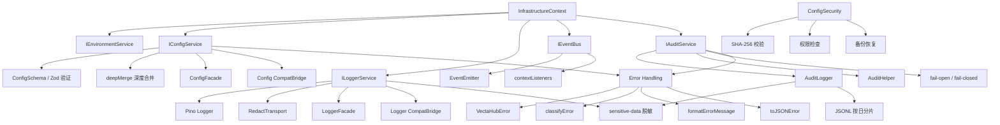

# Infrastructure 增强功能设计

> Document Status: Current Implementation / Architecture Design
> Authority: Infrastructure 模块的增强功能设计文档，包括审计系统、配置管理、错误处理、结构化日志、依赖注入容器和事件总线。

## 概述

Infrastructure 模块是 VectaHub 的基础层，为上层模块（Workflow Engine、Sandbox、CLI 等）提供横切关注点支持。为提高模块的可测试性、可维护性和安全性，我们对基础设施层进行了多项增强，核心改进包括：依赖注入容器、接口驱动的服务设计、Facade + Compat-Bridge 分层架构、Zod Schema 验证、敏感数据脱敏和 fail-open / fail-closed 错误隔离策略。

## 增强功能

### 1. 审计系统

**文件**: `src/infrastructure/audit/index.ts`, `src/infrastructure/audit/service.ts`, `src/infrastructure/audit/env-audit.ts`

审计系统负责记录系统中所有关键操作，支持结构化事件记录、敏感数据自动脱敏、按日期分片存储和多维度查询。

#### 事件类型

```typescript
enum AuditEventType {
  CLI_COMMAND = 'CLI_COMMAND',
  CLI_OUTPUT = 'CLI_OUTPUT',
  WORKFLOW_START = 'WORKFLOW_START',
  WORKFLOW_END = 'WORKFLOW_END',
  WORKFLOW_STEP = 'WORKFLOW_STEP',
  SANDBOX_DETECT = 'SANDBOX_DETECT',
  SECURITY_ALERT = 'SECURITY_ALERT',
  SECURITY_ACTION = 'SECURITY_ACTION',
  CONFIG_CHANGE = 'CONFIG_CHANGE',
  FILE_OPERATION = 'FILE_OPERATION',
  INTENT_MATCH = 'INTENT_MATCH',
  EXECUTOR_RESULT = 'EXECUTOR_RESULT',
  ENV_AUDIT = 'ENV_AUDIT',
}
```

#### 配置选项

```typescript
interface AuditEvent {
  event: AuditEventType;
  timestamp: string;
  sessionId: string;
  user?: string;
  module: string;
  action: string;
  input?: unknown;
  output?: unknown;
  duration?: number;
  success: boolean;
  error?: string;
  metadata?: Record<string, unknown>;
}
```

#### 使用示例

```typescript
// 通过依赖注入创建 AuditService
const auditService = new AuditService(environmentService, {
  sessionId: 'sess_123',
  failureMode: 'fail-open',
  onError: (error) => logger.error({ error }, 'Audit write failed'),
});

// 获取便捷方法集
const helper = auditService.getHelper();

// 记录 CLI 命令
helper.cliCommand('git', ['status'], 'sess_123');

// 记录工作流执行
helper.workflowStart('wf-001', 'deploy to staging', 'sess_123');
helper.workflowStep('step-1', 'docker', ['build', '.'], 'sess_123');
helper.workflowEnd('wf-001', 'COMPLETED', 5200, 'sess_123');

// 记录安全事件
helper.securityAlert('RULE-001', 'rm -rf /', 'critical', 'sess_123');
helper.sandboxDetect('rm -rf /', true, 'CRITICAL', 'sess_123');

// 查询审计日志
const logger = auditService.getLogger();
const events = logger.query({
  eventType: 'SECURITY_ALERT',
  module: 'Security',
  limit: 50,
});

// 导出审计日志
const csv = logger.export('csv');
const json = logger.export('json');
```

#### Fail-Open / Fail-Closed 错误隔离

```typescript
// fail-open: 审计写入失败时记录错误并继续执行（默认模式）
const service = new AuditService(env, {
  failureMode: 'fail-open',
  onError: (err) => logger.warn({ error: err }, 'Audit degraded'),
});

// fail-closed: 审计写入失败时抛出异常，适用于必须保留审计完整性的入口
const service = new AuditService(env, {
  failureMode: 'fail-closed',
});
```

#### 环境审计

```typescript
// 检测运行环境的沙箱就绪状态
const result = await performEnvAudit();

// result 包含：
// - platform: 'darwin' | 'linux' | ...
// - linuxKernel: { userNamespaces, cgroupsV2 }
// - shell: { uid, isRoot, hasSudo }
// - toolchain: { git, node, docker }
// - sandboxReadiness: 'READY' | 'DEGRADED' | 'NOT_SUPPORTED'
// - reasons: string[]
```

#### 实现细节

- 使用 JSONL 格式按日期分片存储审计日志（`YYYY-MM-DD.jsonl`）
- 写入前自动调用 `redactSensitiveData()` 脱敏敏感字段（input、output、error、metadata）
- 支持通过 `VECTAHUB_AUDIT_DISABLED=1` 环境变量禁用审计
- `AuditService` 封装 `AuditLogger` 并添加错误隔离层，所有便捷方法均经过 `runAuditHelperCall` 包装
- `AuditHelper` 接口提供 13 个语义化便捷方法，覆盖 CLI、工作流、安全、配置、NLP、文件操作等场景
- `createNoopAuditHelper()` 提供空实现用于测试

### 2. 配置管理

**文件**: `src/infrastructure/config/schema.ts`, `src/infrastructure/config/service.ts`, `src/infrastructure/config/facade.ts`, `src/infrastructure/config/compat-bridge.ts`

配置管理系统使用 Zod Schema 进行运行时类型验证，支持深度合并默认配置、增量更新、缓存和依赖注入。

#### 配置 Schema

```typescript
const ConfigSchema = z.object({
  version: z.number().default(1),
  first_run_completed: z.boolean().default(false),
  sandbox: SandboxConfigSchema,
  ai: AIConfigSchema,
  ai_providers: z.record(z.string(), AIProviderConfigSchema),
  ai_modules: z.record(z.string(), AIModuleConfigSchema),
  external_cli: z.record(z.string(), ExternalCLIConfigSchema),
  cli_tools: CLIToolsConfigSchema,
  storage: StorageConfigSchema,
  priority: z.array(z.string()),
});

type Config = z.infer<typeof ConfigSchema>;
```

#### Facade 依赖契约

```typescript
interface ConfigFacadeDeps {
  environment: IEnvironmentService;
  config: IConfigService;
}

// 基于显式依赖的 API
loadConfigWithDeps(deps, configPath?);
getDefaultConfigWithDeps(deps);
saveConfigWithDeps(deps, config, configPath?);
updateConfigWithDeps(deps, patch, configPath?);
```

#### 使用示例

```typescript
// 推荐：通过 InfrastructureContext 注入
const ctx = new InfrastructureContext();
const config = ctx.config.getConfig();

// 增量更新配置
const updated = ctx.config.updateConfig({
  sandbox: { enabled: true, mode: 'RELAXED', defaultPolicy: 'prompt' },
});

// Facade API（显式依赖注入）
const config = loadConfigWithDeps({
  environment: envService,
  config: configService,
}, '/custom/path/config.yaml');

// 兼容桥接层（向后兼容，已标记 @deprecated）
const config = loadConfig();
```

#### 实现细节

- 使用 Zod Schema 对所有配置字段进行运行时验证，包括嵌套对象和联合类型
- `loadConfig()` 自动合并默认配置和用户配置（深度合并），确保缺失字段有合理默认值
- 所有写入操作（`saveConfig`、`updateConfig`）均在持久化前强制执行 Zod 验证
- 配置文件使用 YAML 格式存储
- `getConfig()` 支持内存缓存，避免重复读取磁盘
- `reloadConfig()` 强制从磁盘重新加载
- Facade + Compat-Bridge 分层：Facade 接受显式依赖，Compat-Bridge 通过 `getDefaultContext()` 桥接历史 API
- `deepMerge` 递归合并嵌套对象，非对象值直接覆盖

### 3. 错误处理

**文件**: `src/infrastructure/errors/index.ts`

集中式错误处理模块提供统一的错误类型分类、错误消息格式化和 JSON 错误响应生成。

#### 错误类型枚举

```typescript
enum ErrorType {
  CONFIGURATION = 'CONFIGURATION',
  PERMISSION = 'PERMISSION',
  FILESYSTEM = 'FILESYSTEM',
  RUNTIME = 'RUNTIME',
  SECURITY = 'SECURITY',
  UNKNOWN = 'UNKNOWN',
}
```

#### 核心接口

```typescript
interface JSONErrorResponse {
  ok: false;
  error: {
    code: string;
    message: string;
    type: ErrorType;
    details?: unknown;
  };
}
```

#### 使用示例

```typescript
// 抛出带类型的错误
throw new VectaHubError(
  '配置文件格式无效',
  ErrorType.CONFIGURATION,
  originalError,
);

// 自动分类未知错误
const classified = classifyError(unknownError);
// => { type: ErrorType.PERMISSION, message: 'EACCES: permission denied', cause: ... }

// 格式化用户友好的错误消息
const message = formatErrorMessage(error, 'ConfigLoader');
// => '[ConfigLoader] 配置错误: Configuration validation failed'

// 生成 JSON 错误响应（用于 CLI --json 模式）
const response = toJSONError(error, false);
// => { ok: false, error: { code: 'CONFIGURATION', message: '...', type: 'CONFIGURATION' } }
```

#### 实现细节

- `VectaHubError` 继承 `Error`，增加 `type`（`ErrorType`）和 `cause`（原始错误）字段
- `classifyError()` 通过消息关键词匹配自动将原生错误分类为对应 `ErrorType`：
  - `permission` / `eacces` → `PERMISSION`
  - `enoent` / `file not found` → `FILESYSTEM`
  - `config` / `configuration` / `invalid` → `CONFIGURATION`
  - `security` / `blocked` / `forbidden` → `SECURITY`
  - 其他 → `RUNTIME`
  - 非 Error 类型 → `UNKNOWN`
- `formatErrorMessage()` 生成带上下文前缀的中文错误消息
- `toJSONError()` 生成结构化 JSON 响应，可选包含 stack trace
- 所有 Infrastructure 模块统一使用 `VectaHubError` 替代原生 `Error`

### 4. 日志系统

**文件**: `src/infrastructure/logger/service.ts`, `src/infrastructure/logger/facade.ts`, `src/infrastructure/logger/redact-transport.ts`, `src/infrastructure/logger/json-mode.test.ts`

基于 Pino 的结构化日志系统，支持控制台和文件双输出、敏感数据脱敏、日志级别动态调整和静音模式。

#### 配置选项

```typescript
interface ILoggerService {
  getLogger(prefix?: string): pino.Logger;
  createConsoleLogger(prefix?: string): pino.Logger;
  createFileLogger(prefix?: string): pino.Logger;
  setLogLevel(level: pino.Level | 'silent'): void;
  getLogLevel(): pino.Level | 'silent';
  setMuted(muted: boolean): void;
  isMuted(): boolean;
}

enum LogLevel {
  DEBUG = 0,
  INFO = 1,
  WARN = 2,
  ERROR = 3,
}
```

#### 使用示例

```typescript
// 通过 InfrastructureContext 获取 logger
const ctx = new InfrastructureContext();
const logger = ctx.logger.getLogger('workflow');

logger.info({ workflowId: 'wf-001' }, 'Workflow started');
logger.error({ error: err, stepId: 'step-1' }, 'Step failed');
logger.debug({ config }, 'Loaded config');

// 动态调整日志级别
ctx.logger.setLogLevel('debug');

// 静音模式（测试环境）
ctx.logger.setMuted(true);

// 创建文件 logger（自动按日期分文件）
const fileLogger = ctx.logger.createFileLogger('audit');
// 日志文件：logs/app/YYYY-MM-DD.log 和 logs/error/YYYY-MM-DD.json

// Facade API（显式依赖注入）
const logger = getLoggerWithDeps({ logger: loggerService }, 'my-module');
```

#### JSON 模式保证

```typescript
// --json 模式下 stdout 只输出纯 JSON，日志写入 stderr
// 通过 pino.destination(2) 确保日志不污染 stdout
// 测试验证：json-mode.test.ts 确保 stdout 无日志前缀
```

#### 实现细节

- 基于 Pino 日志库，支持高性能结构化日志
- 控制台 logger 在开发环境自动使用 `pino-pretty` 格式化（加载失败则回退到普通输出）
- 文件 logger 使用三路输出：stdout、应用日志文件（按日期）、错误日志文件（按日期）
- `formatters.log` 对所有字符串字段自动调用 `redactString()` 脱敏敏感数据
- `RedactTransport` 提供 Pino transport 包装，在写入前对整条日志消息执行脱敏
- `loggerCache` 缓存已创建的 logger 实例，避免重复创建
- `getEffectiveLevel()` 在静音模式下返回 `'silent'`
- Facade + Compat-Bridge 分层与 Config 模块一致

### 5. 依赖注入容器

**文件**: `src/infrastructure/context.ts`

`InfrastructureContext` 作为统一的依赖注入容器，管理所有基础设施服务的生命周期和依赖关系。

#### 配置选项

```typescript
class InfrastructureContext {
  readonly environment: IEnvironmentService;
  readonly config: IConfigService;
  readonly logger: ILoggerService;
  readonly eventBus: IEventBus;

  constructor(options?: {
    environment?: IEnvironmentService;
    config?: IConfigService;
    logger?: ILoggerService;
    eventBus?: IEventBus;
    audit?: IAuditService;
  });

  get audit(): IAuditService;
  with(overrides: Partial<{...}>): InfrastructureContext;
}
```

#### 使用示例

```typescript
// 使用默认实现
const ctx = new InfrastructureContext();

// 注入自定义实现（测试场景）
const ctx = new InfrastructureContext({
  environment: mockEnvService,
  logger: mockLoggerService,
  config: mockConfigService,
});

// 局部覆盖（不修改原实例）
const testCtx = ctx.with({
  logger: silentLogger,
  audit: noopAuditService,
});

// 懒加载 AuditService
const audit = ctx.audit; // 首次访问时创建

// 全局默认上下文（向后兼容）
const defaultCtx = getDefaultContext();
setDefaultContext(customContext); // 用于测试
resetDefaultContext(); // 测试清理
```

#### 实现细节

- 所有服务通过构造函数注入，未提供时使用默认实现
- `audit` 属性使用 `??=` 懒加载，首次访问时创建 `AuditService`
- AuditService 的 `onError` 回调自动接入 `logger`，实现错误日志联动
- `with()` 方法创建新实例，原实例不可变，支持测试时局部替换
- `getDefaultContext()` / `setDefaultContext()` / `resetDefaultContext()` 提供全局单例管理
- Compat-Bridge 层通过 `getDefaultContext()` 桥接历史无参 API

### 6. 事件总线

**文件**: `src/infrastructure/event/bus.ts`

基于 Node.js EventEmitter 的事件总线，支持上下文关联的监听器管理和批量注销。

#### 配置选项

```typescript
interface IEventBus {
  on(event: string, listener: EventListener, context?: unknown): void;
  once(event: string, listener: EventListener, context?: unknown): void;
  off(event: string, listener?: EventListener): void;
  offByContext(context: unknown): void;
  emit(event: string, ...args: unknown[]): void;
  getListenerCount(event: string): number;
  cleanup(): void;
}
```

#### 使用示例

```typescript
const eventBus = ctx.eventBus;

// 注册监听器（带上下文）
const handler = (data: unknown) => console.log('Workflow completed', data);
eventBus.on('workflow:complete', handler, workflowContext);

// 批量注销（按上下文）
eventBus.offByContext(workflowContext);

// 单独注销
eventBus.off('workflow:complete', handler);

// 一次性监听
eventBus.once('app:ready', () => console.log('Ready'));

// 查询监听器数量
const count = eventBus.getListenerCount('workflow:complete');

// 清理所有监听器
eventBus.cleanup();
```

#### 实现细节

- 基于 Node.js `EventEmitter` 封装
- `contextListeners` Map 跟踪上下文与监听器的关联关系，支持 `offByContext()` 批量注销
- `registeredListeners` Map 防止同一监听器重复注册
- `once()` 包装器自动在触发后清理注册记录和上下文关联
- `cleanup()` 清除所有监听器和内部状态
- 适用于模块间解耦通信，如工作流事件、配置变更通知等

### 7. 配置安全管理

**文件**: `src/infrastructure/security/config-security.ts`

配置安全管理模块提供配置文件的完整性校验、权限检查、变更检测和备份恢复。

#### 配置选项

```typescript
interface ConfigSecurityOptions {
  configPath?: string;
  enableChecksums?: boolean;
  enablePermissions?: boolean;
}

interface ConfigSecurityDeps {
  logger: pino.Logger;
  resolveStoragePath: ConfigSecurityPathResolver;
}
```

#### 使用示例

```typescript
const security = new ConfigSecurity({
  deps: { logger, resolveStoragePath: getVectaHubPath },
  enableChecksums: true,
  enablePermissions: true,
});

// 验证配置文件完整性
const { valid, hash } = await security.verifyConfigIntegrity();

// 检查文件权限
const { secure, permissions } = await security.checkFilePermissions();

// 强制设置安全权限（600）
await security.enforceSecurePermissions();

// 扫描所有安全问题
const status = await security.scanSecurityIssues();
// => { secure: false, issues: [...], lastChecked: '...' }

// 检测配置变更
const change = await security.detectChanges();
// => { timestamp, type: 'modify', oldHash, newHash, detectedBy }

// 备份和恢复
const backupPath = await security.backupConfig();
await security.restoreConfig(backupPath);
```

#### 实现细节

- 使用 SHA-256 哈希校验配置文件完整性
- 哈希值持久化存储在 `.config-hashes.json` 文件中
- 文件权限检查：仅允许用户读写（group 和 other 仅允许 read 或 none）
- `enforceSecurePermissions()` 强制设置 `chmod 600`
- `scanSecurityIssues()` 综合检查权限和完整性，返回结构化问题列表（severity: low / medium / high / critical）
- `detectChanges()` 对比当前哈希与存储哈希，检测外部篡改
- 备份文件自动应用安全权限
- 显式依赖校验：构造时校验 `logger` 和 `resolveStoragePath` 是否存在，缺失直接抛出 `VectaHubError`

## 架构图



## 性能影响

### 审计系统

- **优点**: JSONL 追加写入性能高，按日分片避免单文件过大
- **缺点**: `query()` 需要扫描多个日志文件，大量日志时查询较慢
- **建议**: 生产环境中使用 `limit` 参数限制查询范围；对于高频审计场景，可考虑异步写入或批量缓冲

### 配置管理

- **优点**: Zod 验证在启动时一次性完成，内存缓存避免重复读取磁盘
- **缺点**: Zod Schema 解析有微小开销（通常 < 1ms）
- **建议**: 在启动时完成配置加载和验证，运行时使用缓存；避免在热路径中调用 `reloadConfig()`

### 错误处理

- **优点**: 统一的错误分类和格式化减少重复代码
- **缺点**: `classifyError()` 使用字符串匹配，存在误分类风险
- **建议**: 优先使用 `VectaHubError` 明确指定错误类型，仅在捕获未知错误时依赖自动分类

### 日志系统

- **优点**: Pino 是 Node.js 生态中性能最优的日志库之一，结构化日志便于后续分析
- **缺点**: `pino-pretty` 在开发环境增加格式化开销；文件日志增加 I/O
- **建议**: 生产环境使用 JSON 格式日志；通过 `setMuted(true)` 或 `setLogLevel('warn')` 在测试环境减少日志输出

### 依赖注入容器

- **优点**: 懒加载避免未使用的服务占用资源；`with()` 方法支持轻量级局部替换
- **缺点**: 每次 `with()` 调用创建新实例，频繁调用时有微小内存开销
- **建议**: 在应用顶层创建一次 `InfrastructureContext`，通过参数传递到各模块；测试中使用 `with()` 替换特定服务

### 事件总线

- **优点**: 上下文关联的批量注销避免内存泄漏
- **缺点**: `createKey()` 使用 `toString().slice(0, 100)` 生成键，匿名函数可能产生键冲突
- **建议**: 使用具名函数作为监听器；在模块销毁时调用 `offByContext()` 批量清理

## 测试覆盖

所有增强功能都有完整的测试覆盖：

- `src/infrastructure/audit/index.test.ts`: 审计日志器核心功能测试
- `src/infrastructure/audit/service.test.ts`: AuditService 测试（fail-open / fail-closed 模式）
- `src/infrastructure/config/config.test.ts`: 配置加载、验证、合并测试
- `src/infrastructure/config/service.test.ts`: ConfigService 测试（Zod 验证、缓存、增量更新）
- `src/infrastructure/errors/index.test.ts`: 错误分类、格式化、JSON 响应测试
- `src/infrastructure/logger/json-mode.test.ts`: JSON 模式输出纯净性测试（3 个用例）
- `src/infrastructure/trace/context.test.ts`: 链路上下文测试
- `src/infrastructure/trace/tracer.test.ts`: Tracer 测试
- `src/infrastructure/trace-audit/alert-system.test.ts`: 告警系统测试
- `src/infrastructure/trace-audit/async-writer.test.ts`: 异步写入器测试
- `src/infrastructure/trace-audit/query-engine.test.ts`: 查询引擎测试
- `src/infrastructure/trace-audit/system.test.ts`: 链路审计系统测试
- `src/infrastructure/trace-audit/trace-core.test.ts`: 链路核心测试

**覆盖目标**: Infrastructure 模块 >= 70%

## 最佳实践

### 1. 审计系统

```typescript
// ✅ 推荐：通过依赖注入使用 AuditService
const auditService = new AuditService(env, {
  failureMode: 'fail-open',
  onError: (err) => logger.warn({ error: err }, 'Audit degraded'),
});
const helper = auditService.getHelper();
helper.cliCommand('git', ['status'], sessionId);

// ❌ 避免：使用已废弃的全局单例
import { audit } from './infrastructure/audit/index.js';
audit.cliCommand('git', ['status'], sessionId); // @deprecated
```

### 2. 配置管理

```typescript
// ✅ 推荐：通过 InfrastructureContext 获取配置
const ctx = new InfrastructureContext();
const config = ctx.config.getConfig();
const updated = ctx.config.updateConfig({ sandbox: { enabled: false, mode: 'STRICT', defaultPolicy: 'block' } });

// ❌ 避免：直接调用 compat-bridge 全局函数
import { loadConfig, saveConfig } from './infrastructure/config/index.js';
const config = loadConfig(); // @deprecated，无依赖注入
```

### 3. 错误处理

```typescript
// ✅ 推荐：使用 VectaHubError 明确错误类型
throw new VectaHubError(
  `配置文件不存在: ${path}`,
  ErrorType.FILESYSTEM,
  originalError,
);

// ❌ 避免：抛出无类型的原生 Error
throw new Error(`File not found: ${path}`); // classifyError 只能靠关键词猜测
```

### 4. 日志系统

```typescript
// ✅ 推荐：通过 InfrastructureContext 获取 logger，使用结构化字段
const logger = ctx.logger.getLogger('workflow');
logger.info({ workflowId, stepCount: steps.length }, 'Workflow started');

// ❌ 避免：使用 console.log 或字符串拼接日志
console.log(`Workflow ${workflowId} started with ${steps.length} steps`);
// 无法结构化查询、无级别控制、无脱敏
```

### 5. 依赖注入容器

```typescript
// ✅ 推荐：使用 with() 进行测试替换
const testCtx = ctx.with({
  logger: createNoopLogger(),
  audit: createNoopAuditService(),
});

// ❌ 避免：修改全局默认上下文后忘记重置
setDefaultContext(testContext);
// ... 测试代码 ...
// 忘记调用 resetDefaultContext()，污染后续测试
```

### 6. 事件总线

```typescript
// ✅ 推荐：使用 context 参数支持批量注销
eventBus.on('data:change', handleChange, this);
// 组件销毁时
eventBus.offByContext(this);

// ❌ 避免：注册监听器后不注销，导致内存泄漏
eventBus.on('data:change', (data) => {
  this.update(data);
});
// 组件销毁后监听器仍然存在
```

### 7. Facade vs Compat-Bridge

```typescript
// ✅ 推荐：新代码使用 Facade API（显式依赖注入）
import { loadConfigWithDeps, type ConfigFacadeDeps } from './config/facade.js';

function initApp(deps: ConfigFacadeDeps) {
  const config = loadConfigWithDeps(deps);
  // ...
}

// ❌ 避免：新代码使用 Compat-Bridge（已标记 @deprecated）
import { loadConfig } from './config/compat-bridge.js';
const config = loadConfig(); // 隐式依赖全局默认上下文
```

## 相关文档

- [Agent Runtime 增强功能设计](./agent-runtime-enhancements.md)
- [Agent CLI 注册与 Runtime 架构设计](./agent-cli-runtime-architecture.md)
- [Agent 操作规范](../agent-operating-guide.md)
