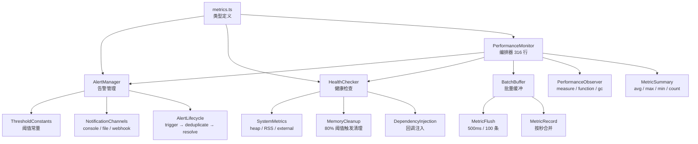

# Monitoring 增强功能设计

> Document Status: Current Implementation / Architecture Design
> Authority: Monitoring 模块的增强功能设计文档，包括告警管理、健康检查、指标收集和 Monitor 重构。

## 概述

Monitoring 模块是 VectaHub 的性能监控核心，负责指标采集、阈值告警、系统健康检查和历史数据管理。为了提高模块的可维护性和单一职责原则，我们将原有的 `PerformanceMonitor` 拆分为三个独立组件：`AlertManager`、`HealthChecker` 和 `PerformanceMonitor`（编排器），同时新增了指标聚合和阈值常量体系。

## 增强功能

### 1. Alert Manager — 基于阈值的告警管理

**文件**: `src/monitoring/alert-manager.ts`

`AlertManager` 从 `PerformanceMonitor` 中提取，专门负责阈值评估、告警生命周期管理和通知分发。支持 warning/critical 两级告警，告警去重和自动恢复。

#### 阈值常量

```typescript
const CPU_USAGE_WARNING_MAX = 80;
const CPU_USAGE_CRITICAL_MAX = 95;
const MEMORY_USAGE_WARNING_MAX = 85;
const MEMORY_USAGE_CRITICAL_MAX = 95;
const RESPONSE_TIME_WARNING_MAX = 1000;   // ms
const RESPONSE_TIME_CRITICAL_MAX = 5000;  // ms
const SUCCESS_RATE_WARNING_MIN = 95;      // %
const SUCCESS_RATE_CRITICAL_MIN = 90;     // %
const CACHE_HIT_RATE_WARNING_MIN = 50;    // %
const ERROR_RATE_WARNING_MAX = 5;         // %
```

#### 配置接口

```typescript
interface AlertConfig {
  enabled: boolean;
  thresholds: MetricThreshold[];
  notificationChannels: ('console' | 'file' | 'webhook')[];
  webhookUrl?: string;
}

interface MetricThreshold {
  type: MetricType;
  warning?: { min?: number; max?: number };
  critical?: { min?: number; max?: number };
}

interface Alert {
  id: string;
  type: 'warning' | 'critical' | 'info';
  message: string;
  timestamp: number;
  metricType: MetricType;
  currentValue: number;
  threshold: number;
  resolved: boolean;
}
```

#### 使用示例

```typescript
import { AlertManager, DEFAULT_ALERT_CONFIG } from './alert-manager.js';

const alertManager = new AlertManager({
  logger,
  getLogDir: () => '/var/log/vectahub',
  config: {
    ...DEFAULT_ALERT_CONFIG,
    notificationChannels: ['console', 'file'],
  },
});

// 评估指标是否触发告警
alertManager.checkAlerts(recentMetrics);

// 获取当前活跃告警
const activeAlerts = alertManager.getAlerts(false);

// 获取已恢复告警
const resolvedAlerts = alertManager.getAlerts(true);

// 动态更新配置
alertManager.updateConfig({
  ...DEFAULT_ALERT_CONFIG,
  enabled: false,
});
```

#### 实现细节

- **告警去重**: 同一 `metricType` + 同一 `type`（warning/critical）只保留一个活跃告警，避免重复通知
- **告警恢复**: 当指标回归正常范围时，自动标记原告警为 `resolved`，并生成一条 `info` 类型的恢复通知
- **通知渠道**: 支持三种通知渠道：
  - `console`: 通过 pino logger 输出（critical → error, warning → warn, info → info）
  - `file`: 按日期写入 `alerts-YYYY-MM-DD.log` 文件
  - `webhook`: 通过 `fetch` POST JSON 到配置的 `webhookUrl`
- **阈值评估优先级**: critical 优先于 warning，同时支持 `max`（超过阈值）和 `min`（低于阈值）两种方向

### 2. Health Checker — 系统健康检查

**文件**: `src/monitoring/health-checker.ts`

`HealthChecker` 从 `PerformanceMonitor` 中提取，专门负责系统级指标采集和内存压力下的历史数据清理。

#### 阈值常量

```typescript
const MAX_MEMORY_USAGE_PERCENT = 80;  // 内存使用率触发清理的阈值
const MIN_HISTORY_SIZE = 10;          // 清理后最少保留的历史记录数
const CLEANUP_FACTOR = 0.5;           // 清理比例（保留 50%）
```

#### 使用示例

```typescript
import { HealthChecker } from './health-checker.js';

const healthChecker = new HealthChecker({
  logger,
  getMetricsLength: () => metricsStore.length,
  trimMetrics: (targetSize) => { metricsStore = metricsStore.slice(-targetSize); },
  addMetricRecords: (metrics) => metricsStore.push(...metrics),
  recordMetric: (type, value, unit) => { /* 记录单条指标 */ },
});

// 采集系统指标（heap, RSS, external memory）
healthChecker.collectSystemMetrics();

// 检查内存使用率，必要时清理历史数据
healthChecker.checkMemoryUsage();

// 获取当前内存使用信息
const { usedMB, totalMB, percent } = healthChecker.getMemoryUsage();
```

#### 实现细节

- **系统指标采集**: 通过 `process.memoryUsage()` 和 `os.totalmem()` 采集五类指标：
  - `memory_used`: 堆内存使用量（MB）
  - `memory_total`: 系统总内存（MB）
  - `memory_usage`: 内存使用率（%）
  - `external_memory`: V8 外部内存（MB）
  - `rss_memory`: 常驻内存集（MB）
- **内存压力清理**: 当内存使用率超过 80% 且历史记录数大于 10 时，自动裁剪至 50% 的历史记录
- **依赖注入**: 通过构造函数注入回调函数（`getMetricsLength`、`trimMetrics`、`addMetricRecords`、`recordMetric`），与 `PerformanceMonitor` 解耦

### 3. Metrics Collection — 指标类型与聚合

**文件**: `src/monitoring/metrics.ts`

定义了完整的指标类型体系、阈值接口和聚合统计结构，作为整个 Monitoring 模块的类型基础。

#### 指标类型

```typescript
type MetricType =
  | 'cpu_usage'
  | 'memory_usage'
  | 'memory_total'
  | 'memory_used'
  | 'response_time'
  | 'execution_time'
  | 'queue_length'
  | 'error_count'
  | 'error_rate'
  | 'success_rate'
  | 'cache_hit_rate'
  | 'external_memory'
  | 'rss_memory'
  | 'memory_cleanup';
```

#### 聚合统计

```typescript
interface MetricSummaryEntry {
  avg: number;
  max: number;
  min: number;
  count: number;
}

type MetricSummary = Record<string, MetricSummaryEntry>;
```

#### 使用示例

```typescript
import type { PerformanceMetric, MetricRecord, MetricSummary } from './metrics.js';

// 记录单条指标
const metric: PerformanceMetric = {
  timestamp: Date.now(),
  type: 'response_time',
  value: 250,
  unit: 'ms',
  tags: { operation: 'workflow-execution' },
};

// 获取聚合统计
const summary: MetricSummary = monitor.getSummary();
// summary.response_time → { avg: 250, max: 250, min: 250, count: 1 }
```

#### 实现细节

- **类型安全**: `MetricType` 使用联合类型确保只有合法的指标类型被使用
- **批量记录**: `MetricRecord` 将同一时间窗口内的多条指标打包，减少存储开销
- **聚合计算**: `getSummary()` 遍历所有历史记录，按 `MetricType` 计算 avg、max、min、count
- **标签系统**: `PerformanceMetric.tags` 支持附加键值对上下文信息（如 operation name、label）

### 4. Monitor Refactoring — 编排器重构

**文件**: `src/monitoring/monitor.ts`

`PerformanceMonitor` 重构为轻量编排器，从原来的 409 行减少到 316 行，将告警逻辑委托给 `AlertManager`，系统健康检查委托给 `HealthChecker`。

#### 配置常量

```typescript
const MAX_HISTORY_SIZE = 1000;    // 最大历史批次记录数
const BATCH_FLUSH_INTERVAL = 500; // 批量刷新间隔（ms）
const BATCH_MAX_SIZE = 100;       // 批量缓冲区最大容量
```

#### 使用示例

```typescript
import { PerformanceMonitor } from './monitor.js';

const monitor = new PerformanceMonitor({
  logger,
  getLogDir: () => '/var/log/vectahub',
});

// 启动定期监控（默认 5 秒间隔）
monitor.start(5000);

// 记录指标（自动批量处理）
monitor.recordMetric('response_time', 150, 'ms', { operation: 'api-call' });
monitor.recordResponseTime(200, 'workflow-run');
monitor.recordExecutionTime('step-1', 50);

// 记录成功/失败（自动计算成功率）
monitor.incrementSuccess();
monitor.incrementError();

// 获取聚合统计
const summary = monitor.getSummary();

// 获取告警
const activeAlerts = monitor.getAlerts(false);

// 获取内存使用
const memInfo = monitor.getMemoryUsage();

// 配置管理
monitor.setConfig({ enabled: false });
monitor.setMaxHistorySize(500);

// 停止监控
monitor.stop();

// 重置所有状态
monitor.reset();
```

#### 实现细节

- **委托模式**: `PerformanceMonitor` 通过构造函数创建 `AlertManager` 和 `HealthChecker` 实例，将职责明确分离
- **批量缓冲**: 指标先写入 `batchBuffer`，当缓冲区满（100 条）或超时（500ms）后批量刷入历史记录
- **记录合并**: 同一秒内的刷入操作会合并到同一个 `MetricRecord` 中，减少存储碎片
- **历史裁剪**: 历史记录超过 `MAX_HISTORY_SIZE`（1000）时自动移除最早的记录
- **PerformanceObserver 集成**: 自动监听 `measure`、`function`、`gc` 类型的性能条目并转换为指标
- **历史大小可配**: `setMaxHistorySize()` 支持动态调整，范围 [10, 1000]

## 架构图



## 性能影响

### Alert Manager

- **优点**: 阈值评估为 O(n×m)（n=指标数, m=阈值数），常量级开销；告警去重避免重复通知
- **缺点**: webhook 通知为异步网络调用，失败时仅记录日志不阻塞主流程
- **建议**: 生产环境建议使用 `file` 渠道代替 `webhook` 进行持久化记录，webhook 作为补充通知手段

### Health Checker

- **优点**: 自动清理机制防止内存持续增长，清理比例为 50% 保证数据连续性
- **缺点**: `process.memoryUsage()` 调用有一定开销，不建议频率低于 1 秒
- **建议**: 监控间隔保持 5 秒以上，清理阈值（80%）可根据实际内存环境调整

### Metrics Collection

- **优点**: 批量缓冲减少 I/O 频率，同秒合并减少记录碎片
- **缺点**: `MAX_HISTORY_SIZE=1000` 在高频记录下可能占用较多内存
- **建议**: 通过 `setMaxHistorySize()` 根据实际场景调整上限；测试环境自动同步刷入（`NODE_ENV=test`）

### Monitor Refactoring

- **优点**: 从 409 行减少到 316 行（减少 22.7%），单一职责更清晰，便于独立测试
- **缺点**: 增加了对象间的引用开销（两个委托实例）
- **建议**: 委托实例在构造函数中一次性创建，运行时无额外分配开销

## 测试覆盖

所有增强功能都有完整的测试覆盖，测试文件位于 `src/monitoring/monitor.test.ts`：

| 测试组 | 测试用例数 | 覆盖范围 |
|--------|-----------|---------|
| PerformanceMonitor | 16 | 初始化、启停、指标记录、计数器、聚合统计、配置管理、历史大小 |
| AlertManager - threshold evaluation | 8 | cache_hit_rate、error_rate、cpu_usage、response_time、success_rate 的 warning/critical 触发 |
| AlertManager - alert lifecycle | 7 | 告警去重、自动恢复、恢复去重、禁用模式、无匹配阈值、多指标并发告警、reset |
| AlertManager - evaluateThreshold | 3 | max 方向阈值、min 方向阈值、正常范围恢复 |

**总计**: 34 个测试用例

关键测试场景：

- 告警触发后同一指标重复超限不会创建重复告警
- 指标恢复正常后自动生成 `info` 类型的恢复通知
- critical 阈值优先于 warning 阈值
- `enabled: false` 时跳过所有评估
- 无匹配阈值的指标类型被安全忽略

## 最佳实践

### 1. Alert Manager 配置

```typescript
// ✅ 推荐：使用默认阈值并按需覆盖
const alertManager = new AlertManager({
  logger,
  getLogDir: () => logDir,
  config: {
    ...DEFAULT_ALERT_CONFIG,
    notificationChannels: ['console', 'file'],
  },
});

// ❌ 避免：禁用告警后不记录任何监控数据
const alertManager = new AlertManager({
  logger,
  getLogDir: () => logDir,
  config: { enabled: false, thresholds: [], notificationChannels: [] },
});
```

### 2. Health Checker 依赖注入

```typescript
// ✅ 推荐：通过回调注入，保持 HealthChecker 与存储解耦
const healthChecker = new HealthChecker({
  logger,
  getMetricsLength: () => store.length,
  trimMetrics: (size) => store.trim(size),
  addMetricRecords: (m) => store.append(m),
  recordMetric: (t, v, u) => store.record(t, v, u),
});

// ❌ 避免：将整个 store 引用传入（破坏封装性）
const healthChecker = new HealthChecker({
  logger,
  store: metricsStore,  // 不要这样做
});
```

### 3. Metrics 记录

```typescript
// ✅ 推荐：使用便捷方法并附加操作标签
monitor.recordResponseTime(150, 'workflow-step-1');
monitor.recordExecutionTime('parse-config', 45);

// ❌ 避免：高频直接调用 recordMetric 不加标签（难以聚合分析）
setInterval(() => {
  monitor.recordMetric('queue_length', queue.size, 'count');
  // 毫秒级调用会导致批量缓冲区频繁刷新
}, 10);
```

### 4. Monitor 生命周期

```typescript
// ✅ 推荐：在应用启动时 start，关闭时 stop 并 reset
const monitor = new PerformanceMonitor({ logger, getLogDir });
monitor.start(5000);

process.on('SIGTERM', () => {
  monitor.stop();
  monitor.reset();
  process.exit(0);
});

// ❌ 避免：忘记 stop 导致 setInterval 泄漏
monitor.start(5000);
// 应用退出前未调用 monitor.stop()
```

### 5. 历史大小管理

```typescript
// ✅ 推荐：根据内存预算设置合理上限
monitor.setMaxHistorySize(200);  // 约 200 个批次

// ❌ 避免：设置为 MAX_HISTORY_SIZE 且无内存监控
monitor.setMaxHistorySize(1000);  // 高频场景下可能占用大量内存
```

## 相关文档

- [Agent Runtime 增强功能设计](./agent-runtime-enhancements.md)
- [Agent CLI 注册与 Runtime 架构设计](./agent-cli-runtime-architecture.md)
- [Agent 操作规范](../agent-operating-guide.md)
