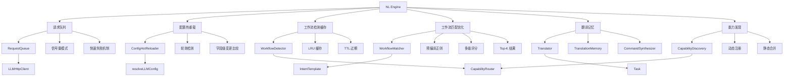

# NL Engine 增强功能设计

> Document Status: Current Implementation / Target Design / Migration Contract
> Authority: NL Engine 模块的增强功能设计文档，包括请求队列、配置热重载、工作流检测缓存、工作流匹配优化、翻译记忆和能力发现。

## 概述

NL Engine 是 VectaHub 的自然语言处理核心模块，负责将用户输入的自然语言转换为可执行的工作流。该模块涵盖意图识别、实体提取、命令合成和工作流路由等关键环节。为了提高模块的性能、可靠性和可扩展性，我们对以下六个子系统进行了增强：

1. **请求队列** — 控制并发 LLM HTTP 请求，防止服务过载
2. **配置热重载** — 监听配置文件变更并自动重新加载
3. **工作流检测缓存** — 缓存工作流检测结果，避免重复计算
4. **工作流匹配优化** — 预编译正则 + 多级评分的高性能匹配算法
5. **翻译记忆** — 缓存意图到命令的翻译结果，避免重复翻译
6. **能力发现** — 动态注册和发现 Capability，支持运行时扩展

## 增强功能

### 1. 请求队列（Request Queue）

**文件**: `src/nl/llm-http-client.ts`

LLM HTTP 客户端内置请求队列管理器，使用信号量模式控制并发请求数。超出上限的请求进入等待队列，队列满或等待超时时快速失败，避免无限阻塞。

#### 配置选项

```typescript
interface RequestQueueOptions {
  maxConcurrent?: number;   // 最大并发请求数，默认 4
  maxQueueSize?: number;    // 等待队列最大长度，默认 16
  queueTimeoutMs?: number;  // 队列等待超时时间（毫秒），默认 30000
}
```

#### 使用示例

```typescript
import { RequestQueue, LLMHttpClient } from './llm-http-client.js';

const queue = new RequestQueue({
  maxConcurrent: 8,
  maxQueueSize: 32,
  queueTimeoutMs: 60_000,
});

const client = new LLMHttpClient(config, queue);

// 所有 HTTP 方法均通过队列调度
const response = await client.callOpenAICompatible(userInput, systemPrompt, tools);

// 监控队列状态
console.log('活跃请求数:', queue.activeCount);
console.log('等待队列长度:', queue.pendingCount);
```

#### 实现细节

- 使用信号量模式，通过 `running` 计数器跟踪活跃请求数
- `enqueue()` 方法在并发未满时直接执行，否则入队等待
- `flushNext()` 在每个任务完成后检查队列，调度下一批等待请求
- 队列满时立即抛出 `Request queue full` 错误
- 等待超时时抛出 `Request queue timeout` 错误，包含实际等待时长和限制值
- 所有公共 HTTP 方法（`callOpenAICompatible`、`callAnthropic`、`callOpenAICompatibleRaw`、`callAnthropicRaw`、`callOpenAICompatibleChat`、`callAnthropicChat`、`embed`）均通过队列调度

### 2. 配置热重载（Config Hot-Reloading）

**文件**: `src/nl/llm-config.ts`

配置热重载管理器支持监听 LLM 配置文件变更并自动通知订阅者。采用轮询方式定期检查配置变化，通过字段级比较检测变更。

#### 配置选项

```typescript
interface HotReloadOptions {
  intervalMs?: number; // 轮询间隔（毫秒），默认 10000
}
```

#### 事件类型

```typescript
type LLMConfigState = 'unconfigured' | 'configured' | 'invalid';

interface LLMConfigResolution {
  state: LLMConfigState;
  config: LLMConfig | null;
  error?: VectaHubError;
}

type ConfigChangeListener = (resolution: LLMConfigResolution) => void;
```

#### 使用示例

```typescript
import { getConfigHotReloader } from './llm-config.js';

const reloader = getConfigHotReloader();

// 注册配置变更监听器
reloader.onChange((resolution) => {
  if (resolution.state === 'configured') {
    console.log('LLM 配置已更新:', resolution.config);
    // 重新初始化 LLM 客户端
    rebuildLLMClient(resolution.config);
  } else if (resolution.state === 'invalid') {
    console.error('LLM 配置无效:', resolution.error);
  }
});

// 启动热重载（10 秒轮询间隔）
reloader.start({ intervalMs: 10_000 });

// 手动触发检查
const changed = reloader.check();

// 获取当前缓存的配置
const current = reloader.getCurrent();

// 移除监听器
reloader.offChange(listener);

// 停止热重载
reloader.stop();
```

#### 实现细节

- 使用单例模式，通过 `getConfigHotReloader()` 获取全局实例
- 配置解析优先级：配置文件 > 环境变量
- 支持 4 种 LLM 提供商：`openai`、`anthropic`、`ollama`、`groq`
- 变更检测通过逐字段比较实现：`state`、`provider`、`model`、`baseUrl`、`apiKey`、`timeout`
- 监听器异常不会影响其他监听器的执行
- `start()` 时立即执行一次配置解析作为基线

### 3. 工作流检测缓存（Workflow Detection Cache）

**文件**: `src/nl/workflow-detector.ts`

工作流检测器内置 LRU + TTL 缓存，相同输入在 TTL 窗口内不会重复执行检测逻辑。缓存键基于归一化后的输入文本和项目上下文。

#### 配置选项

```typescript
interface WorkflowDetectorOptions {
  cacheTtlMs?: number;   // 缓存条目过期时间（毫秒），默认 60000
  maxCacheSize?: number; // 缓存最大条目数，默认 128
}
```

#### 使用示例

```typescript
import { WorkflowDetector } from './workflow-detector.js';

const detector = new WorkflowDetector({
  cacheTtlMs: 120_000,  // 2 分钟缓存
  maxCacheSize: 256,
});

// 第一次检测（执行完整检测逻辑）
const result1 = detector.detect('创建一个新文件 test.ts');

// 第二次相同输入（从缓存返回）
const result2 = detector.detect('创建一个新文件 test.ts');

// 带项目上下文的检测（不同 cwd 会产生不同的缓存条目）
const result3 = detector.detect('创建一个新文件 test.ts', { cwd: '/project-a' });

// 获取解析后的目标
const { result, goal } = detector.detectWithGoal('部署到生产环境');

// 清除过期缓存
const evicted = detector.evictExpired();
console.log(`清除了 ${evicted} 个过期条目`);

// 清除所有缓存
detector.clearCache();

// 查看缓存大小
console.log('缓存条目数:', detector.cacheSize);
```

#### 实现细节

- 输入归一化：`trim()` → `toLowerCase()` → 连续空白合并为单空格
- 缓存键格式：`{normalizedInput}::{cwd}`
- LRU 淘汰策略：缓存满时删除最早插入的条目
- TTL 过期检查：每次访问时检查 `Date.now() - cachedAt > ttlMs`
- LRU 触摸：命中时先删除再重新插入，更新 Map 中的顺序
- 提供 `detect()` 和 `detectWithGoal()` 两个入口，后者同时返回解析后的 `ParsedGoal`

### 4. 工作流匹配优化（Workflow Matcher Optimization）

**文件**: `src/nl/workflow-matcher.ts`

工作流匹配器提供高性能的意图匹配算法，通过预编译正则表达式、构建倒排索引和多级评分机制，显著提升匹配效率和准确率。

#### 配置选项

```typescript
interface MatchOptions {
  minScore?: number; // 最低分数阈值，默认 0.3
}

interface TopKOptions {
  k?: number;        // 返回结果数量，默认 3
  minScore?: number; // 最低分数阈值，默认 0.3
}
```

#### 使用示例

```typescript
import { WorkflowMatcher } from './workflow-matcher.js';

const matcher = new WorkflowMatcher();

// 单一最佳匹配
const best = matcher.match('帮我提交代码');
if (best) {
  console.log(`意图: ${best.intent}, 分数: ${best.score}, 分类: ${best.category}`);
}

// Top-K 匹配
const top3 = matcher.matchTopK('部署应用到服务器', { k: 3, minScore: 0.2 });
for (const candidate of top3) {
  console.log(`${candidate.intent}: ${candidate.score}`);
}

// 检查是否匹配特定意图
const isGitOp = matcher.matchesIntent('push 代码到远程仓库', 'GIT_WORKFLOW', 0.5);

// 查看已编译的模式数量
console.log('编译模式数:', matcher.patternCount);
```

#### 评分机制

匹配过程分为三个阶段：

| 阶段 | 权重 | 说明 |
|------|------|------|
| 模式匹配 | 0.7 × weight | 正则表达式匹配，按模板优先级加权 |
| 示例相似度 | 0.15 × hitCount（上限 0.4） | 输入词与示例词的交集计数 |
| 总分 | 累加 | 模式分数 + 示例分数 |

#### 实现细节

- **预编译正则**：构造时一次性编译所有模板的正则表达式，避免运行时重复编译
- **优先级排序**：编译后的模式按 `priority` 字段升序排列，高优先级模板先匹配
- **倒排索引**：构建示例词到意图的倒排索引，用于快速示例相似度计算
- **词级索引**：仅对长度 ≥ 2 的词建索引，过滤噪声
- **Top-K 过滤**：先过滤低于 `minScore` 的候选项，再按分数降序取前 K 个
- **多模式累加**：同一意图的多个模式匹配分数累加

### 5. 翻译记忆（Translation Memory）

**文件**: `src/nl/translator.ts`

翻译记忆库缓存意图到命令的翻译结果，避免对相同输入重复执行意图解析和命令合成。使用 LRU 淘汰策略和 TTL 过期机制管理缓存。

#### 配置选项

```typescript
interface TranslationMemoryOptions {
  maxSize?: number; // 最大缓存条目数，默认 256
  ttlMs?: number;   // 缓存条目过期时间（毫秒），默认 300000（5 分钟）
}
```

#### 使用示例

```typescript
import { Translator, TranslationMemory } from './translator.js';

// 方式一：直接使用 Translator（内部自动管理 TranslationMemory）
const translator = new Translator({
  maxMemorySize: 512,
  memoryTtlMs: 600_000, // 10 分钟
});

// 首次翻译（执行完整翻译逻辑）
const task1 = translator.translate('GIT_WORKFLOW', { BRANCH_NAME: ['main'] }, 'push 代码到 main');

// 相同输入（从缓存返回）
const task2 = translator.translate('GIT_WORKFLOW', { BRANCH_NAME: ['main'] }, 'push 代码到 main');

// 查看缓存统计
const stats = translator.getMemoryStats();
console.log(`缓存条目: ${stats.entries}, 总命中: ${stats.totalHits}`);

// 方式二：手动管理 TranslationMemory
const memory = new TranslationMemory({ maxSize: 1024, ttlMs: 120_000 });

const cached = memory.get(key);
if (!cached) {
  const task = createTask(intent, entities, input);
  memory.put(key, task);
}
```

#### 缓存键构建

翻译记忆的缓存键由三部分组成，确保精确匹配：

```
{intent}::{sorted_entities}::{normalized_input}
```

- `intent`：意图名称（如 `GIT_WORKFLOW`）
- `sorted_entities`：按实体类型字母序排列的 `key=value` 对，用 `;` 分隔
- `normalized_input`：原始输入经 `trim().toLowerCase()` 归一化

#### 实现细节

- LRU 淘汰策略：缓存满时删除最早插入的条目（Map 迭代顺序）
- TTL 过期检查：访问时检查 `Date.now() - translatedAt > ttlMs`
- 命中计数：每次命中时 `hitCount++`，用于统计和调试
- LRU 触摸：命中时先删除再重新插入
- `Translator` 封装了 `TranslationMemory` + `CommandSynthesizer`，提供统一的翻译接口
- 翻译流程：缓存查询 → `createTaskFromIntent()` → 缓存写入

### 6. 能力发现（Capability Discovery）

**文件**: `src/nl/capabilities/capability-discovery.ts`

能力发现器支持动态注册和发现新的 Capability，运行时可以通过 `register()` 注册新能力，也可以通过 `discover()` 批量发现。已注册的能力会被缓存，过期后自动清除。

#### 配置选项

```typescript
interface CapabilityDiscoveryOptions {
  ttlMs?: number; // 已注册能力的过期时间（毫秒），默认 300000（5 分钟）
}
```

#### 使用示例

```typescript
import { getCapabilityDiscovery } from './capability-discovery.js';

const discovery = getCapabilityDiscovery();

// 注册单个能力
discovery.register({
  id: 'custom-deploy',
  name: '自定义部署',
  matcher: (goal) => goal.action === 'deploy',
  handler: async (goal, context) => { /* ... */ },
}, 'plugin:deploy-plugin');

// 批量发现
const result = discovery.discover([
  { id: 'api-monitor', name: 'API 监控', /* ... */ },
  { id: 'log-analyzer', name: '日志分析', /* ... */ },
], 'config');

console.log(`发现 ${result.discovered.length} 个能力，总计 ${result.totalRegistered} 个`);

// 获取能力
const capability = discovery.get('custom-deploy');

// 检查能力是否存在
if (discovery.has('api-monitor')) {
  // ...
}

// 合并动态能力与静态能力（动态优先）
const allCapabilities = discovery.mergeWithStatic(staticCapabilities);

// 查看来源统计
const stats = discovery.getSourceStats();
// { 'plugin:deploy-plugin': 1, 'config': 2 }

// 注销能力
discovery.unregister('custom-deploy');

// 清除所有
discovery.clear();
```

#### 实现细节

- 使用单例模式，通过 `getCapabilityDiscovery()` 获取全局实例
- TTL 过期机制：每次访问时检查 `Date.now() - discoveredAt > ttlMs`
- 来源追踪：每个能力记录注册来源（`plugin:xxx`、`config`、`runtime`、`discovery`）
- 合并策略：动态注册的能力覆盖同名的静态能力
- `getAll()` 和 `size` 在返回前自动清除过期条目
- 空 ID 的能力注册返回 `false`

## 架构图



## 性能影响

### 请求队列

- **优点**: 防止 LLM 服务过载，避免并发请求导致的超时和限流
- **缺点**: 高负载时请求排队会增加延迟
- **建议**: 根据 LLM 服务的速率限制调整 `maxConcurrent`，根据用户容忍度调整 `queueTimeoutMs`

### 配置热重载

- **优点**: 配置变更无需重启服务，支持运行时切换 LLM 提供商
- **缺点**: 轮询机制产生周期性 I/O 开销
- **建议**: 开发环境使用较短间隔（5-10 秒），生产环境使用较长间隔（30-60 秒）

### 工作流检测缓存

- **优点**: 相同输入在 TTL 窗口内直接返回缓存结果，跳过完整的检测流程
- **缺点**: 增加内存使用，缓存过期前可能返回过时结果
- **建议**: 对于交互式场景使用较短 TTL（60 秒），对于批处理场景使用较长 TTL（5 分钟）

### 工作流匹配优化

- **优点**: 预编译正则避免运行时编译开销，倒排索引加速示例匹配
- **缺点**: 构造时一次性编译所有模式，模板数量多时初始化略慢
- **建议**: 模板数量超过 1000 时考虑分片加载

### 翻译记忆

- **优点**: 相同意图 + 实体 + 输入的组合直接返回缓存的 Task 对象
- **缺点**: 缓存键包含原始输入，微小的输入差异会导致缓存未命中
- **建议**: 确保上游传入的输入已经过归一化处理

### 能力发现

- **优点**: 支持运行时扩展 NL Engine 的处理能力，无需修改核心代码
- **缺点**: 动态能力的 TTL 过期后需要重新注册
- **建议**: 插件系统应在初始化时注册能力，并在插件卸载时调用 `unregister()`

## 测试覆盖

所有增强功能都有完整的测试覆盖：

| 模块 | 测试文件 | 用例数 | 覆盖内容 |
|------|----------|--------|----------|
| 请求队列 | `llm-http-client.test.ts` | 5 | 并发控制、队列满快速失败、超时拒绝、状态查询 |
| 配置热重载 | `llm-config.test.ts` | 4 | 启停控制、变更检测、监听器通知、手动触发 |
| 工作流检测缓存 | `workflow-detector.test.ts` | 4 | 缓存命中、TTL 过期、LRU 淘汰、上下文隔离 |
| 工作流匹配优化 | `workflow-matcher.test.ts` | 5 | 模式匹配、Top-K、示例相似度、阈值过滤、意图检查 |
| 翻译记忆 | `translator.test.ts` | 5 | 缓存命中、TTL 过期、命中统计、键构建、LRU 淘汰 |
| 能力发现 | `capability-discovery.test.ts` | 5 | 注册/注销、批量发现、静态合并、TTL 过期、来源统计 |

**总计**: 28 个测试用例

## 最佳实践

### 1. 请求队列

```typescript
// ✅ 推荐：根据 LLM 服务速率限制配置并发数
const queue = new RequestQueue({
  maxConcurrent: 4,       // 匹配服务端并发限制
  maxQueueSize: 16,       // 留足缓冲空间
  queueTimeoutMs: 30_000, // 用户可接受的等待上限
});

// ❌ 避免：并发数过高导致服务端限流
const queue = new RequestQueue({
  maxConcurrent: 50,     // 可能触发 429 错误
  maxQueueSize: 1000,    // 大量请求堆积
  queueTimeoutMs: 300_000, // 5 分钟超时过长
});
```

### 2. 配置热重载

```typescript
// ✅ 推荐：在应用启动时启动热重载，退出时停止
const reloader = getConfigHotReloader();
reloader.onChange(handleConfigChange);
reloader.start({ intervalMs: 10_000 });

process.on('SIGINT', () => {
  reloader.stop();
  process.exit(0);
});

// ❌ 避免：忘记停止热重载（进程无法正常退出）
const reloader = getConfigHotReloader();
reloader.start();
// 缺少 stop() 调用，轮询定时器阻止进程退出
```

### 3. 工作流检测缓存

```typescript
// ✅ 推荐：根据使用场景调整 TTL 和缓存大小
const detector = new WorkflowDetector({
  cacheTtlMs: 60_000,  // 1 分钟，适合交互式场景
  maxCacheSize: 128,   // 合理的内存占用
});

// ❌ 避免：TTL 过长导致返回过时的路由结果
const detector = new WorkflowDetector({
  cacheTtlMs: 3_600_000, // 1 小时，能力变更后可能返回旧结果
  maxCacheSize: 10_000,  // 内存占用过大
});
```

### 4. 工作流匹配优化

```typescript
// ✅ 推荐：使用 Top-K 获取多个候选结果，提高下游容错能力
const candidates = matcher.matchTopK(input, { k: 3, minScore: 0.3 });
if (candidates.length === 0) {
  // 无匹配，走 LLM 降级路径
} else if (candidates[0].score > 0.8) {
  // 高置信度，直接使用
} else {
  // 低置信度，结合 LLM 判断
}

// ❌ 避免：仅使用 match() 且阈值过低，导致误匹配
const result = matcher.match(input, { minScore: 0.1 }); // 0.1 太低
```

### 5. 翻译记忆

```typescript
// ✅ 推荐：合理设置缓存大小和 TTL
const translator = new Translator({
  maxMemorySize: 256,    // 匹配典型会话中的不同意图数量
  memoryTtlMs: 300_000,  // 5 分钟，平衡命中率和时效性
});

// ❌ 避免：缓存大小过小导致频繁淘汰
const translator = new Translator({
  maxMemorySize: 5,      // 几乎每次都会淘汰旧条目
  memoryTtlMs: 60_000,
});
```

### 6. 能力发现

```typescript
// ✅ 推荐：插件注册时指定来源，便于调试和统计
discovery.register(myCapability, 'plugin:my-plugin');

// ✅ 推荐：合并时使用 mergeWithStatic 确保动态能力优先
const capabilities = discovery.mergeWithStatic(builtinCapabilities);

// ❌ 避免：不检查 TTL 直接使用可能已过期的能力
const cap = discovery.get('my-cap');
await cap.handler(goal, context); // cap 可能为 null

// ✅ 推荐：先检查再使用
if (discovery.has('my-cap')) {
  const cap = discovery.get('my-cap')!;
  await cap.handler(goal, context);
}
```

## 相关文档

- [Agent Runtime 增强功能设计](./agent-runtime-enhancements.md)
- [Agent CLI 注册与 Runtime 架构设计](./agent-cli-runtime-architecture.md)
- [Agent 操作规范](../agent-operating-guide.md)
