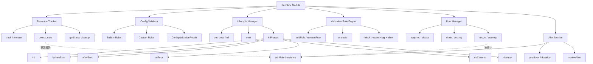

# Sandbox 增强功能设计

> Document Status: Current Implementation / Target Design / Migration Contract
> Authority: Sandbox 模块的增强功能设计文档，包括资源追踪、配置验证、生命周期钩子、验证规则引擎、沙箱池管理和监控告警。

## 概述

Sandbox 模块是 VectaHub 的安全执行层，负责隔离和控制外部命令的执行环境。为了提高模块的资源管理能力、配置健壮性、执行可观测性和运行时性能，我们对模块进行了多项增强。

## 增强功能

### 1. 资源追踪器（Resource Tracker）

**文件**: `src/sandbox/resource-tracker.ts`

资源追踪器负责追踪沙箱运行期间分配的各类资源（文件句柄、子进程、临时文件等），在资源未被正常释放时检测泄漏并生成报告。

#### 资源类型

```typescript
type ResourceType = 'file_handle' | 'child_process' | 'temp_file' | 'temp_dir' | 'stream' | 'timer';

type ResourceStatus = 'active' | 'released' | 'leaked';
```

#### 使用示例

```typescript
import { createResourceTracker } from './resource-tracker';

const tracker = createResourceTracker();

// 追踪资源
const fileId = tracker.track('file_handle', '/tmp/output.txt', { encoding: 'utf-8' });
const procId = tracker.track('child_process', 'node worker.js');

// 释放资源
tracker.release(fileId);

// 检测泄漏（默认阈值 300 秒）
const leakReport = tracker.detectLeaks();
console.log(`泄漏资源: ${leakReport.totalLeaked}`);

// 获取统计信息
const stats = tracker.getStats();
console.log(`活跃: ${stats.active}, 已释放: ${stats.released}`);

// 清理非活跃记录
const cleaned = tracker.cleanup();
```

#### 实现细节

- 使用 `Map<string, ResourceRecord>` 存储资源记录，以 `res_<uuid>` 为键
- `track()` 分配资源并记录创建时间和元数据
- `release()` 将资源状态从 `active` 更新为 `released`
- `detectLeaks()` 将超过阈值（默认 300,000ms）的活跃资源标记为 `leaked`
- `cleanup()` 移除所有 `released` 和 `leaked` 状态的记录
- `getStats()` 按类型和状态汇总资源统计

### 2. 配置验证器（Config Validator）

**文件**: `src/sandbox/config.ts`

配置验证器对沙箱配置进行结构化验证，防止无效配置导致运行时错误。支持内置规则和自定义规则。

#### 验证规则

```typescript
interface ConfigValidationRule {
  field: string;
  validate: (value: unknown, config: SandboxConfig) => ValidationIssue | null;
}

interface ValidationIssue {
  field: string;
  message: string;
  severity: 'error' | 'warning' | 'info';
  value?: unknown;
  expected?: string;
}
```

#### 内置验证规则

| 字段 | 规则 |
|------|------|
| `root` | 路径不能为空字符串 |
| `workspace` | 路径不能为空字符串 |
| `mode` | 必须是 `STRICT`、`RELAXED`、`CONSENSUS` 之一 |
| `maxMemoryMB` | 必须是有限数值，范围 16-16384 |
| `timeoutMs` | 必须是有限数值，范围 1000-3600000 |
| `allowedEnvVars` | 必须是字符串数组 |
| `namespaceIsolation` | 必须是布尔值 |

#### 使用示例

```typescript
import { createConfigValidator } from './config';

const validator = createConfigValidator();

// 验证配置
const result = validator.validate({
  mode: 'STRICT',
  maxMemoryMB: 512,
  timeoutMs: 30000,
});

if (!result.valid) {
  for (const issue of result.issues) {
    console.error(`[${issue.severity}] ${issue.field}: ${issue.message}`);
  }
}

// 添加自定义规则
validator.addRule({
  field: 'maxMemoryMB',
  validate(value) {
    if (typeof value === 'number' && value > 8192) {
      return {
        field: 'maxMemoryMB',
        message: '内存超过 8GB 需要管理员审批',
        severity: 'warning',
        value,
      };
    }
    return null;
  },
});

// 移除规则
validator.removeRule('maxMemoryMB');

// 获取当前规则列表
const rules = validator.getRules();
```

#### 实现细节

- 内置 7 条默认验证规则，覆盖所有核心配置字段
- `validate()` 遍历所有规则，收集 `ValidationIssue`
- `valid` 字段基于是否存在 `severity === 'error'` 的问题
- `addRule()` 支持按字段名覆盖已有规则
- `removeRule()` 按字段名精确移除

### 3. 生命周期钩子（Lifecycle Hooks）

**文件**: `src/sandbox/lifecycle.ts`

生命周期管理器支持在沙箱的不同阶段注册钩子函数，实现前置检查、后置清理、错误处理等横切关注点。

#### 生命周期阶段

```typescript
type LifecyclePhase = 'init' | 'beforeExec' | 'afterExec' | 'onError' | 'onCleanup' | 'destroy';
```

#### 钩子上下文

```typescript
interface LifecycleContext {
  phase: LifecyclePhase;
  sessionId: string;
  command?: string;
  args?: string[];
  options?: ExecOptions;
  result?: ExecResult;
  error?: Error;
  timestamp: number;
  metadata: Record<string, unknown>;
}
```

#### 使用示例

```typescript
import { createLifecycleManager } from './lifecycle';

const lifecycle = createLifecycleManager();

// 注册持久钩子（优先级数值越小越先执行）
lifecycle.on('beforeExec', async (ctx) => {
  console.log(`准备执行: ${ctx.command}`);
}, 10);

// 注册一次性钩子
lifecycle.once('init', async (ctx) => {
  console.log(`沙箱初始化: ${ctx.sessionId}`);
});

// 注册错误处理钩子
lifecycle.on('onError', async (ctx) => {
  console.error(`执行失败: ${ctx.error?.message}`);
}, 50);

// 注册清理钩子
lifecycle.on('onCleanup', async (ctx) => {
  console.log(`清理资源: ${ctx.sessionId}`);
});

// 触发阶段
await lifecycle.emit('beforeExec', {
  sessionId: 'sess_001',
  command: 'node build.js',
  metadata: {},
});

// 移除钩子
const hookId = lifecycle.on('afterExec', async (ctx) => { /* ... */ });
lifecycle.off(hookId);

// 获取指定阶段的钩子
const hooks = lifecycle.getHooks('beforeExec');

// 清除所有钩子
lifecycle.clear();
```

#### 实现细节

- 使用 `Map<string, LifecycleHookRegistration>` 存储钩子注册信息
- 使用 `Map<LifecyclePhase, string[]>` 维护阶段索引，加速查找
- `on()` 注册持久钩子，`once()` 注册一次性钩子
- `emit()` 按优先级升序执行钩子，一次性钩子执行后自动移除
- 单个钩子执行失败不阻断后续钩子（静默捕获异常）
- `off()` 按 ID 精确移除钩子

### 4. 验证规则引擎（Validation Rule Engine）

**文件**: `src/sandbox/validator.ts`

验证规则引擎支持注册自定义验证规则，对输入字符串进行多规则评估，根据最高优先级动作输出最终决策。

#### 规则定义

```typescript
interface ValidationRule {
  id: string;
  name: string;
  description: string;
  severity: 'critical' | 'high' | 'medium' | 'low' | 'info';
  action: 'block' | 'warn' | 'log' | 'allow';
  condition: (input: string, context?: Record<string, unknown>) => boolean;
  enabled: boolean;
}
```

#### 动作优先级

```
block (0) > warn (1) > log (2) > allow (3)
```

#### 使用示例

```typescript
import { createValidationRuleEngine } from './validator';

const engine = createValidationRuleEngine();

// 添加规则
engine.addRule({
  id: 'rule_no_rm_rf',
  name: '禁止 rm -rf',
  description: '阻止危险的递归删除命令',
  severity: 'critical',
  action: 'block',
  condition: (input) => /rm\s+(-[a-zA-Z]*r[a-zA-Z]*f|-[a-zA-Z]*f[a-zA-Z]*r)/.test(input),
  enabled: true,
});

engine.addRule({
  id: 'rule_warn_sudo',
  name: '警告 sudo',
  description: '使用 sudo 需要注意权限',
  severity: 'medium',
  action: 'warn',
  condition: (input) => input.startsWith('sudo '),
  enabled: true,
});

// 评估命令
const result = engine.evaluate('rm -rf /tmp/data', { sessionId: 'sess_001' });

if (result.blocked) {
  console.error('命令被阻止:', result.finalAction);
  for (const r of result.results.filter((r) => r.matched)) {
    console.log(`  规则: ${r.rule?.name} -> ${r.action}`);
  }
}

// 启用/禁用规则
engine.disableRule('rule_no_rm_rf');
engine.enableRule('rule_no_rm_rf');

// 获取所有规则
const rules = engine.getRules();

// 清除所有规则
engine.clearRules();
```

#### 实现细节

- 使用 `Map<string, ValidationRule>` 存储规则，以 `id` 为键
- `evaluate()` 遍历所有已启用规则，独立评估每条规则
- 最终动作取所有匹配规则中优先级最高的动作
- 规则条件函数抛出异常时视为未匹配（安全降级）
- 支持 `addRule()`、`removeRule()`、`enableRule()`、`disableRule()` 管理规则生命周期

### 5. 沙箱池管理器（Pool Manager）

**文件**: `src/sandbox/pool-manager.ts`

沙箱池管理器通过 `acquire/release` 模式管理可复用的沙箱实例，减少频繁创建和销毁沙箱的开销。

#### 池配置

```typescript
interface SandboxPoolConfig {
  minSize: number;        // 最小实例数，默认 1
  maxSize: number;        // 最大实例数，默认 5
  idleTimeoutMs: number;  // 空闲超时（毫秒），默认 300000
  maxReuseCount: number;  // 最大复用次数，默认 100
  warmupEnabled: boolean; // 是否预热，默认 false
}
```

#### 使用示例

```typescript
import { createSandboxPool } from './pool-manager';

// 创建池（预热 2 个实例，最大 10 个）
const pool = createSandboxPool({
  minSize: 2,
  maxSize: 10,
  idleTimeoutMs: 600000,
  maxReuseCount: 50,
  warmupEnabled: true,
});

// 获取实例
const entry = await pool.acquire('session_001');
console.log(`获取实例: ${entry.id}, 复用次数: ${entry.reuseCount}`);

// 释放实例（归还到池中）
pool.release(entry.id);

// 动态调整池容量
pool.resize(3, 15);

// 获取池统计
const stats = pool.getStats();
console.log(`总数: ${stats.total}, 空闲: ${stats.idle}, 活跃: ${stats.active}`);
console.log(`平均复用次数: ${stats.averageReuseCount}`);

// 获取所有实例
const entries = pool.getEntries();

// 排空池（拒绝新请求，等待活跃实例归还）
await pool.drain();

// 销毁池
await pool.destroy();
```

#### 实现细节

- 使用 `Map<string, PooledSandboxEntry>` 存储实例记录
- `acquire()` 优先复用空闲实例，若无空闲且未达上限则创建新实例
- 达到上限时进入等待队列（`waitQueue`），释放时自动分配给等待者
- 空闲实例超过 `idleTimeoutMs` 后被自动清理（`pruneIdleEntries`）
- 复用次数超过 `maxReuseCount` 的实例不再被复用
- `warmupEnabled` 启动时预创建 `minSize` 个空闲实例
- `drain()` 拒绝新请求，为等待队列中的请求分配 `draining` 状态实例
- `destroy()` 销毁所有实例并清空等待队列

### 6. 监控告警管理器（Alert Monitor）

**文件**: `src/sandbox/alert-monitor.ts`

监控告警管理器支持注册基于指标阈值的告警规则，在每次指标快照时评估规则，触发告警事件并执行自定义动作。

#### 指标快照

```typescript
interface MetricSnapshot {
  memoryUsageMB: number;
  memoryPercentage: number;
  activeResources: number;
  activeSandboxes: number;
  timestamp: number;
}
```

#### 告警规则

```typescript
interface AlertRule {
  id: string;
  name: string;
  description: string;
  severity: 'critical' | 'warning' | 'info';
  condition: {
    metric: string;
    operator: '>' | '<' | '>=' | '<=' | '==' | '!=';
    threshold: number;
    durationMs?: number;  // 持续时间条件
  };
  enabled: boolean;
  cooldownMs: number;     // 冷却期（防止告警风暴）
  action?: (alert: AlertEvent) => void | Promise<void>;
}
```

#### 使用示例

```typescript
import { createMonitorAlertManager } from './alert-monitor';

const monitor = createMonitorAlertManager();

// 添加内存告警规则
monitor.addRule({
  id: 'alert_high_memory',
  name: '高内存使用',
  description: '内存使用超过阈值',
  severity: 'warning',
  condition: {
    metric: 'memoryPercentage',
    operator: '>',
    threshold: 80,
  },
  enabled: true,
  cooldownMs: 60000,
  action: (alert) => {
    console.warn(`告警: ${alert.message}`);
  },
});

// 添加持续时间告警（连续 5 秒内存超过 90%）
monitor.addRule({
  id: 'alert_critical_memory',
  name: '严重内存压力',
  description: '内存持续超过 90%',
  severity: 'critical',
  condition: {
    metric: 'memoryPercentage',
    operator: '>',
    threshold: 90,
    durationMs: 5000,
  },
  enabled: true,
  cooldownMs: 300000,
});

// 评估指标快照
const snapshot: MetricSnapshot = {
  memoryUsageMB: 1024,
  memoryPercentage: 85,
  activeResources: 12,
  activeSandboxes: 3,
  timestamp: Date.now(),
};

const alerts = monitor.evaluate(snapshot);
for (const alert of alerts) {
  console.log(`[${alert.severity}] ${alert.message}`);
}

// 获取活跃告警
const activeAlerts = monitor.getActiveAlerts();

// 解决告警
if (activeAlerts.length > 0) {
  monitor.resolveAlert(activeAlerts[0].id);
}

// 管理规则
monitor.disableRule('alert_high_memory');
monitor.enableRule('alert_high_memory');
monitor.removeRule('alert_high_memory');

// 清除所有告警
monitor.clearAlerts();
```

#### 实现细节

- 支持 6 种比较运算符：`>`、`<`、`>=`、`<=`、`==`、`!=`
- `evaluate()` 遍历所有已启用规则，跳过冷却期内的规则
- 支持 `durationMs` 持续时间条件：检查历史记录中指定时间窗口内的所有值
- 指标历史记录保留最近 100 条数据点
- 告警动作支持同步和异步函数，失败不阻断评估
- 冷却期通过 `lastTriggeredAt` 记录实现，防止告警风暴

## 架构图



## 性能影响

### 资源追踪器

- **优点**: 提供资源泄漏检测能力，防止文件句柄和进程泄漏
- **缺点**: 每次资源操作增加 Map 查找开销
- **建议**: 在生产环境中定期调用 `detectLeaks()` 和 `cleanup()`，避免记录无限增长

### 配置验证器

- **优点**: 提前发现配置错误，防止运行时异常
- **缺点**: 增加配置初始化时间（验证开销）
- **建议**: 在沙箱启动时执行一次验证，运行时无需重复验证

### 生命周期钩子

- **优点**: 支持横切关注点的解耦，提高代码可维护性
- **缺点**: 钩子执行增加阶段间延迟
- **建议**: 为关键钩子设置高优先级（低数值），避免在钩子中执行耗时操作

### 验证规则引擎

- **优点**: 提供灵活的命令安全策略，支持动态规则管理
- **缺点**: 规则数量多时评估时间线性增长
- **建议**: 将高频匹配的规则排在前面，禁用不活跃的规则

### 沙箱池管理器

- **优点**: 显著减少沙箱创建/销毁开销，提高响应速度
- **缺点**: 增加内存占用（维持空闲实例）
- **建议**: 根据并发量调整 `minSize` 和 `maxSize`，设置合理的 `idleTimeoutMs`

### 监控告警管理器

- **优点**: 实时检测资源异常，支持自动响应
- **缺点**: 指标历史记录占用内存，冷却期可能延迟告警
- **建议**: 根据监控粒度调整冷却期，避免告警风暴

## 测试覆盖

所有增强功能的测试文件：

- `resource-tracker.test.ts`: 资源追踪器测试（待创建）
- `config-validator.test.ts`: 配置验证器测试（待创建）
- `lifecycle.test.ts`: 生命周期钩子测试（待创建）
- `validator-engine.test.ts`: 验证规则引擎测试（待创建）
- `pool-manager.test.ts`: 沙箱池管理器测试（待创建）
- `alert-monitor.test.ts`: 监控告警管理器测试（待创建）

## 最佳实践

### 1. 资源追踪器

```typescript
// ✅ 推荐：始终在资源使用完毕后释放
const fileId = tracker.track('file_handle', '/tmp/data.txt');
try {
  await processFile(fileId);
} finally {
  tracker.release(fileId);
}

// ❌ 避免：忘记释放资源导致泄漏
const fileId = tracker.track('file_handle', '/tmp/data.txt');
await processFile(fileId);
// 资源未释放，detectLeaks() 将报告泄漏
```

### 2. 配置验证器

```typescript
// ✅ 推荐：在沙箱启动时验证完整配置
const validator = createConfigValidator();
const result = validator.validate(sandboxConfig);
if (!result.valid) {
  const errors = result.issues.filter((i) => i.severity === 'error');
  throw new Error(`配置无效: ${errors.map((e) => e.message).join(', ')}`);
}

// ❌ 避免：跳过验证直接使用配置
const config = { mode: 'INVALID', maxMemoryMB: -1 };
// 直接使用可能导致不可预期的行为
```

### 3. 生命周期钩子

```typescript
// ✅ 推荐：使用优先级控制执行顺序
lifecycle.on('beforeExec', validateCommand, 10);   // 先验证
lifecycle.on('beforeExec', setupEnvironment, 50);   // 再准备环境
lifecycle.on('beforeExec', logExecution, 100);      // 最后记录日志

// ❌ 避免：在钩子中执行阻塞操作
lifecycle.on('beforeExec', async (ctx) => {
  await heavyComputation(); // 可能阻塞整个执行流程
});
```

### 4. 验证规则引擎

```typescript
// ✅ 推荐：为规则提供明确的 ID 和描述
engine.addRule({
  id: 'rule_block_curl_pipe',
  name: '阻止 curl | sh',
  description: '防止通过管道执行远程脚本',
  severity: 'critical',
  action: 'block',
  condition: (input) => /curl\s.*\|\s*(sh|bash)/.test(input),
  enabled: true,
});

// ❌ 避免：规则条件过于宽泛
engine.addRule({
  id: 'rule_block_all',
  name: '阻止一切',
  description: '阻止所有命令',
  severity: 'critical',
  action: 'block',
  condition: () => true, // 会阻止所有命令
  enabled: true,
});
```

### 5. 沙箱池管理器

```typescript
// ✅ 推荐：使用完毕后立即释放实例
const entry = await pool.acquire(sessionId);
try {
  await executeInSandbox(entry);
} finally {
  pool.release(entry.id);
}

// ❌ 避免：持有实例过长时间
const entry = await pool.acquire(sessionId);
await longRunningTask(); // 其他请求可能在等待
pool.release(entry.id);
```

### 6. 监控告警管理器

```typescript
// ✅ 推荐：设置合理的冷却期和持续时间条件
monitor.addRule({
  id: 'alert_memory_sustained',
  name: '持续高内存',
  description: '内存连续 10 秒超过 85%',
  severity: 'warning',
  condition: {
    metric: 'memoryPercentage',
    operator: '>',
    threshold: 85,
    durationMs: 10000,
  },
  enabled: true,
  cooldownMs: 120000,
});

// ❌ 避免：冷却期过短导致告警风暴
monitor.addRule({
  id: 'alert_noisy',
  name: '噪音告警',
  description: '无冷却期的告警',
  severity: 'info',
  condition: { metric: 'memoryPercentage', operator: '>', threshold: 50 },
  enabled: true,
  cooldownMs: 0, // 每次评估都会触发
});
```

## 相关文档

- [Agent Runtime 增强功能设计](./agent-runtime-enhancements.md)
- [Workflow Engine 架构设计](./workflow-engine-architecture.md)
- [Safety Trace Recovery 架构](./safety-trace-recovery-architecture.md)
- [Recovery Model](./recovery-model.md)
- [Agent 操作规范](../agent-operating-guide.md)
