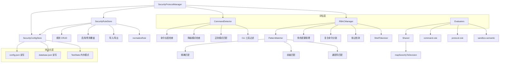

# Security Protocol 增强功能设计

> Document Status: Current Implementation / Architecture Design
> Authority: Security Protocol 模块的增强功能设计文档，包括 Manager 重构、配置存储、规则管理、命令检测、模式匹配和共享评估器。

## 概述

Security Protocol 模块是 VectaHub 的安全核心，负责命令风险评估、安全规则管理和角色权限控制。为了提高模块的可维护性和关注点分离，我们将原先 476 行的 `SecurityProtocolManager` 重构为 216 行的 Facade，将职责拆分到专用子模块中。

## 增强功能

### 1. Manager 重构（Facade 模式）

**文件**: `src/security-protocol/manager.ts`

原先的 `SecurityProtocolManager` 承担了配置管理、规则 CRUD、命令检测等所有职责，共 476 行。重构后拆分为三个专用子模块，Manager 仅作为 Facade 协调各子模块。

#### 接口定义

```typescript
interface SecurityProtocolManagerOptions {
  configPath?: string;
  logger?: Pick<Console, 'warn'>;
}

class SecurityProtocolManager {
  constructor(configPathOrOptions?: string | SecurityProtocolManagerOptions);
  isDegradedMode(): boolean;
  setDegradedMode(enabled: boolean): void;
  getDatabase(): SecurityDatabase;
  getConfig(): SecurityConfig;
  getAllRules(): SecurityRule[];
  getEnabledRules(): SecurityRule[];
  getRuleById(id: string): SecurityRule | undefined;
  addRule(rule: Omit<SecurityRule, 'id' | 'createdAt' | 'updatedAt' | 'source'>): SecurityRule;
  updateRule(id: string, updates: Partial<Omit<SecurityRule, 'id' | 'createdAt' | 'source'>>): SecurityRule | undefined;
  deleteRule(id: string): boolean;
  enableRule(id: string): boolean;
  disableRule(id: string): boolean;
  detectCommand(command: string, cliTool?: string): DetectionResult;
  importRulesFromFile(filePath: string): Promise<number>;
  exportRulesToFile(filePath: string, options?: { includeDisabled?: boolean }): void;
  resetToDefaults(): void;
}
```

#### 使用示例

```typescript
import { getSecurityManager, setTestMode } from './manager';

// 生产模式
const manager = getSecurityManager();

// 测试模式（内存操作，不涉及磁盘 I/O）
setTestMode(true);
const testManager = getSecurityManager();

// 添加自定义规则
const rule = manager.addRule({
  name: 'Block rm -rf',
  description: '阻止递归删除根目录',
  category: 'filesystem',
  severity: 'critical',
  patterns: ['rm\\s+-rf\\s+/'],
  enabled: true,
});

// 检测命令风险
const result = manager.detectCommand('rm -rf /', 'bash');
// => { isDangerous: true, severity: 'critical', ... }
```

#### 实现细节

- 使用 Facade 模式组合 `SecurityConfigStore`、`SecurityRuleStore`、`CommandDetector` 三个子模块
- 支持通过字符串路径或 `Options` 对象两种方式构造
- 使用 `TestState` 接口实现测试模式，通过共享引用实现内存操作
- 单例模式通过 `getSecurityManager()` 提供，测试模式下每次创建新实例
- 所有返回值使用浅拷贝防止外部修改内部状态

### 2. Security Config Store（配置持久化）

**文件**: `src/security-protocol/security-config-store.ts`

从 Manager 中提取的专用配置和数据库文件 I/O 管理模块。

#### 接口定义

```typescript
interface TestState {
  mode: boolean;
  config: SecurityConfig | null;
  database: SecurityDatabase | null;
}

interface SecurityConfigStoreOptions {
  configPath?: string;
  logger?: Pick<Console, 'warn'>;
}

class SecurityConfigStore {
  constructor(options?: SecurityConfigStoreOptions, testState?: TestState);
  getConfig(): SecurityConfig;
  getDatabase(): SecurityDatabase;
  getConfigPath(): string;
  getDatabasePath(): string;
  loadConfig(): SecurityConfig;
  saveConfig(): void;
  loadDatabase(): SecurityDatabase;
  saveDatabase(): void;
  ensureDirectory(filePath: string): void;
}
```

#### 使用示例

```typescript
import { SecurityConfigStore } from './security-config-store';

// 自动从磁盘加载或初始化默认配置
const store = new SecurityConfigStore({ configPath: '/custom/path/security-config.json' });

// 读取当前配置
const config = store.getConfig();
console.log(config.autoUpdate); // true

// 修改并持久化
config.rules.disabled.push('rule-sudo');
store.saveConfig();

// 读取安全数据库
const database = store.getDatabase();
console.log(database.rules.length); // 内置规则数量
```

#### 实现细节

- 配置文件路径默认通过 `getVectaHubPath('security-config.json')` 获取
- 数据库文件与配置文件同目录，命名为 `security-database.json`
- 首次运行时自动创建默认配置和数据库文件
- 测试模式下通过 `TestState` 共享引用实现内存操作，跳过磁盘 I/O
- 所有文件 I/O 错误通过 `toError()` 工具函数包装为带 `cause` 的 Error
- 目录不存在时通过 `ensureDirectory()` 自动创建

### 3. Security Rule Store（规则管理）

**文件**: `src/security-protocol/security-rule-store.ts`

从 Manager 中提取的专用规则 CRUD 模块，委托 `SecurityConfigStore` 进行持久化。

#### 接口定义

```typescript
class SecurityRuleStore {
  constructor(configStore: SecurityConfigStore, testMode?: boolean);
  getAllRules(): SecurityRule[];
  getEnabledRules(): SecurityRule[];
  getRuleById(id: string): SecurityRule | undefined;
  addRule(rule: Omit<SecurityRule, 'id' | 'createdAt' | 'updatedAt' | 'source'>): SecurityRule;
  updateRule(id: string, updates: Partial<Omit<SecurityRule, 'id' | 'createdAt' | 'source'>>): SecurityRule | undefined;
  deleteRule(id: string): boolean;
  enableRule(id: string): boolean;
  disableRule(id: string): boolean;
  importRulesFromFile(filePath: string): Promise<number>;
  exportRulesToFile(filePath: string, options?: { includeDisabled?: boolean }): void;
  resetToDefaults(): void;
  normalizeRule(data: Record<string, unknown>): SecurityRule | null;
}
```

#### 使用示例

```typescript
import { SecurityConfigStore } from './security-config-store';
import { SecurityRuleStore } from './security-rule-store';

const configStore = new SecurityConfigStore();
const ruleStore = new SecurityRuleStore(configStore);

// 获取启用的规则（考虑 config 中的 enabled/disabled 覆盖）
const enabledRules = ruleStore.getEnabledRules();

// 添加规则
const newRule = ruleStore.addRule({
  name: 'Block curl to external',
  description: '阻止 curl 请求外部地址',
  category: 'network',
  severity: 'high',
  patterns: ['curl\\s+https?://(?!localhost)'],
  enabled: true,
});

// 导入规则（支持数组和 {rules:[]} 两种 JSON 格式）
const count = await ruleStore.importRulesFromFile('/path/to/rules.json');
console.log(`导入了 ${count} 条规则`);
```

#### 实现细节

- 规则启用逻辑：`config.rules.disabled` 优先级最高，其次 `config.rules.enabled`，最后看规则自身 `enabled` 字段
- 新规则自动生成 `id`（时间戳 + 随机字符串）、`createdAt`、`updatedAt` 和 `source: 'custom'`
- `normalizeRule()` 对导入数据进行严格验证，确保 `name` 和 `patterns` 存在且类型正确
- 导入时同 ID 规则更新，新 ID 规则追加
- 导出时默认只导出启用的规则，可通过 `includeDisabled: true` 包含全部规则

### 4. Command Detector（命令风险检测）

**文件**: `src/security-protocol/command-detector.ts`

从 Manager 中提取的专用命令风险评估模块。

#### 接口定义

```typescript
class CommandDetector {
  detectCommand(
    command: string,
    cliTool: string | undefined,
    enabledRules: SecurityRule[],
    degradedMode: boolean,
    logger: Pick<Console, 'warn'>,
  ): DetectionResult;
}
```

#### 使用示例

```typescript
import { CommandDetector } from './command-detector';

const detector = new CommandDetector();

// 正常检测
const result1 = detector.detectCommand(
  'git push --force origin main',
  'git',
  enabledRules,
  false,
  console,
);

// 超长命令自动阻止（Fail Closed）
const result2 = detector.detectCommand(
  'A'.repeat(10001),
  undefined,
  [],
  false,
  console,
);
// => { isDangerous: true, severity: 'critical', matchedPattern: 'command-length-limit' }

// 降级模式下非白名单命令需要确认
const result3 = detector.detectCommand(
  'npm install lodash',
  'npm',
  [],
  true,
  console,
);
// => { isDangerous: true, severity: 'high', matchedPattern: 'degraded-mode' }
```

#### 实现细节

- 命令长度超过 10000 字符时自动判定为 `critical`（防止安全绕过）
- 降级模式下所有命令判定为 `high`（Fail Closed 策略）
- 支持按 `cliTools` 过滤规则，仅对匹配的 CLI 工具生效
- 使用 `RegExp` 进行模式匹配，无效正则通过 `logger.warn` 记录后跳过
- 返回 `DetectionResult` 包含匹配的规则和模式信息

### 5. Pattern Matcher（模式匹配）

**文件**: `src/security-protocol/pattern-matcher.ts`

基于正则和通配符的命令模式匹配模块，用于 RBAC 和安全规则评估。

#### 接口定义

```typescript
function matchBlockedCommand(command: string, blockedPattern: string): boolean;
```

#### 使用示例

```typescript
import { matchBlockedCommand } from './pattern-matcher';

// 精确匹配
matchBlockedCommand('rm -rf /', 'rm -rf /');          // true

// 前缀匹配（命令以 pattern 开头即命中）
matchBlockedCommand('rm -rf /home/user', 'rm -rf');    // true

// 通配符匹配（* 匹配任意字符）
matchBlockedCommand('rm -rf /tmp', 'rm -rf *');         // true

// 通配符匹配（? 匹配单个字符）
matchBlockedCommand('chmod 777 /', 'chmod ?777 /');     // true

// 多段通配符匹配
matchBlockedCommand('dd if=/dev/zero of=/dev/sda', 'dd of=/dev/*'); // true

// 不匹配
matchBlockedCommand('git push origin main', 'rm -rf');  // false
```

#### 实现细节

- 所有匹配前先 `trim()` 和 `toLowerCase()` 进行规范化
- 支持精确匹配、前缀匹配和通配符匹配（`*` 和 `?`）
- `*` 匹配零个或多个字符，`?` 匹配单个字符
- 多词模式按空格分段后逐段匹配，支持跨段通配符
- 通过 `escapeRegexSegment()` 将通配符模式转义为安全的正则表达式
- 单段通配符支持前缀通配（`*foo`）、后缀通配（`foo*`）和全通配（`*`）

### 6. Shared Evaluators（共享评估器）

**文件**: `src/security-protocol/evaluators/shared.ts`

为各评估器提供通用的严重级别映射工具函数。

#### 接口定义

```typescript
function mapSeverityToDecision(severity: string): {
  decision: SecurityDecisionType;
  riskLevel: SecurityRiskLevel;
};
```

#### 使用示例

```typescript
import { mapSeverityToDecision } from './evaluators/shared';

// critical 级别映射为 BLOCKED
const result1 = mapSeverityToDecision('critical');
// => { decision: 'BLOCKED', riskLevel: 'critical' }

// high 级别映射为 REQUIRES_CONFIRMATION
const result2 = mapSeverityToDecision('high');
// => { decision: 'REQUIRES_CONFIRMATION', riskLevel: 'high' }

// medium/low 级别映射为 PASSED
const result3 = mapSeverityToDecision('medium');
// => { decision: 'PASSED', riskLevel: 'medium' }

// 未知级别默认映射为 PASSED + none
const result4 = mapSeverityToDecision('unknown');
// => { decision: 'PASSED', riskLevel: 'none' }
```

#### 实现细节

- 将字符串严重级别映射为标准的 `SecurityDecisionType` 和 `SecurityRiskLevel`
- 映射规则：
  - `critical` → `BLOCKED` / `critical`
  - `high` → `REQUIRES_CONFIRMATION` / `high`
  - `medium` → `PASSED` / `medium`
  - `low` → `PASSED` / `low`
  - 其他 → `PASSED` / `none`
- 被 `command-rule`、`protocol-rule`、`sandbox-semantic` 等评估器复用

### 7. RBAC（角色权限控制）

**文件**: `src/security-protocol/rbac.ts`

基于角色的访问控制系统，管理角色定义、权限检查和配置持久化。

#### 接口定义

```typescript
type RoleName = 'developer' | 'ci-runner' | 'admin';

interface RoleConfig {
  name: RoleName;
  allowed_tools: string[];
  blocked_commands: string[];
  max_timeout: number;
  sandbox_mode: 'STRICT' | 'RELAXED' | 'CONSENSUS';
}

interface RBACManager {
  getRole(name: RoleName): RoleConfig;
  getAllRoles(): RoleConfig[];
  canExecute(role: RoleName, command: string, tool?: string): boolean;
  getMaxTimeout(role: RoleName): number;
  getSandboxMode(role: RoleName): 'STRICT' | 'RELAXED' | 'CONSENSUS';
  saveConfig(roles: RoleConfig[]): void;
  loadConfig(): RoleConfig[];
}
```

#### 使用示例

```typescript
import { createRBACManager } from './rbac';

const rbac = createRBACManager();

// 检查角色权限
rbac.canExecute('developer', 'git push origin main');    // true
rbac.canExecute('developer', 'rm -rf /');                // false
rbac.canExecute('ci-runner', 'sudo apt install');        // false

// 获取角色配置
const devRole = rbac.getRole('developer');
console.log(devRole.sandbox_mode); // 'RELAXED'

// 获取超时和沙箱模式
rbac.getMaxTimeout('ci-runner');     // 600000
rbac.getSandboxMode('admin');        // 'CONSENSUS'
```

#### 实现细节

- 内置三种角色：`developer`（宽松）、`ci-runner`（严格）、`admin`（共识）
- 配置文件通过 `getVectaHubPath('rbac.json')` 持久化
- 通过 `matchBlockedCommand` 进行通配符模式匹配
- 使用 `ShellTokenizer` 将命令分词后逐子命令检查
- 通过 `splitCompoundCommand` 分割复合命令（`;`、`&&`、`||`、`|`）
- 通过 `detectBypassAttempt` 检测变量注入（`${var}`、反引号、`$(...)`）和别名攻击
- 工具白名单支持 `*` 通配符表示允许所有工具

## 架构图



## 性能影响

### Manager 重构

- **优点**: 关注点分离，每个子模块职责单一，便于独立测试和维护
- **缺点**: 增加了对象间的间接调用层
- **建议**: Facade 层的间接调用开销可忽略不计，可维护性收益远大于性能损耗

### Security Config Store

- **优点**: 配置和数据库 I/O 集中管理，避免散落在多个模块
- **缺点**: 每次 `saveConfig()` / `saveDatabase()` 均为同步写入
- **建议**: 批量操作时减少保存频率，或在调用层做合并写入

### Security Rule Store

- **优点**: 规则 CRUD 逻辑内聚，`normalizeRule` 统一入口验证
- **缺点**: `getEnabledRules()` 每次调用都重新过滤
- **建议**: 当规则数量较大时可考虑缓存过滤结果，当前规模下无需优化

### Command Detector

- **优点**: 检测逻辑独立，支持 Fail Closed 策略
- **缺点**: 每次检测遍历所有启用规则的正则模式
- **建议**: 正则编译在每次调用时执行，高频场景可考虑预编译缓存

### Pattern Matcher

- **优点**: 通配符匹配支持丰富的模式语法
- **缺点**: 多段通配符匹配使用嵌套循环，复杂模式下可能有性能开销
- **建议**: 避免在安全规则中使用过于复杂的多段通配符模式

### Shared Evaluators

- **优点**: 严重级别映射逻辑单一来源，避免重复实现
- **缺点**: 无明显性能影响
- **建议**: 保持函数为纯函数，便于测试和复用

## 测试覆盖

所有增强功能都有完整的测试覆盖：

- `manager.test.ts`: Manager Facade 测试（4 个用例）
  - 默认规则重置
  - 损坏配置文件异常处理
  - 损坏数据库文件异常处理
  - 不可写路径异常处理
- `rbac.test.ts`: RBAC 角色权限测试
  - 角色配置加载与回退
  - 复合命令分割与检查
  - 绕过检测（变量注入、别名攻击）
  - 通配符工具白名单
- `guard.test.ts`: 安全守卫测试
- `engine.test.ts`: 安全引擎测试
- `risk-mitigation.test.ts`: 风险缓解测试
- `redactor.test.ts`: 敏感信息脱敏测试
- `default-rules.test.ts`: 内置规则测试
- `evaluators/evaluators.test.ts`: 评估器测试

**总计**: 覆盖 Manager、RBAC、Guard、Engine、Risk Mitigation、Redactor、Default Rules、Evaluators 等全部安全子模块

## 最佳实践

### 1. Manager 使用

```typescript
// ✅ 推荐：使用 getSecurityManager() 获取单例
const manager = getSecurityManager();
const result = manager.detectCommand(command, cliTool);

// ❌ 避免：直接构造多个实例（破坏单例模式）
const m1 = new SecurityProtocolManager();
const m2 = new SecurityProtocolManager();
```

### 2. 测试模式

```typescript
// ✅ 推荐：测试前启用测试模式，测试后关闭
beforeEach(() => setTestMode(true));
afterEach(() => setTestMode(false));

// ❌ 避免：忘记关闭测试模式（影响后续测试）
beforeEach(() => setTestMode(true));
// afterEach 缺失
```

### 3. 规则管理

```typescript
// ✅ 推荐：通过 enableRule/disableRule 管理覆盖，保留规则数据
manager.disableRule('rule-sudo');

// ❌ 避免：直接删除内置规则（不可恢复）
manager.deleteRule('rule-sudo');
```

### 4. 降级模式

```typescript
// ✅ 推荐：初始化失败时启用降级模式，确保 Fail Closed
try {
  await initializeSecurity();
} catch (error) {
  manager.setDegradedMode(true);
  logger.warn('安全引擎初始化失败，已启用降级模式');
}

// ❌ 避免：初始化失败后继续正常模式（可能跳过安全检查）
try {
  await initializeSecurity();
} catch (error) {
  logger.warn('初始化失败'); // 未启用降级模式
}
```

### 5. RBAC 角色选择

```typescript
// ✅ 推荐：CI 环境使用 ci-runner 角色（严格模式）
const canRun = rbac.canExecute('ci-runner', command);

// ❌ 避免：CI 环境使用 admin 角色（无限制）
const canRun = rbac.canExecute('admin', command);
```

### 6. Pattern Matcher 使用

```typescript
// ✅ 推荐：使用具体的通配符模式
matchBlockedCommand('rm -rf /tmp', 'rm -rf /tmp*');  // 明确匹配 /tmp 开头

// ❌ 避免：使用过于宽泛的通配符
matchBlockedCommand('git push', '*');  // 匹配所有命令
```

## 相关文档

- [Agent Runtime 增强功能设计](./agent-runtime-enhancements.md)
- [Agent CLI 注册与 Runtime 架构设计](./agent-cli-runtime-architecture.md)
- [Agent 操作规范](../agent-operating-guide.md)
