# Skills 增强功能设计

> Document Status: Current Implementation / Architecture Design
> Authority: Skills 模块的增强功能设计文档，包括版本管理、发现机制、执行沙箱、生命周期管理和集中化管理。

## 概述

Skills 模块是 VectaHub 的核心能力扩展模块，负责技能的注册、发现、执行和管理。为了提高模块的健壮性、安全性和可维护性，我们对模块进行了多项增强。增强后的模块支持语义化版本管理、自动技能发现、沙箱隔离执行、完整的生命周期管理以及集中化的技能管理。

## 增强功能

### 1. Skill Version Management

**文件**: `src/skills/types.ts`, `src/skills/command-skill.ts`

技能版本管理系统支持语义化版本（SemVer）规范，提供版本解析、比较和回滚能力。

#### 配置选项

```typescript
interface SkillVersion {
  major: number;        // 主版本号（破坏性变更）
  minor: number;        // 次版本号（新功能）
  patch: number;        // 补丁版本号（Bug 修复）
  prerelease?: string;  // 预发布标识符
  buildMetadata?: string; // 构建元数据
}

interface SkillVersionHistory {
  version: string;           // 版本字符串
  timestamp: Date;           // 创建时间
  changes: string;           // 变更描述
  rollbackAvailable: boolean; // 是否支持回滚
}
```

#### 使用示例

```typescript
const skill = createCommandSkill();

// 获取当前版本
const current = skill.getCurrentVersion();
console.log(`Current: ${current.major}.${current.minor}.${current.patch}`);

// 获取版本历史
const history = skill.getVersionHistory();
console.log(`History entries: ${history.length}`);

// 回滚到指定版本
const rolledBack = skill.rollbackToVersion('1.0.0');
if (rolledBack) {
  console.log('Rollback successful');
}
```

#### 实现细节

- 使用正则表达式解析语义化版本字符串（`parseVersion`）
- 支持预发布标识符和构建元数据
- 版本比较遵循 SemVer 规范（`compareVersions`）
- 回滚操作仅允许回滚到更低版本
- 版本历史记录每个版本的变更描述和回滚可用性

### 2. Discovery Mechanism

**文件**: `src/skills/registry.ts`

自动技能发现机制支持定时扫描指定路径，自动发现并注册新技能。

#### 配置选项

```typescript
interface SkillDiscoveryConfig {
  autoDiscover: boolean;       // 是否自动发现
  discoveryPaths: string[];    // 发现路径列表
  discoveryInterval: number;   // 发现间隔（毫秒）
  excludePatterns: string[];   // 排除模式
}
```

#### 使用示例

```typescript
const registry = createSkillRegistry();

// 启用自动发现
registry.enableDiscovery({
  autoDiscover: true,
  discoveryPaths: ['/path/to/skills', '/path/to/plugins'],
  discoveryInterval: 60000, // 每分钟扫描一次
  excludePatterns: ['*.test.ts', '*.spec.ts']
});

// 手动触发发现
const discovered = await registry.discoverSkills();
console.log(`Discovered ${discovered.length} new skills`);

// 获取已发现的技能
const allDiscovered = registry.getDiscoveredSkills();

// 将发现的技能注册到主注册表
registry.registerDiscoveredSkill('discovered-skill-id');

// 停用自动发现
registry.disableDiscovery();
```

#### 实现细节

- 使用定时器实现周期性扫描（`setInterval`）
- 发现的技能存储在独立的 `discoveredSkills` 映射中
- 已注册的技能不会被重复发现
- 支持手动触发发现流程
- 提供从发现列表到主注册表的显式注册路径
- 扫描失败时静默继续，不影响其他路径

### 3. Execution Sandbox

**文件**: `src/skills/executor.ts`, `src/skills/types.ts`

执行沙箱提供隔离的技能执行环境，限制危险模块的访问。

#### 配置选项

```typescript
interface SkillSandboxConfig {
  enabled: boolean;          // 是否启用沙箱
  timeout: number;           // 执行超时（毫秒）
  memoryLimit: number;       // 内存限制（字节）
  allowedModules: string[];  // 允许的模块列表
  blockedModules: string[];  // 阻止的模块列表
}
```

#### 使用示例

```typescript
const executor = createSkillExecutor({
  maxRetries: 3,
  timeout: 120000,
  logger: console,
  sandbox: {
    enabled: true,
    timeout: 60000,
    memoryLimit: 256 * 1024 * 1024, // 256MB
    allowedModules: ['lodash', 'moment'],
    blockedModules: ['child_process', 'fs', 'net']
  }
});

// 执行技能（沙箱模式）
const result = await executor.execute(skill, input, context);

// 查看执行指标
const metrics = executor.getMetrics();
console.log(`Sandboxed executions: ${metrics.sandboxedExecutions}`);
```

#### 实现细节

- 通过替换 `globalThis.require` 实现模块访问控制
- 被阻止的模块会抛出明确的错误信息
- 支持执行超时控制（`Promise.race`）
- 沙箱执行完成后恢复原始 `require` 和 `process`
- 执行指标跟踪沙箱执行次数
- 默认阻止 `child_process`、`fs`、`net` 等危险模块

### 4. Lifecycle Management

**文件**: `src/skills/manager.ts`, `src/skills/types.ts`

生命周期管理提供技能从注册到卸载的完整状态跟踪。

#### 配置选项

```typescript
interface SkillManagerOptions {
  registry: SkillRegistry;      // 技能注册表
  executor: SkillExecutor;      // 技能执行器
  logger: LoggerType;           // 日志实例
  maxHistorySize?: number;      // 最大历史事件数（默认 1000）
}

interface SkillLifecycleState {
  state: 'registered' | 'enabled' | 'disabled' | 'unloaded' | 'error';
  stateChangedAt: Date;
  previousState?: string;
}

interface SkillLifecycleEvent {
  type: 'register' | 'enable' | 'disable' | 'unload' | 'error';
  skillId: string;
  timestamp: Date;
  data?: unknown;
}
```

#### 使用示例

```typescript
const manager = createSkillManager({
  registry,
  executor,
  logger: console,
  maxHistorySize: 500
});

// 注册技能
manager.registerSkill(skill, { author: 'team', category: 'file-ops' });

// 启用/禁用技能
manager.enableSkill('vectahub.file-ops');
manager.disableSkill('vectahub.file-ops');

// 获取生命周期状态
const state = manager.getLifecycleState('vectahub.file-ops');
console.log(`State: ${state?.state}`);

// 获取生命周期事件历史
const events = manager.getLifecycleEvents('vectahub.file-ops', 50);

// 健康检查
const health = await manager.healthCheck('vectahub.file-ops');
console.log(`Healthy: ${health.healthy}`);

// 全量健康检查
const allHealth = await manager.healthCheckAll();

// 获取错误状态的技能
const errorSkills = manager.getErrorSkills();

// 重置错误状态
manager.resetSkill('vectahub.file-ops');

// 卸载技能
manager.unloadSkill('vectahub.file-ops');
```

#### 实现细节

- 状态机支持 5 种状态：`registered`、`enabled`、`disabled`、`unloaded`、`error`
- 每次状态变更记录前一个状态
- 事件历史使用环形缓冲区（`maxHistorySize`）防止内存溢出
- 健康检查验证技能存在性、启用状态、错误状态和 `canHandle` 可用性
- 提供全量健康检查（`healthCheckAll`）
- 错误状态支持重置到 `registered` 状态

### 5. Skill Manager

**文件**: `src/skills/manager.ts`, `src/skills/registry.ts`, `src/skills/executor.ts`

集中化技能管理整合注册表、执行器和生命周期管理，提供统一的技能管理接口。

#### 架构组件

```typescript
// SkillRegistry - 技能注册与发现
class SkillRegistry {
  register(skill: Skill): void;
  get(id: string): Skill | undefined;
  has(id: string): boolean;
  list(): Skill[];
  listByCategory(category?: string): Skill[];
  remove(id: string): void;
  enable(id: string): void;
  disable(id: string): void;
  enableDiscovery(config: SkillDiscoveryConfig): void;
  discoverSkills(): Promise<Skill[]>;
  findApplicableSkills(context: SkillContext): Promise<Skill[]>;
  findSkillsBySemantic(input: string, options?: SemanticOptions): Promise<SkillMatchResult[]>;
  configureCache(config: Partial<SkillCacheConfig>): void;
  getCacheStats(): { size: number; hitRate: number };
}

// SkillExecutor - 技能执行
class SkillExecutor {
  execute<TInput, TOutput>(skill: Skill, input: TInput, context: SkillContext): Promise<SkillResult>;
  executeComposite<TInput, TOutput>(composite: CompositeSkill, input: TInput, context: SkillContext): Promise<SkillResult>;
  getMetrics(): ExecutionMetrics;
  resetMetrics(): void;
}

// SkillManager - 生命周期管理
class SkillManager {
  registerSkill(skill: Skill, metadata?: SkillMetadata): void;
  enableSkill(skillId: string): void;
  disableSkill(skillId: string): void;
  unloadSkill(skillId: string): void;
  healthCheck(skillId: string): Promise<SkillHealthCheckResult>;
  healthCheckAll(): Promise<Map<string, SkillHealthCheckResult>>;
  getSkillsWithState(): Array<{ skill: Skill; state: SkillLifecycleState }>;
  getErrorSkills(): string[];
  resetSkill(skillId: string): void;
}
```

#### 使用示例

```typescript
// 创建完整的技能管理栈
const registry = createSkillRegistry();
const executor = createSkillExecutor({ logger: console });
const manager = createSkillManager({ registry, executor, logger: console });

// 注册技能
manager.registerSkill(fileOpsSkill, {
  author: 'VectaHub',
  category: 'file-ops',
  enabled: true
});

// 配置缓存
registry.configureCache({ maxSize: 200, ttl: 1800000 });

// 语义搜索技能
const matches = await registry.findSkillsBySemantic('read file content', {
  threshold: 0.4,
  limit: 3
});

// 执行技能
const result = await executor.execute(fileOpsSkill, input, context);

// 监控
const metrics = executor.getMetrics();
const cacheStats = registry.getCacheStats();
const health = await manager.healthCheckAll();
```

#### 实现细节

- 三层架构：Registry（发现与存储）→ Executor（执行与沙箱）→ Manager（生命周期）
- 语义匹配支持自定义评分器（LLM 增强）
- 缓存使用 LRU 策略，支持 TTL 过期
- 复合技能支持三种执行策略：sequential、parallel、conditional
- 指数退避重试机制（`Math.pow(2, retries) * 100`）
- 工厂函数模式简化实例创建

## 架构图

```mermaid
graph TD
    A[Skills Module] --> B[SkillRegistry]
    A --> C[SkillExecutor]
    A --> D[SkillManager]

    B --> B1[Skill Registration]
    B --> B2[Discovery Mechanism]
    B --> B3[Semantic Matching]
    B --> B4[Cache Layer]

    B2 --> B21[Auto Discovery]
    B2 --> B22[Manual Discovery]
    B2 --> B23[Discovery Paths]

    B3 --> B31[Tag Matching]
    B3 --> B32[Keyword Matching]
    B3 --> B33[LLM Scorer]

    B4 --> B41[LRU Cache]
    B4 --> B42[TTL Expiration]
    B4 --> B43[Access Count]

    C --> C1[Single Execution]
    C --> C2[Composite Execution]
    C --> C3[Sandbox Mode]
    C --> C4[Retry Logic]

    C2 --> C21[Sequential]
    C2 --> C22[Parallel]
    C2 --> C23[Conditional]

    C3 --> C31[Module Blocking]
    C3 --> C32[Timeout Control]
    C3 --> C33[Memory Limit]

    D --> D1[Lifecycle State]
    D --> D2[Health Check]
    D --> D3[Event History]
    D --> D4[Error Recovery]

    D1 --> D11[registered]
    D1 --> D12[enabled]
    D1 --> D13[disabled]
    D1 --> D14[unloaded]
    D1 --> D15[error]

    E[Skill Types] --> E1[SkillVersion]
    E --> E2[SkillMetadata]
    E --> E3[SkillSandboxConfig]
    E --> E4[SkillLifecycleState]
    E --> E5[SkillCacheConfig]
```



## 性能影响

### Skill Version Management

- **优点**: 支持版本回滚，降低升级风险
- **缺点**: 版本历史占用少量内存
- **建议**: 定期清理不需要的版本历史记录

### Discovery Mechanism

- **优点**: 自动发现新技能，减少手动配置
- **缺点**: 定期扫描消耗 I/O 和 CPU 资源
- **建议**: 根据技能更新频率调整 `discoveryInterval`，生产环境建议 60000ms 以上

### Execution Sandbox

- **优点**: 隔离危险模块，提高执行安全性
- **缺点**: 沙箱初始化和模块拦截增加执行开销
- **建议**: 仅对不可信技能启用沙箱，可信技能可跳过沙箱以提高性能

### Lifecycle Management

- **优点**: 完整的状态跟踪和健康检查，便于故障排查
- **缺点**: 事件历史占用内存（受 `maxHistorySize` 控制）
- **建议**: 根据系统规模设置合理的 `maxHistorySize`（默认 1000）

### Skill Manager

- **优点**: 统一管理接口，降低使用复杂度
- **缺点**: 三层架构增加少量调用开销
- **建议**: 使用工厂函数创建实例，避免手动组装

## 测试覆盖

所有增强功能都有完整的测试覆盖：

- `types.test.ts`: 版本类型和接口测试（5 个用例）
- `registry.test.ts`: 注册、发现、缓存和语义匹配测试（12 个用例）
- `executor.test.ts`: 执行、沙箱、重试和复合执行测试（10 个用例）
- `command-skill.test.ts`: 版本管理和命令执行测试（8 个用例）
- `manager.test.ts`: 生命周期管理和健康检查测试（9 个用例）

**总计**: 44 个测试用例

| 模块 | 覆盖率目标 | 测试重点 |
|------|-----------|---------|
| SkillRegistry | ≥80% | 注册、发现、缓存、语义匹配 |
| SkillExecutor | ≥75% | 执行、沙箱、重试、超时 |
| SkillManager | ≥80% | 生命周期、健康检查、事件历史 |
| CommandSkill | ≥70% | 版本管理、文件操作、意图分析 |

## 最佳实践

### 1. Skill Version Management

```typescript
// ✅ 推荐：使用语义化版本，记录变更历史
const skill = createCommandSkill();
const history = skill.getVersionHistory();
console.log(`Version: ${skill.getCurrentVersion()}`);

// ❌ 避免：回滚到更高版本或不存在的版本
const success = skill.rollbackToVersion('99.0.0'); // 会返回 false
```

### 2. Discovery Mechanism

```typescript
// ✅ 推荐：配置合理的发现间隔和排除模式
registry.enableDiscovery({
  autoDiscover: true,
  discoveryPaths: ['/path/to/skills'],
  discoveryInterval: 120000, // 2 分钟
  excludePatterns: ['*.test.ts', '*.spec.ts', 'node_modules']
});

// ❌ 避免：过于频繁的扫描或扫描过多路径
registry.enableDiscovery({
  autoDiscover: true,
  discoveryPaths: ['/'], // 扫描根目录
  discoveryInterval: 1000 // 每秒扫描
});
```

### 3. Execution Sandbox

```typescript
// ✅ 推荐：对不可信技能启用沙箱，配置合理的超时
const executor = createSkillExecutor({
  logger: console,
  sandbox: {
    enabled: true,
    timeout: 30000,
    blockedModules: ['child_process', 'fs', 'net', 'dgram']
  }
});

// ❌ 避免：阻止所有模块或不配置超时
const executor = createSkillExecutor({
  logger: console,
  sandbox: {
    enabled: true,
    blockedModules: ['*'], // 过于严格
    timeout: 0 // 无超时限制
  }
});
```

### 4. Lifecycle Management

```typescript
// ✅ 推荐：定期执行健康检查，及时处理错误状态
const manager = createSkillManager({ registry, executor, logger: console });

const allHealth = await manager.healthCheckAll();
for (const [id, health] of allHealth) {
  if (!health.healthy) {
    console.warn(`Skill ${id} is unhealthy:`, health.checks);
    manager.resetSkill(id);
  }
}

// ❌ 避免：忽略健康检查结果，不处理错误状态
const allHealth = await manager.healthCheckAll();
// 不检查结果，不处理错误
```

### 5. Skill Manager

```typescript
// ✅ 推荐：使用工厂函数创建实例，配置缓存和发现
const registry = createSkillRegistry();
const executor = createSkillExecutor({ logger: console });
const manager = createSkillManager({ registry, executor, logger: console });

registry.configureCache({ maxSize: 100, ttl: 3600000 });

// ❌ 避免：直接操作内部状态，绕过 Manager
registry.skills.set('id', skill); // 不要直接访问私有成员
```

## 相关文档

- [Agent Runtime 增强功能设计](./agent-runtime-enhancements.md)
- [Agent CLI Runtime 架构设计](./agent-cli-runtime-architecture.md)
- [Workflow Engine 架构设计](./workflow-engine-architecture.md)
- [Safety Trace Recovery 架构](./safety-trace-recovery-architecture.md)
- [Agent 操作规范](../agent-operating-guide.md)
