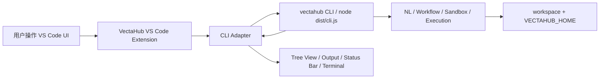
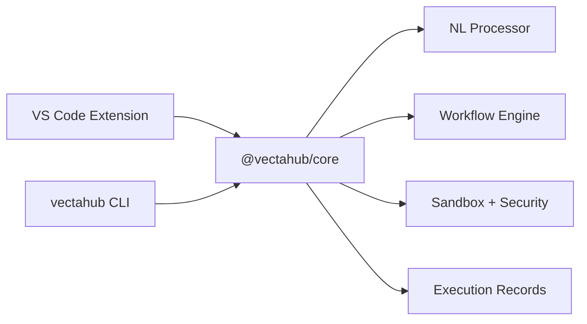

# VectaHub VS Code 插件可行性与产品规划报告

> 日期: 2026-05-08
> 目标: 将当前 TypeScript CLI 项目规划为可落地的 VS Code 插件
> 状态: 方案规划，可进入 CLI JSON 协议与插件原型实现
> 参考: VS Code 官方 Extension API、UX Guidelines、Webview、Tree View、Task Provider 文档

## 1. 结论

将 VectaHub 变成 VS Code 插件是可行的，而且产品形态天然匹配 VS Code 的工作区、终端、任务、输出面板和侧边栏模型。

建议不要一开始做“完整可视化工作流编辑器”。更稳妥的路线是:

1. **第一阶段做 CLI 驱动型插件**: VS Code 插件作为 VectaHub CLI 的 UI 外壳，提供命令面板、侧边栏、状态栏、输出面板和安全确认。
2. **第二阶段抽 SDK**: 将 `src/workflow`、`src/nl`、`src/sandbox`、`src/execution` 抽成可被插件直接调用的 core package，减少子进程和日志解析成本。
3. **第三阶段做图形化工作流设计器**: 对 YAML 工作流提供 DAG 预览、步骤编辑、执行历史和调试器 UI。

`docs/reports/03_usability_repair_execution_plan.md` 中的核心可用性阻断已完成修复:

- `run --dry-run` 已实现零副作用，不触发首次安装、外部 CLI 扫描、执行或记录写入。
- 测试默认使用临时 `VECTAHUB_HOME`，不再写真实用户 HOME。
- Chat / NL pipeline / workflow if 语义已对齐。
- CLI / API / doctor 环境兼容问题已修复或明确跳过。
- 当前基线: `npm run build`、`npm run typecheck`、`npm test -- --run` 通过，测试结果为 `1178 passed | 18 skipped`。

仍需在插件开发前完成的 P0 是 CLI JSON 输出协议。否则插件只能实现 shell、设置、CLI 检测和空状态，不能稳定渲染 Preview / Run Intent 结果。

## 2. 产品定位

### 2.1 插件一句话定位

VectaHub VS Code 插件是一个“自然语言驱动的本地工作流执行与审计面板”，让用户在编辑器内用自然语言生成、预览、执行和管理安全工作流。

### 2.2 目标用户

| 用户 | 核心诉求 | 插件价值 |
| --- | --- | --- |
| 个人开发者 | 不想记复杂命令 | 用自然语言运行 Git、npm、测试、构建等任务 |
| 团队工程师 | 希望复用标准工作流 | 将 YAML 工作流挂到侧边栏和 VS Code Tasks |
| 安全敏感团队 | 需要命令审计与确认 | 在执行前展示命令、安全等级和审计记录 |
| Agent 用户 | 想把本地工具接入 IDE | 用 Chat/命令面板触发 VectaHub 工作流 |

### 2.3 不建议的定位

- 不建议做一个独立于 VS Code 体验的大型 Web App。
- 不建议第一版强依赖 Webview 来复刻完整 IDE。
- 不建议默认自动执行危险命令。
- 不建议绕开 VS Code 已有的 Settings、Tasks、Terminal、Output、Tree View 体系。

## 3. 当前项目适配度分析

### 3.1 已适配的能力

| 现有能力 | 插件映射 | 可行性 |
| --- | --- | --- |
| `vectahub run <intent>` | Command Palette / Chat 输入框 / 侧边栏动作 | 高 |
| `--dry-run` | 执行前预览面板 | 高，零副作用已修复；仍需 JSON 输出 |
| YAML workflow | 自定义编辑、Tree View、DAG Webview | 高 |
| execution record | Runs 历史视图 | 高 |
| tools list/info | Tools 视图 | 高 |
| security test/list | Security 视图与执行前确认 | 高 |
| doctor/config/setup | Onboarding 与状态栏 | 中，doctor 误报和退出问题已修复；仍需 `--json` |
| Chat REPL | Webview View 或 VS Code Chat 入口 | 中，核心行为已稳定；MVP 仍只做轻量任务输入 |
| daemon/server | 长连接服务或后台 worker | 中，当前不建议作为 MVP 核心 |

### 3.2 当前阻断项状态

| 阻断项 | 当前状态 | 插件化影响 |
| --- | --- | --- |
| 全量测试失败 | 已修复，`100 passed test files / 1178 passed / 18 skipped` | 不再阻塞插件原型 |
| `--dry-run` 首次运行会写配置和扫描工具 | 已修复 | 不再阻塞插件预览 |
| 测试写真实 HOME | 已修复，测试默认临时 `VECTAHUB_HOME` | 不再阻塞插件测试 |
| Node.js engine `>=21` | VS Code Extension Host 的 Node 版本不一定满足 | 需要子进程隔离或降低 core 运行要求 |
| CLI 输出非结构化 | 未修复 | UI 状态难以稳定渲染，仍是插件 P0 |
| Chat/NL pipeline 测试失败 | 已修复 | MVP 可做轻量任务输入，但不做完整 REPL |

## 4. 推荐架构

### 4.1 MVP 架构: Extension Shell + CLI Adapter

第一版插件不直接嵌入 core，而是调用已构建或用户安装的 VectaHub CLI。



**优点**

- 改动小，能快速验证产品形态。
- 与当前 CLI 项目边界清晰。
- 避免 VS Code extension host Node 版本和项目 Node `>=21` 直接冲突。

**缺点**

- 需要稳定的 JSON 输出，否则 UI 解析脆弱。
- 子进程启动有延迟。
- 错误处理、取消、进度条需要额外协议。

### 4.2 中期架构: Core SDK + Extension UI

第二阶段将 CLI 内部逻辑抽成 SDK，让插件直接调用。



**需要抽出的公共 API**

```ts
interface VectaHubCore {
  parseIntent(input: string, options: ParseOptions): Promise<ParseResult>;
  preview(inputOrWorkflow: string, options: PreviewOptions): Promise<PreviewResult>;
  execute(workflow: Workflow, options: ExecuteOptions): Promise<ExecutionResult>;
  listWorkflows(): Promise<WorkflowSummary[]>;
  listExecutions(): Promise<ExecutionSummary[]>;
  testSecurity(command: string): Promise<SecurityResult>;
}
```

### 4.3 长期架构: Workflow Designer

第三阶段再做图形化工作流设计器。此时 Webview 是合理的，因为 DAG 编辑、节点拖拽、步骤配置超出了原生 Tree View 能力。

VS Code 官方 UX 指南强调: Webview 应只在原生 API 不足时使用，并且需要主题、可访问性和键盘导航支持。VectaHub 的 DAG 编辑器属于可接受场景，但普通列表、设置、历史记录不应使用 Webview。

## 5. UI 信息架构

### 5.0 任务面板优先策略

建议将 MVP 的主界面从“暴露引擎能力”调整为“任务面板优先”。也就是说，用户第一眼看到的不是 workflow、CLI、sandbox、NL pipeline 这些实现概念，而是一组可执行任务:

- Check Project
- Run Tests
- Build Project
- Preview Intent
- Run Workflow
- Git Status
- Security Check
- Fix Last Failure

这比直接展示 `Workflows / Runs / Tools / Security` 四个视图更适合第一版。原因是:

- VS Code 用户的目标是完成开发任务，不是学习 VectaHub 的内部架构。
- `workflow`、`CLI`、`sandbox`、`intent` 对新用户有理解成本。
- 任务面板可以把复杂能力包装成明确动作，同时保留高级入口。
- 插件 MVP 可以更快验证核心价值: “我在编辑器里能不能更快完成常见任务”。

推荐调整为:

| 层级 | 面向对象 | 展示方式 |
| --- | --- | --- |
| 默认层 | 普通用户 | Task Panel: 常用任务、最近任务、失败任务 |
| 进阶层 | 熟悉 VectaHub 的用户 | Workflows、Runs、Tools、Security 折叠分组 |
| 专家层 | 调试/扩展用户 | 原始 CLI、JSON、审计详情、DAG 设计器 |

任务面板不应隐藏能力本身，而是隐藏术语和复杂配置。用户执行任务时仍应看到真实命令、安全等级和确认按钮。

建议 MVP 侧边栏结构改为:

```text
VectaHub
  Tasks
    Common
      Check Project
      Run Tests
      Build Project
      Git Status
    Natural Language
      Preview Intent
      Run Intent
    Recent
      Last 5 runs
    Failed
      Last failed step

  Advanced
    Workflows
    Tools
    Security
    Settings
```

这个结构能把“工作流引擎”包装成“任务中心”。后续用户熟悉后，再进入 Advanced 管理 YAML、CLI 工具和安全策略。

### 5.1 Activity Bar

新增一个 `VectaHub` Activity Bar 容器。官方指南建议 Activity Bar 图标要清晰、不要重复系统图标，且不要用 Activity Bar 项直接打开 Webview。

建议 View Container:

- 名称: `VectaHub`
- 图标: 简洁线性图标，表达 workflow/network/route
- 激活条件: 打开工作区时激活，不要空窗口自动弹出复杂 UI

### 5.2 Primary Sidebar Views

如果采用任务面板优先策略，建议默认只暴露 2 个视图:

| 视图 | 类型 | 内容 | 第一版是否做 |
| --- | --- | --- | --- |
| Tasks | Tree View | 常用任务、自然语言任务、最近执行、失败任务 | 是 |
| Advanced | Tree View | Workflows、Tools、Security、Settings 分组 | 是 |

原先规划的 4 个视图可以作为 Advanced 内的折叠分组，而不是默认平铺:

| 视图 | 类型 | 内容 | 第一版是否做 |
| --- | --- | --- | --- |
| Workflows | Advanced 分组 | 保存的 YAML 工作流、模板、最近使用 | 可折叠展示 |
| Runs | Tasks/Advanced 分组 | 最近执行记录、状态、耗时、失败步骤 | Tasks 展示摘要，Advanced 展示详情 |
| Tools | Advanced 分组 | git/npm/docker/curl 等工具及可用命令 | 默认隐藏 |
| Security | Advanced 分组 | 当前模式、安全规则、危险命令检测入口 | 默认隐藏，遇到风险时前置提示 |

避免把每个动作做成单独 Tree Item。Tree Item 应展示实体，动作放在 item context menu 或 view toolbar。

### 5.3 Command Palette

必须提供的命令:

| Command ID | 名称 | 行为 |
| --- | --- | --- |
| `vectahub.runIntent` | VectaHub: Run Intent | 输入自然语言并执行 |
| `vectahub.previewIntent` | VectaHub: Preview Intent | 输入自然语言，只预览命令 |
| `vectahub.runCurrentWorkflow` | VectaHub: Run Current Workflow | 执行当前 YAML |
| `vectahub.previewCurrentWorkflow` | VectaHub: Preview Current Workflow | 预览当前 YAML |
| `vectahub.showRuns` | VectaHub: Show Runs | 聚焦 Runs 视图 |
| `vectahub.openSettings` | VectaHub: Open Settings | 打开 VS Code Settings 对应项 |
| `vectahub.doctor` | VectaHub: Doctor | 运行诊断并输出报告 |
| `vectahub.securityTestSelection` | VectaHub: Test Selected Command Safety | 对选中文本做安全检测 |

### 5.4 Status Bar

状态栏只展示高价值状态:

- 当前执行模式: `VectaHub: relaxed/strict/consensus`
- 最近一次执行状态: success/failed/running
- 点击后打开 VectaHub 面板或 mode 切换 QuickPick

不要把长文本、帮助说明、营销内容放到状态栏。

### 5.5 Output Channel 与 Terminal

建议分层:

- Output Channel: 展示 VectaHub 插件日志、解析结果、错误。
- Terminal: 用户选择“在终端中执行”时展示真实命令。
- Progress Notification: 长任务执行中显示可取消进度。

### 5.6 Webview 使用边界

第一版只建议一个 Webview:

- `Workflow Preview / Designer`
- 用途: 展示 workflow DAG、步骤详情、安全风险和执行路径。

不建议 Webview 用于:

- Settings，应该使用 VS Code Settings。
- 普通列表，应该使用 Tree View。
- 首次配置向导，应该使用 QuickPick/InputBox/Settings。
- 纯日志展示，应该使用 Output Channel。

## 6. 核心用户流程

### 6.1 自然语言预览

1. 用户执行 `VectaHub: Preview Intent`。
2. 输入 `查看 git 状态`。
3. 插件调用 `vectahub run --dry-run --json "查看 git 状态"`。
4. UI 展示:
   - 识别意图: `GIT_WORKFLOW`
   - 将执行: `git status`
   - 风险等级: low
   - 操作按钮: Run / Copy Command / Open Terminal
5. 用户点击 Run 后执行。

### 6.2 当前 YAML 工作流执行

1. 用户打开 `daily-check.yaml`。
2. 点击编辑器标题栏按钮或命令 `Run Current Workflow`。
3. 插件先 preview。
4. 若安全规则允许，执行并在 Runs 视图展示状态。
5. 失败时显示失败步骤、stderr、建议修复动作。

### 6.3 安全检测选中文本

1. 用户选中 `rm -rf /tmp/cache`。
2. 执行 `Test Selected Command Safety`。
3. 插件展示安全等级、命中规则、建议替代命令。

### 6.4 工作流历史追踪

1. Runs 视图展示最近执行。
2. 点击 run item 查看步骤详情。
3. 支持 rerun、open record、copy output。

## 7. 必须新增的 CLI 能力

为了让插件稳定，不建议解析人类日志。CLI 需要新增结构化协议。

### 7.1 JSON 输出

建议所有插件调用统一加 `--json`:

```bash
vectahub run --dry-run --json "查看 git 状态"
vectahub run --json "查看 git 状态"
vectahub tools list --json
vectahub security test --json "git status"
vectahub history --json
```

建议响应:

```ts
interface CliJsonResponse<T> {
  ok: boolean;
  data?: T;
  error?: {
    code: string;
    message: string;
    details?: unknown;
  };
  diagnostics?: DiagnosticMessage[];
}
```

### 7.2 取消执行

插件需要支持用户取消长任务:

- CLI 子进程收到 SIGINT/SIGTERM 后能清理。
- workflow engine 支持 abort token。
- execution record 标记为 cancelled。

### 7.3 工作区隔离

插件必须能指定:

```bash
VECTAHUB_HOME=<extension globalStorageUri>
VECTAHUB_WORKSPACE=<workspace folder>
```

避免所有 VS Code 工作区共享一套不可控状态。

## 8. 设置项设计

遵循 VS Code Settings 官方建议: 使用 configuration contribution point，不做自定义设置 Webview。

建议设置:

| Setting ID | 类型 | 默认值 | 说明 |
| --- | --- | --- | --- |
| `vectahub.cliPath` | string | `vectahub` | CLI 路径，未找到时可选择项目内 dist |
| `vectahub.executionMode` | enum | `strict` | 插件默认执行模式 |
| `vectahub.autoPreviewBeforeRun` | boolean | `true` | 执行前是否强制预览 |
| `vectahub.vectahubHomeMode` | enum | `extensionStorage` | 使用插件存储还是用户 HOME |
| `vectahub.enableChat` | boolean | `false` | Chat 功能在稳定前默认关闭 |
| `vectahub.showStatusBar` | boolean | `true` | 是否显示状态栏 |
| `vectahub.logLevel` | enum | `info` | 插件日志级别 |

## 9. 安全模型

### 9.1 默认策略

插件比 CLI 更容易被误触，因此默认应更保守:

- 默认 `strict` 或 “preview first”。
- 所有自然语言执行必须先展示命令预览。
- 高危命令必须二次确认。
- 不允许静默执行 destructive command。
- 不记录 secret、token、完整环境变量。

### 9.2 权限边界

- 插件运行在 VS Code extension host，不应直接执行用户输入。
- 所有命令必须经过 VectaHub security/sandbox 评估。
- 用户点击 Run 时展示实际命令。
- Output Channel 中脱敏敏感信息。

### 9.3 审计

Runs 视图应能展示:

- 输入来源: intent / yaml / command palette / context menu
- 原始自然语言
- 生成命令
- 安全判定
- 执行状态
- 时间、耗时、工作区

## 10. MVP 范围

### 10.1 MVP 必做

- 插件项目 scaffold。
- 激活条件与命令注册。
- CLI path 检测。
- `Preview Intent`。
- `Run Intent`。
- 轻量任务输入面板，不做完整 Chat REPL。
- Output Channel。
- Status Bar mode/status。
- Tasks 主视图。
- Advanced 视图，折叠承载 Workflows / Runs / Tools / Security。
- 临时 VECTAHUB_HOME 隔离策略。
- JSON 输出协议的 CLI 支持。
- smoke tests。

### 10.2 MVP 不做

- 完整 DAG 拖拽编辑器。
- 图形化工作流编辑器。
- 完整 Chat REPL Webview。
- Marketplace 发布自动化。
- 长期 daemon 模式。
- 云同步。
- 多用户团队权限。

### 10.3 MVP 验收

| 验收项 | 标准 |
| --- | --- |
| 插件启动 | 打开工作区后 VectaHub Activity Bar 可见 |
| CLI 检测 | 找不到 CLI 时给出明确修复动作 |
| 预览 | `查看 git 状态` 展示 `git status`，不执行 |
| 执行 | 用户确认后执行 `git status` 并在 Runs 视图出现记录 |
| 安全 | 高危命令不会直接执行 |
| 任务面板 | 常用任务可见，复杂能力收纳到 Advanced |
| 输出 | Output Channel 有结构化日志 |
| 设置 | 可配置 CLI 路径和执行模式 |
| 测试 | 插件 smoke test 和 core test 通过 |

## 11. 分阶段路线图

### Phase 0: Core 可用性修复

依赖 `03_usability_repair_execution_plan.md`:

- [x] 修复 dry-run 零副作用。
- [x] 修复测试 HOME 隔离。
- [x] 修复 CLI/API/Chat/NL pipeline 失败。
- [ ] 补 JSON 输出协议。

完成标准:

```bash
npm run build
npm run typecheck
npm test -- --run
node dist/cli.js run --dry-run --json "查看 git 状态"
```

当前状态:

- `npm run build`: 通过。
- `npm run typecheck`: 通过。
- `npm test -- --run`: 通过，`1178 passed | 18 skipped`。
- `node dist/cli.js run --dry-run "查看 git 状态"`: 通过且零副作用。
- `node dist/cli.js doctor`: 通过且正常退出。
- `node dist/cli.js run --dry-run --json "查看 git 状态"`: 未完成，CLI 尚无 `--json` 协议。

### Phase 1: VS Code 插件 MVP

目录建议:

```text
packages/
  vscode-extension/
    package.json
    src/
      extension.ts
      cli/adapter.ts
      views/workflows.ts
      views/runs.ts
      views/tools.ts
      views/security.ts
      views/tasks.ts
      views/advanced.ts
      commands/runIntent.ts
      commands/previewIntent.ts
      ui/statusBar.ts
      ui/output.ts
```

完成标准:

- 能在 Extension Development Host 启动。
- 命令面板可 preview/run intent。
- 侧边栏默认展示 Tasks。
- Advanced 中可查看 workflows/runs/tools/security。

### Phase 2: YAML Workflow 编辑体验

- 为 `.yaml` / `.yml` workflow 文件提供 CodeLens。
- 提供 Run / Preview / Validate。
- 执行失败后跳转到对应 step。

### Phase 3: Core SDK 化

- 抽出 `@vectahub/core`。
- CLI 和插件共享 core API。
- 插件减少子进程调用。

### Phase 4: Workflow Designer

暂不进入当前路线图。只有当 YAML workflow 编排模型已经被用户验证、并且普通用户能理解基础概念后，再重新评估是否需要图形化编辑器。

## 12. 任务卡

### VSC-P0-01: 新增 CLI JSON 输出协议

**状态**: 未完成。

**目标**: 插件不解析人类日志。

**范围**

- `run --json`
- `tools list --json`
- `security test --json`
- `history --json`
- `doctor --json`

**验收**

```bash
node dist/cli.js run --dry-run --json "查看 git 状态"
node dist/cli.js tools list --json
```

---

### VSC-P0-02: 建立 VS Code 插件 scaffold

**状态**: 未完成。当前仓库尚无 `packages/vectahub-vscode-extension`。

**目标**: 建立可运行插件骨架。

**范围**

- `packages/vscode-extension/package.json`
- `src/extension.ts`
- command contribution
- view container contribution
- settings contribution
- Tasks 主视图
- Advanced 折叠视图

**验收**

- Extension Development Host 可启动。
- `VectaHub: Preview Intent` 出现在命令面板。
- VectaHub 侧边栏默认展示任务面板。

---

### VSC-P0-03: CLI Adapter

**状态**: 未完成。

**目标**: 插件安全调用 VectaHub CLI。

**范围**

- CLI path resolution。
- 临时 `VECTAHUB_HOME`。
- workspace cwd。
- stdout JSON parse。
- cancellation。
- error mapping。

**验收**

- 找不到 CLI 时提示配置。
- CLI 返回错误时 UI 显示结构化错误。

---

### VSC-P0-04: Preview / Run Intent 命令

**状态**: 未完成，依赖 `VSC-P0-01`。

**目标**: 完成最核心用户流程。

**范围**

- InputBox 获取自然语言。
- Preview QuickPick / Webview-lite 展示命令。
- Run 需要确认。
- 输出写入 Output Channel。

**验收**

- `查看 git 状态` 可预览。
- 用户确认后执行成功。

---

### VSC-P1-01: Task Panel 与 Advanced Tree Views

**状态**: 未完成。

**目标**: 提供低门槛侧边栏工作台。

**范围**

- Tasks: Common / Natural Language / Recent / Failed
- Advanced: Workflows / Runs / Tools / Security / Settings

**验收**

- 每个视图能 refresh。
- item context menu 有对应动作。
- 常用任务不暴露 workflow、CLI、sandbox 等内部术语。

---

### VSC-P1-02: YAML Workflow CodeLens

**状态**: 未完成。

**目标**: 用户打开 workflow 文件即可执行。

**范围**

- validate current file
- preview current file
- run current file

**验收**

- YAML 顶部出现 Preview / Run CodeLens。

---

### VSC-P2-01: Workflow Text Editing Assist

**状态**: 未完成。

**目标**: 在不做图形化编辑器的前提下，降低 YAML workflow 使用难度。

**范围**

- YAML schema。
- snippet。
- validate。
- preview。
- run current workflow。
- 错误定位到 step。

**验收**

- 不引入 DAG Webview。
- 用户可通过 CodeLens 或命令运行当前 workflow。

## 13. 风险与缓解

| 风险 | 等级 | 缓解 |
| --- | --- | --- |
| VS Code extension host Node 版本与项目 Node `>=21` 不一致 | 高 | MVP 使用 CLI 子进程，后续 SDK 降低运行要求 |
| CLI 输出不稳定 | 高 | 先实现 `--json` |
| dry-run 有副作用 | 已解除 | 已修复零副作用 dry-run |
| Chat 行为未稳定 | 已降低 | 核心测试已通过，MVP 仍只做轻量任务输入 |
| Webview 过重 | 中 | MVP 使用 Tree View，DAG 只读后置 |
| 多工作区路径混乱 | 中 | 所有调用传 workspace cwd 与 VECTAHUB_HOME |
| 高危命令误执行 | 高 | preview first + strict default + 二次确认 |

## 14. 官方文档参考

- [VS Code Extension API](https://code.visualstudio.com/api)
- [VS Code Extension Guides](https://code.visualstudio.com/api/extension-guides/overview)
- [VS Code UX Guidelines](https://code.visualstudio.com/api/ux-guidelines/overview)
- [VS Code Views UX Guidelines](https://code.visualstudio.com/api/ux-guidelines/views)
- [VS Code Webviews UX Guidelines](https://code.visualstudio.com/api/ux-guidelines/webviews)
- [VS Code Webview API](https://code.visualstudio.com/api/extension-guides/webview)
- [VS Code Task Provider](https://code.visualstudio.com/api/extension-guides/task-provider)
- [VS Code Settings UX Guidelines](https://code.visualstudio.com/api/ux-guidelines/settings)
- [VS Code Activity Bar UX Guidelines](https://code.visualstudio.com/api/ux-guidelines/activity-bar)

## 15. 需要产品确认的问题

已确认决策:

| 问题 | 决策 | 说明 |
| --- | --- | --- |
| 第一版运行方式 | 只支持本地 CLI，不内置 core | 插件作为 UI shell 和 CLI adapter，降低初期风险 |
| 默认执行模式 | 建议 `strict + preview first` | VS Code 内误触成本更高，第一版应比 CLI 更保守 |
| Chat 是否进入 MVP | 进入 MVP，但只做轻量任务输入 | 支持自然语言输入与任务面板，不做完整 REPL/Webview Chat |
| 图形化工作流编辑器 | 第一版去掉 | 当前 workflow 编排模型尚未被产品验证，不应先做复杂编辑器 |
| 发布目标 | 面向 Marketplace 发布 | 从第一版开始按发布标准设计设置、权限、安全和文档 |

后续仍需确认:

| 问题 | 决策 | 说明 |
| --- | --- | --- |
| Marketplace 发布账号 | 暂不处理 | 先完成插件能力和本地打包 |
| 插件项目名 | 跟项目同名并加插件后缀 | 建议目录名 `vectahub-vscode-extension` |
| 插件显示名 | `VectaHub Tasks` | 强化任务面板定位 |
| 第一版平台 | 先支持 macOS | Windows / Linux 后续作为兼容性阶段 |
| 本地 CLI 安装 | 插件提供引导安装 | 找不到 CLI 时展示安装指引，不静默安装 |

实现前还需要确认:

| 问题 | 决策 | 说明 |
| --- | --- | --- |
| CLI 安装来源 | npm 全局安装 | 引导用户执行 `npm install -g vectahub` |
| CLI 检测时机 | 插件自动检测 | 激活后检测 CLI，安装完成后自动调用一次 VectaHub 诊断/版本命令 |
| 安装引导形式 | 一键在终端打开安装命令 | 不静默安装，由用户在终端确认执行 |
| macOS 支持范围 | Apple Silicon 和 Intel 都支持 | 插件 UI 基本无差异，主要验证全局 npm 路径、Node 版本和 CLI 可执行路径 |

macOS 双架构差异分析:

| 差异点 | Apple Silicon | Intel | 对策 |
| --- | --- | --- | --- |
| Homebrew 默认路径 | `/opt/homebrew` | `/usr/local` | CLI 自动检测时检查 `PATH`、npm prefix 和常见路径 |
| 全局 npm bin | 取决于 Node 安装方式 | 取决于 Node 安装方式 | 通过 `npm bin -g` / `npm prefix -g` 辅助提示 |
| VS Code Extension Host | 插件 API 基本一致 | 插件 API 基本一致 | 插件逻辑不写架构分支 |
| 本地 CLI 子进程 | 依赖用户 Node/npm | 依赖用户 Node/npm | doctor 展示 Node 版本和 CLI 路径 |
| 外部工具 gemini/codex 等 | 安装路径可能不同 | 安装路径可能不同 | 由 VectaHub CLI 自己扫描，插件只展示结果 |

因此第一版可以声明“支持 macOS”，但测试矩阵至少记录:

- macOS Apple Silicon: 必测。
- macOS Intel: 发布前补测，若暂时没有机器，可标记为待验证兼容项。
